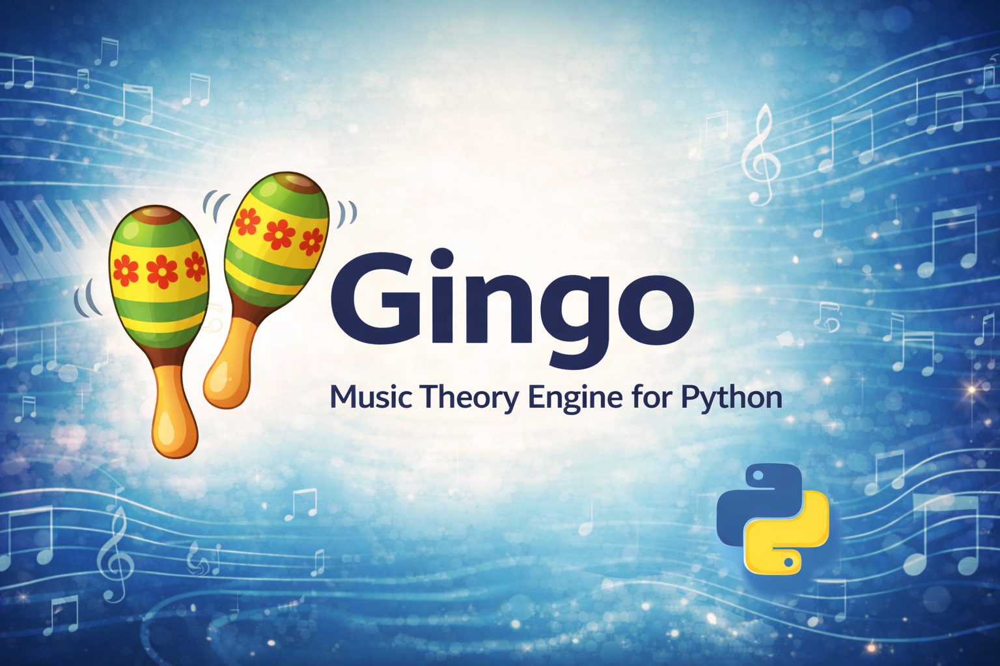
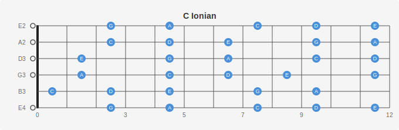
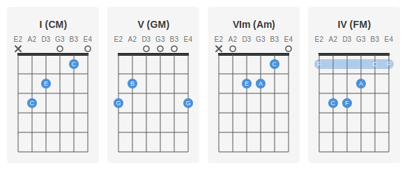
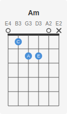
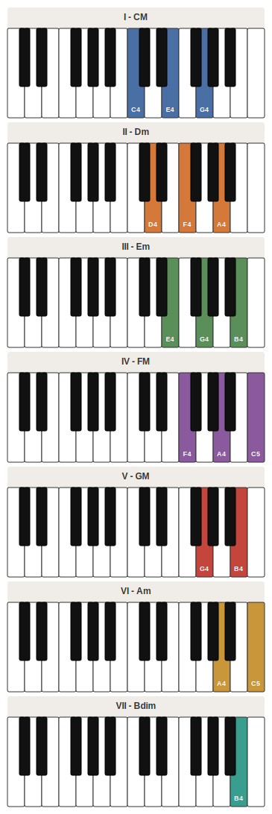
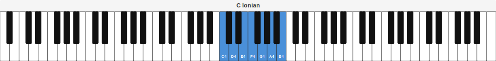
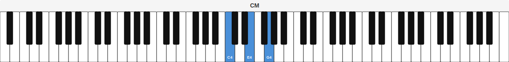

<p align="center">
  
</p>

# 🪇 Gingo

Music theory engine for Python, powered by a C++17 core.

<p align="center">

[](https://pypi.org/project/gingo/)
[](https://pypi.org/project/gingo/)
[](https://github.com/sauloverissimo/gingopy/blob/main/LICENSE)
[](https://en.cppreference.com/w/cpp/17)
[](https://sauloverissimo.github.io/gingopy/)
[](https://github.com/sauloverissimo/gingopy)

</p>

<p align="center">
  <a href="https://github.com/sponsors/sauloverissimo"></a>
</p>

From pitch classes to harmonic trees and rhythmic grids — with audio playback and a friendly CLI.

Notes, intervals, chords, scales, and harmonic fields are just the beginning: Gingo also ships with durations, tempo markings (nomes de tempo), time signatures, and sequence playback.

**Português (pt-BR)**: https://sauloverissimo.github.io/gingopy/ (guia e referência completos)

---

## About

Gingo is a pragmatic library for analysis, composition, and teaching. It prioritizes correctness, ergonomics, and speed, while keeping the API compact and consistent across concepts.

**Highlights**

- **C++17 core + Python API** — fast and deterministic, with full type hints.
- **Pitch & harmony** — `Note`, `Interval`, `Chord`, `Scale`, `Field`, `Tree`, and `Progression` with identification, deduction, and comparison utilities.
- **Instruments** — `Piano` maps theory to physical keys (forward & reverse MIDI), with voicing styles (close, open, shell). `Fretboard` generates playable fingerings for guitar, cavaquinho, bandolim (or custom tunings) using a CAGED-based scoring algorithm.
- **SVG Visualization** — `PianoSVG` renders interactive piano keyboard SVGs. `FretboardSVG` renders chord boxes, fretboard diagrams, scale maps, and harmonic field charts — with orientation (horizontal/vertical) and handedness (right/left) support.
- **Notation** — `MusicXML` serializes any musical object to MusicXML 4.0 for MuseScore, Finale, and Sibelius.
- **MIDI 1.0 & 2.0** — `Sequence.to_midi()` / `.from_midi()` for Standard MIDI File import/export. MIDI 2.0 UMP stream support via `Midi2`. `Monitor` for real-time event routing. `Duration.midi_ticks()` and `Tempo.microseconds_per_beat()` for low-level conversions.
- **Rhythm & time** — `Duration` (flexible parsing: names, abbreviations, LilyPond, fractions), `Tempo` (BPM + nomes de tempo), `TimeSignature`, and `Sequence` with note/chord events.
- **Audio** — `.play()` and `.to_wav()` on musical objects, plus CLI `--play` / `--wav` with waveform and strum controls.
- **CLI-first exploration** — query and inspect theory concepts without leaving the terminal.

---

## Installation

```bash
pip install gingo
```

Optional audio playback dependency:

```bash
pip install "gingo[audio]"
```

Requires Python 3.10+. Pre-built binary wheels are available for Linux, macOS, and Windows — no C++17 compiler needed. If no wheel is available for your platform, pip will build from source automatically.

---

## Quick Start

```python
from gingo import (
    Note, Interval, Chord, Scale, Field, Tree, ScaleType,
    Duration, Tempo, TimeSignature, Sequence,
    NoteEvent, ChordEvent, Rest,
    Piano, VoicingStyle, MusicXML,
    Fretboard, FretboardSVG, Orientation, Handedness,
)

# Notes
note = Note("Bb")
note.natural()      # "A#"
note.semitone()     # 10
note.frequency(4)   # 466.16 Hz
note.play(octave=4) # Listen to Bb4

# Intervals
iv = Interval("5J")
iv.semitones()      # 7
iv.anglo_saxon()    # "P5"

# Chords
chord = Chord("Cm7")
chord.root()        # Note("C")
chord.type()        # "m7"
chord.notes()       # [Note("C"), Note("Eb"), Note("G"), Note("Bb")]
chord.interval_labels()  # ["P1", "3m", "5J", "7m"]
chord.play()        # Listen to Cm7

# Identify a chord from notes
Chord.identify(["C", "E", "G"])  # Chord("CM")

# Identify a scale or field from a full note/chord set
Scale.identify(["C", "D", "E", "F", "G", "A", "B"])  # Scale("C", "major")
Field.identify(["CM", "Dm", "Em", "FM", "GM", "Am"])  # Field("C", "major")

# Deduce likely fields from partial evidence (ranked)
matches = Field.deduce(["CM", "FM"])
matches[0].field   # Field("C", "major") or Field("F", "major")
matches[0].score   # 1.0

# Compare two chords (absolute, context-free)
r = Chord("CM").compare(Chord("Am"))
r.common_notes       # [Note("C"), Note("E")]
r.root_distance      # 3
r.transformation     # "R" (neo-Riemannian Relative)
r.transposition      # -1 (not related by transposition)
r.dissonance_a       # 0.057... (psychoacoustic roughness)
r.to_dict()          # full dict serialization

# Scales
scale = Scale("C", ScaleType.Major)
[n.natural() for n in scale.notes()]  # ["C", "D", "E", "F", "G", "A", "B"]
scale.degree(5)     # Note("G")
scale.play()        # Listen to C major scale

# Harmonic fields
field = Field("C", ScaleType.Major)
[c.name() for c in field.chords()]
# ["CM", "Dm", "Em", "FM", "GM", "Am", "Bdim"]

# Compare two chords within a harmonic field (contextual)
r = field.compare(Chord("CM"), Chord("GM"))
r.degree_a           # 1 (I)
r.degree_b           # 5 (V)
r.function_a         # HarmonicFunction.Tonic
r.function_b         # HarmonicFunction.Dominant
r.root_motion        # "ascending_fifth"
r.to_dict()          # full dict serialization

# Harmonic trees (progressions and voice leading)
from gingo import Tree, Progression

tree = Tree("C", ScaleType.Major, "harmonic_tree")
tree.branches()      # All available harmonic branches
tree.paths("I")      # All progressions from tonic
tree.shortest_path("I", "V7")  # ["I", "V7"]
tree.is_valid(["IIm", "V7", "I"])  # True
tree.function("V7")  # HarmonicFunction.Dominant
tree.schemas()       # Named patterns for this tradition
tree.to_dot()        # Export to Graphviz
tree.to_mermaid()    # Export to Mermaid diagram

# Cross-tradition analysis with Progression
prog = Progression("C", "major")
prog.traditions()    # ["harmonic_tree", "jazz"]
prog.identify(["IIm", "V7", "I"])  # ProgressionMatch
prog.deduce(["IIm", "V7"])         # Ranked matches
prog.predict(["I", "IIm"])         # Suggested next chords

# Piano — theory ↔ physical keys
piano = Piano(88)
key = piano.key(Note("C"), 4)
key.midi             # 60
key.white            # True
key.position         # 40 (on an 88-key piano)

# Chord voicing on piano
v = piano.voicing(Chord("Am7"), 4, VoicingStyle.Close)
[k.midi for k in v.keys]  # [69, 72, 76, 79]

# Shell voicing (jazz: root + 3rd + 7th)
v = piano.voicing(Chord("Am7"), 4, VoicingStyle.Shell)
[k.midi for k in v.keys]  # [69, 72, 79]

# Reverse: MIDI → chord
piano.identify([60, 64, 67])  # Chord("CM")

# PianoSVG — interactive piano visualization
from gingo import PianoSVG

piano = Piano(88)
svg = PianoSVG.note(piano, Note("C"), 4)         # single note
svg = PianoSVG.chord(piano, Chord("Am7"), 4)      # chord voicing
svg = PianoSVG.scale(piano, Scale("C", "major"), 4)  # scale
PianoSVG.write(svg, "piano.svg")                  # save to file

# Fretboard — guitar fingerings and visualization
guitar = Fretboard.violao()            # standard 6-string guitar
f = guitar.fingering(Chord("CM"))      # optimal CAGED fingering
f.strings                              # per-string fret/action info
f.barre                                # barre fret (0 = none)

# FretboardSVG — render diagrams
svg = FretboardSVG.chord(guitar, Chord("Am"))           # chord box
svg = FretboardSVG.scale(guitar, Scale("C", "major"))   # fretboard
svg = FretboardSVG.field(guitar, Field("C", "major"))   # all field chords
FretboardSVG.write(svg, "fretboard.svg")                # save to file

# Orientation and handedness
svg = FretboardSVG.chord(guitar, Chord("Am"), 0,
    Orientation.Horizontal, Handedness.LeftHanded)

# MusicXML — export to notation software
xml = MusicXML.note(Note("C"), 4)      # single note
xml = MusicXML.chord(Chord("Am7"), 4)  # chord
xml = MusicXML.scale(Scale("C", "major"), 4)  # scale
xml = MusicXML.field(Field("C", "major"), 4)  # harmonic field
MusicXML.write(xml, "score.musicxml")  # save to file

# Rhythm — flexible Duration parsing
q = Duration("quarter")            # by name
q = Duration("q")                  # abbreviation
q = Duration("4")                  # LilyPond notation
q = Duration("1/4")                # fraction string
q = Duration(1, 4)                 # numerator, denominator
dotted = Duration("q.")            # dotted abbreviation
dotted = Duration("eighth", dots=1)
triplet = Duration("eighth", tuplet=3)
Tempo("Allegro").bpm()             # 140.0
Tempo(120).marking()               # "Allegretto"
TimeSignature(6, 8).classification()  # "compound"

# MIDI conversions
Duration("quarter").midi_ticks()           # 480
Duration.from_ticks(240)                   # Duration("eighth")
Tempo(120).microseconds_per_beat()         # 500000
Tempo.from_microseconds(500000)            # Tempo(120)

# Sequence (events in time)
seq = Sequence(Tempo(120), TimeSignature(4, 4))
seq.add(NoteEvent(Note("C"), Duration("quarter"), octave=4))
seq.add(ChordEvent(Chord("G7"), Duration("half"), octave=4))
seq.add(Rest(Duration("quarter")))
seq.total_seconds()

# MIDI file export/import
seq.to_midi("output.mid")                 # Standard MIDI File (format 0)
seq2 = Sequence.from_midi("output.mid")   # import from MIDI file

# Audio
Note("C").play()
Chord("Am7").play(waveform="square")
Scale("C", "major").to_wav("c_major.wav")
```

---

## Visual Output

Gingo generates publication-quality SVG diagrams for both piano and fretboard instruments — directly from Python code.

### FretboardSVG — Chord Diagram

```python
FretboardSVG.chord(guitar, Chord("Am"))
```

<p align="center">
  
</p>

### FretboardSVG — Scale Map

```python
FretboardSVG.scale(guitar, Scale("C", "major pentatonic"), 0, 12)
```

<p align="center">
  
</p>

### FretboardSVG — Harmonic Field (Grid)

```python
FretboardSVG.field(guitar, Field("G", "major"), Layout.Grid)
```

<p align="center">
  
</p>

### FretboardSVG — Chord Progression

```python
FretboardSVG.progression(guitar, Field("C", "major"), ["I", "V", "VIm", "IV"], Layout.Horizontal)
```

<p align="center">
  
</p>

### FretboardSVG — Left-Handed

```python
FretboardSVG.chord(guitar, Chord("Am"), 0, Orientation.Vertical, Handedness.LeftHanded)
```

<p align="center">
  
</p>

### PianoSVG — Chord Voicing

```python
PianoSVG.chord(Piano(25), Chord("Am7"), 3)
```

<p align="center">
  
</p>

### PianoSVG — Scale

```python
PianoSVG.scale(Piano(25), Scale("C", "major"), 4)
```

<p align="center">
  
</p>

### PianoSVG — Harmonic Field

```python
PianoSVG.field(Piano(25), Field("C", "major"), 4)
```

<p align="center">
  
</p>

### PianoSVG — Full Keyboard (88 keys)

```python
PianoSVG.scale(Piano(88), Scale("C", "major"), 4)
```

<p align="center">
  
</p>

```python
PianoSVG.chord(Piano(88), Chord("CM"), 4)
```

<p align="center">
  
</p>

---

## CLI (quick exploration)

```bash
gingo note C#
gingo note C --fifths
gingo interval 7 --all
gingo scale "C major" --degree 5 5
gingo scale "C,D,E,F,G,A,B" --identify
gingo field "C major" --functions
gingo field "CM,FM,G7" --identify
gingo field "CM,FM" --deduce
gingo compare CM GM --field "C major"
gingo piano C4
gingo piano Am7 --voicings
gingo piano Am7 --style shell
gingo piano "C major" --scale
gingo piano --identify 60 64 67
gingo piano Am7 --svg am7.svg
gingo piano "C major" --scale --svg cmajor.svg
gingo fretboard chord CM
gingo fretboard chord CM --svg chord.svg
gingo fretboard scale "C major"
gingo fretboard scale "C major" --svg scale.svg
gingo fretboard field "C major" --svg field.svg
gingo fretboard chord Am --left --horizontal
gingo musicxml note C
gingo musicxml chord Am7 -o am7.musicxml
gingo musicxml scale "C major"
gingo musicxml field "C major" -o field.musicxml
gingo note C --play --waveform triangle
gingo chord Am7 --play --strum 0.05
gingo chord Am7 --wav am7.wav
gingo duration quarter --tempo 120
gingo tempo Allegro --all
gingo timesig 6 8 --tempo 120
```

Audio flags:

- `--play` outputs to the system audio device
- `--wav FILE` exports a WAV file
- `--waveform` (`sine`, `square`, `sawtooth`, `triangle`)
- `--strum` and `--gap` control timing between chord tones and events

---

## Detailed Guide

### Note

The `Note` class is the atomic unit of the library. It represents a single pitch class (C, D, E, F, G, A, B) with optional accidentals.

```python
from gingo import Note

# Construction — accepts any common notation
c  = Note("C")      # Natural
bb = Note("Bb")     # Flat
fs = Note("F#")     # Sharp
eb = Note("E♭")     # Unicode flat
gs = Note("G##")    # Double sharp

# Core properties
bb.name()           # "Bb"   — the original input
bb.natural()        # "A#"   — canonical sharp-based form
bb.sound()          # "B"    — base letter (no accidentals)
bb.semitone()       # 10     — chromatic position (C=0, C#=1, ..., B=11)

# Frequency calculation (A4 = 440 Hz standard tuning)
Note("A").frequency(4)    # 440.0 Hz
Note("A").frequency(3)    # 220.0 Hz
Note("C").frequency(4)    # 261.63 Hz
Note("A").frequency(5)    # 880.0 Hz

# Enharmonic equivalence
Note("Bb").is_enharmonic(Note("A#"))   # True
Note("Db").is_enharmonic(Note("C#"))   # True
Note("C").is_enharmonic(Note("D"))     # False

# Equality (compares natural forms)
Note("Bb") == Note("A#")   # True — same natural form
Note("C") == Note("C")     # True
Note("C") != Note("D")     # True

# Transposition
Note("C").transpose(7)     # Note("G")  — up a perfect fifth
Note("C").transpose(12)    # Note("C")  — up an octave
Note("A").transpose(-2)    # Note("G")  — down a whole step
Note("E").transpose(1)     # Note("F")  — up a semitone

# Audio playback (requires gingo[audio])
Note("A").play(octave=4)                    # A4 (440 Hz)
Note("C").play(octave=5, waveform="square") # C5 with square wave
Note("Eb").to_wav("eb.wav", octave=4)       # Export to WAV file

# Static utilities
Note.to_natural("Bb")              # "A#"
Note.to_natural("G##")             # "A"
Note.to_natural("Bbb")             # "A"
Note.extract_root("C#m7")          # "C#"
Note.extract_root("Bbdim")         # "Bb"
Note.extract_sound("Gb")           # "G"
Note.extract_type("C#m7")          # "m7"
Note.extract_type("F#m7(b5)")      # "m7(b5)"
Note.extract_type("C")             # ""
```

#### Enharmonic Resolution Table

Gingo resolves 89 enharmonic spellings to a canonical sharp-based form:

| Input | Natural | Category |
|-------|---------|----------|
| `Bb` | `A#` | Standard flat |
| `Db` | `C#` | Standard flat |
| `Eb` | `D#` | Standard flat |
| `Gb` | `F#` | Standard flat |
| `Ab` | `G#` | Standard flat |
| `E#` | `F` | Special sharp (no sharp exists) |
| `B#` | `C` | Special sharp (no sharp exists) |
| `Fb` | `E` | Special flat (no flat exists) |
| `Cb` | `B` | Special flat (no flat exists) |
| `G##` | `A` | Double sharp |
| `C##` | `D` | Double sharp |
| `E##` | `F#` | Double sharp |
| `Bbb` | `A` | Double flat |
| `Abb` | `G` | Double flat |
| `B♭` | `A#` | Unicode flat symbol |
| `E♭♭` | `D` | Unicode double flat |
| `♭♭G` | `F` | Prefix accidentals |

---

### Interval

The `Interval` class represents the distance between two pitches, covering two full octaves (24 semitones).

```python
from gingo import Interval

# Construction — from label or semitone count
p1 = Interval("P1")     # Perfect unison
m3 = Interval("3m")     # Minor third
M3 = Interval("3M")     # Major third
p5 = Interval("5J")     # Perfect fifth
m7 = Interval("7m")     # Minor seventh

# From semitone count
iv = Interval(7)         # Same as Interval("5J")

# Properties
m3.label()        # "3m"
m3.anglo_saxon()  # "mi3"
m3.semitones()    # 3
m3.degree()       # 3
m3.octave()       # 1

# Second octave intervals
b9 = Interval("b9")
b9.semitones()    # 13
b9.octave()       # 2

# Equality (by semitone distance)
Interval("P1") == Interval(0)    # True
Interval("5J") == Interval(7)    # True
```

#### All 24 Interval Labels

| Semitones | Label | Anglo-Saxon | Degree |
|-----------|-------|-------------|--------|
| 0 | P1 | P1 | 1 |
| 1 | 2m | mi2 | 2 |
| 2 | 2M | ma2 | 2 |
| 3 | 3m | mi3 | 3 |
| 4 | 3M | ma3 | 3 |
| 5 | 4J | P4 | 4 |
| 6 | d5 | d5 | 5 |
| 7 | 5J | P5 | 5 |
| 8 | #5 | mi6 | 6 |
| 9 | M6 | ma6 | 6 |
| 10 | 7m | mi7 | 7 |
| 11 | 7M | ma7 | 7 |
| 12 | 8J | P8 | 8 |
| 13 | b9 | mi9 | 9 |
| 14 | 9 | ma9 | 9 |
| 15 | #9 | mi10 | 10 |
| 16 | b11 | ma10 | 10 |
| 17 | 11 | P11 | 11 |
| 18 | #11 | d11 | 11 |
| 19 | 5 | P12 | 12 |
| 20 | b13 | mi13 | 13 |
| 21 | 13 | ma13 | 13 |
| 22 | #13 | mi14 | 14 |
| 23 | bI | ma14 | 14 |

---

### Chord

The `Chord` class represents a musical chord — a root note plus a set of intervals from a database of 42 chord formulas.

```python
from gingo import Chord, Note

# Construction from name
cm   = Chord("CM")           # C major
dm7  = Chord("Dm7")          # D minor seventh
bb7m = Chord("Bb7M")         # Bb major seventh
fsdim = Chord("F#dim")       # F# diminished

# Root, type, and name
cm.root()                    # Note("C")
cm.root().natural()          # "C"
cm.type()                    # "M"
cm.name()                    # "CM"

# Notes — with correct enharmonic spelling
[n.name() for n in Chord("CM").notes()]
# ["C", "E", "G"]

[n.name() for n in Chord("Am7").notes()]
# ["A", "C", "E", "G"]

[n.name() for n in Chord("Dbm7").notes()]
# ["Db", "Fb", "Ab", "Cb"]  — proper flat spelling

# Notes can also be accessed as natural (sharp-based) canonical form
[n.natural() for n in Chord("Dbm7").notes()]
# ["C#", "E", "G#", "B"]

# Interval structure
Chord("Am7").interval_labels()
# ["P1", "3m", "5J", "7m"]

Chord("CM").interval_labels()
# ["P1", "3M", "5J"]

Chord("Bdim").interval_labels()
# ["P1", "3m", "d5"]

# Size
Chord("CM").size()      # 3 (triad)
Chord("Am7").size()     # 4 (seventh chord)
Chord("G7").size()      # 4

# Contains — check if a note belongs to the chord
Chord("CM").contains(Note("E"))    # True
Chord("CM").contains(Note("F"))    # False

# Identify chord from notes (reverse lookup)
c = Chord.identify(["C", "E", "G"])
c.name()                # "CM"
c.type()                # "M"

c2 = Chord.identify(["D", "F#", "A", "C#", "E"])
c2.type()               # "9"

# Equality
Chord("CM") == Chord("CM")     # True
Chord("CM") != Chord("Cm")     # True

# Audio playback (requires gingo[audio])
Chord("Am7").play()                          # Play Am7 chord
Chord("G7").play(waveform="sawtooth")       # Custom waveform
Chord("Dm").play(strum=0.05)                 # Arpeggiated/strummed
Chord("CM").to_wav("cmajor.wav", octave=4)  # Export to WAV file
```

#### Supported Chord Types (42 formulas)

**Triads (7):** M, m, dim, aug, sus2, sus4, 5

**Seventh chords (10):** 7, m7, 7M, m7M, dim7, m7(b5), 7(b5), 7(#5), 7M(#5), sus7

**Sixth chords (3):** 6, m6, 6(9)

**Ninth chords (4):** 9, m9, M9, sus9

**Extended chords (6):** 11, m11, m7(11), 13, m13, M13

**Altered chords (6):** 7(b9), 7(#9), 7(#11), 13(#11), (b9), (b13)

**Add chords (4):** add9, add2, add11, add4

**Other (2):** sus, 7+5

---

### Scale

The `Scale` class builds a scale from a tonic note and a scale pattern. It supports 10 parent families, mode names, pentatonic filters, and a chainable API.

```python
from gingo import Scale, ScaleType, Note

# Construction — from enum, string, or mode name
s1 = Scale("C", ScaleType.Major)
s2 = Scale("C", "major")              # string form
s3 = Scale("D", "dorian")             # mode name → Major, mode 2
s4 = Scale("E", "phrygian dominant")  # mode name → HarmonicMinor, mode 5
s5 = Scale("C", "altered")            # mode name → MelodicMinor, mode 7

# Scale identity
d = Scale("D", "dorian")
d.parent()        # ScaleType.Major
d.mode_number()   # 2
d.mode_name()     # "Dorian"
d.quality()       # "minor"
d.brightness()    # 3

# Scale notes (with correct enharmonic spelling)
[n.name() for n in Scale("C", "major").notes()]
# ["C", "D", "E", "F", "G", "A", "B"]

[n.name() for n in Scale("D", "dorian").notes()]
# ["D", "E", "F", "G", "A", "B", "C"]

[n.name() for n in Scale("Gb", "major").notes()]
# ["Gb", "Ab", "Bb", "Cb", "Db", "Eb", "F"]

# Natural form (canonical sharp-based) also available
[n.natural() for n in Scale("Gb", "major").notes()]
# ["F#", "G#", "A#", "B", "C#", "D#", "F"]

# Degree access (1-indexed, supports chaining)
s = Scale("C", "major")
s.degree(1)        # Note("C")  — tonic
s.degree(5)        # Note("G")  — dominant
s.degree(5, 5)     # Note("D")  — V of V
s.degree(5, 5, 3)  # Note("F")  — III of V of V

# Walk: navigate along the scale
s.walk(1, 4)       # Note("F")  — from I, a fourth = IV
s.walk(5, 5)       # Note("D")  — from V, a fifth = II

# Modes by number or name
s.mode(2)                 # D Dorian
s.mode("lydian")          # F Lydian

# Pentatonic
s.pentatonic()                        # C major pentatonic (5 notes)
Scale("C", "major pentatonic")        # same thing
Scale("A", "minor pentatonic")        # A C D E G

# Color notes (what distinguishes this mode from a reference)
Scale("C", "dorian").colors("ionian")  # [Eb, Bb]

# Other families
Scale("C", "whole tone").size()   # 6
Scale("A", "blues").size()        # 6
Scale("C", "chromatic").size()    # 12
Scale("C", "diminished").size()   # 8

# Audio playback (requires gingo[audio])
Scale("C", "major").play()                      # Play C major scale
Scale("D", "dorian").play(waveform="triangle") # Custom waveform
Scale("A", "minor").to_wav("a_minor.wav")      # Export to WAV file
```

#### Scale Types (10 parent families)

| Type | Notes | Pattern | Description |
|------|:-----:|---------|-------------|
| `Major` | 7 | W-W-H-W-W-W-H | Ionian mode, the most common Western scale |
| `NaturalMinor` | 7 | W-H-W-W-H-W-W | Aeolian mode, relative minor |
| `HarmonicMinor` | 7 | W-H-W-W-H-A2-H | Raised 7th degree, characteristic V7 chord |
| `MelodicMinor` | 7 | W-H-W-W-W-W-H | Raised 6th and 7th degrees (ascending) |
| `HarmonicMajor` | 7 | W-W-H-W-H-A2-H | Major with lowered 6th degree |
| `Diminished` | 8 | W-H-W-H-W-H-W-H | Symmetric octatonic scale |
| `WholeTone` | 6 | W-W-W-W-W-W | Symmetric whole-tone scale |
| `Augmented` | 6 | A2-H-A2-H-A2-H | Symmetric augmented scale |
| `Blues` | 6 | m3-W-H-H-m3-W | Minor pentatonic + blue note |
| `Chromatic` | 12 | H-H-H-H-H-H-H-H-H-H-H-H | All 12 pitch classes |

W = whole step, H = half step, A2 = augmented second, m3 = minor third

---

### Field (Harmonic Field)

The `Field` class generates the diatonic chords built from each degree of a scale — the harmonic field.

```python
from gingo import Field, ScaleType, HarmonicFunction

# Construction
f = Field("C", ScaleType.Major)

# Triads (3-note chords on each degree)
triads = f.chords()
[c.name() for c in triads]
# ["CM", "Dm", "Em", "FM", "GM", "Am", "Bdim"]
#   I     ii   iii    IV    V    vi   vii°

# Seventh chords (4-note chords on each degree)
sevenths = f.sevenths()
[c.name() for c in sevenths]
# ["CM7", "Dm7", "Em7", "FM7", "G7", "Am7", "Bm7(b5)"]
#  Imaj7  ii7   iii7  IVmaj7  V7   vi7   vii-7(b5)

# Access by degree (1-indexed)
f.chord(1)                  # Chord("CM")
f.chord(5)                  # Chord("GM")
f.seventh(5)                # Chord("G7")

# Harmonic function (Tonic / Subdominant / Dominant)
f.function(1)               # HarmonicFunction.Tonic
f.function(5)               # HarmonicFunction.Dominant
f.function(5).name          # "Dominant"
f.function(5).short         # "D"

# Role within function group
f.role(1)                   # "primary"
f.role(6)                   # "relative of I"

# Query by chord name or object
f.function("FM")            # HarmonicFunction.Subdominant
f.function("F#M")           # None (not in the field)
f.role("Am")                # "relative of I"

# Applied chords (tonicization)
f.applied("V7", 2)          # Chord("A7")  — V7 of degree II
f.applied("V7", "V")        # Chord("D7")  — V7 of degree V
f.applied("IIm7(b5)", 5)    # Chord("Am7(b5)")
f.applied(5, 2)             # Chord("A7")  — numeric shorthand

# Number of degrees
f.size()                    # 7

# Works with any scale type
f_minor = Field("A", ScaleType.HarmonicMinor)
[c.name() for c in f_minor.chords()]
# Harmonic minor field: Am, Bdim, Caug, Dm, EM, FM, G#dim
```

---

### Tree (Harmonic Graph)

The `Tree` class represents harmonic progressions and voice leading paths within a scale's harmonic field. It requires a tradition parameter specifying which harmonic school to use.

```python
from gingo import Tree, ScaleType, HarmonicFunction

# Construction — now requires tradition parameter
tree = Tree("C", ScaleType.Major, "harmonic_tree")

# List all available harmonic branches
branches = tree.branches()
# ["I", "IIm", "IIIm", "IV", "V7", "VIm", "VIIdim", "V7/IV", "IVm", "bVI", "bVII", ...]

# Get tradition metadata
tradition = tree.tradition()
tradition.name         # "harmonic_tree"
tradition.description  # "Alencar harmonic tree theory"

# Get named patterns (schemas)
schemas = tree.schemas()
# [Schema(name="descending", branches=["I", "V7/IIm", "IIm", "V7", "I"]), ...]

# Get all possible paths from a branch
paths = tree.paths("I")
for path in paths[:3]:
    print(f"{path.id}: {path.branch} → {path.chord.name()}")
# 0: I → CM
# 1: IIm / IV → Dm
# 2: VIm → Am

# Find shortest path between two branches
path = tree.shortest_path("I", "V7")
# ["I", "V7"]

# Validate a progression
tree.is_valid(["IIm", "V7", "I"])     # True (II-V-I)
tree.is_valid(["I", "IV", "V7"])      # True
tree.is_valid(["I", "INVALID"])       # False

# Harmonic function classification
tree.function("I")       # HarmonicFunction.Tonic
tree.function("IV")      # HarmonicFunction.Subdominant
tree.function("V7")      # HarmonicFunction.Dominant

# Get all branches with a specific function
tonics = tree.branches_with_function(HarmonicFunction.Tonic)
# ["I", "VIm", ...]

# Export to visualization formats
dot = tree.to_dot(show_functions=True)
mermaid = tree.to_mermaid()

# Works with minor scales
tree_minor = Tree("A", ScaleType.NaturalMinor, "harmonic_tree")
tree_minor.branches()
# ["Im", "IIdim", "bIII", "IVm", "Vm", "bVI", "bVII", ...]
```

### Progression (Cross-Tradition Analysis)

The `Progression` class coordinates harmonic analysis across multiple traditions.

```python
from gingo import Progression

# Construction
prog = Progression("C", "major")

# List available traditions
traditions = Progression.traditions()
# [Tradition(name="harmonic_tree"), Tradition(name="jazz")]

# Get a tree for a specific tradition
tree = prog.tree("harmonic_tree")
jazz_tree = prog.tree("jazz")

# Identify tradition and schema from a progression
match = prog.identify(["IIm", "V7", "I"])
match.tradition  # "harmonic_tree"
match.schema     # "descending"
match.score      # 1.0
match.matched    # 2 (transitions)
match.total      # 2

# Deduce likely traditions from partial input
matches = prog.deduce(["IIm", "V7"], limit=5)
for m in matches:
    print(f"{m.tradition}: {m.score}")

# Predict next chords
routes = prog.predict(["I", "IIm"])
for r in routes:
    print(f"Next: {r.next} (from {r.tradition}, conf={r.confidence})")
```

### Piano (Instrument Mapping)

The `Piano` class maps music theory to physical piano keys and back.

```python
from gingo import Piano, Note, Chord, Scale, VoicingStyle

piano = Piano(88)  # standard 88-key piano (also: 61, 76)

# Forward: theory → keys
key = piano.key(Note("C"), 4)
key.midi        # 60
key.octave      # 4
key.note        # "C"
key.white       # True
key.position    # 40

# All C keys on the piano
all_cs = piano.keys(Note("C"))  # 8 keys (C1 through C8)

# Chord voicing
v = piano.voicing(Chord("Am7"), 4, VoicingStyle.Close)
v.keys          # [PianoKey(A4), PianoKey(C5), PianoKey(E5), PianoKey(G5)]
v.style         # VoicingStyle.Close
v.chord_name    # "Am7"
v.inversion     # 0

# All voicing styles at once
voicings = piano.voicings(Chord("Am7"), 4)  # Close, Open, Shell

# Scale keys
keys = piano.scale_keys(Scale("C", "major"), 4)  # 7 PianoKeys

# Reverse: keys → theory
piano.note_at(60)                   # Note("C")
piano.identify([60, 64, 67])        # Chord("CM")
piano.identify([57, 60, 64, 67])    # Chord("Am7")
```

### PianoSVG (Visual Keyboard)

The `PianoSVG` class generates interactive SVG images of a piano keyboard with highlighted keys. Each key is a `<rect>` element with HTML5 data attributes following the W3C Custom Data Attributes standard, making it easy to add click handlers, tooltips, or any interactive behavior.

```python
from gingo import Piano, Note, Chord, Scale, PianoSVG, VoicingStyle

piano = Piano(88)

# Single note
svg = PianoSVG.note(piano, Note("C"), 4)

# Chord (default close voicing)
svg = PianoSVG.chord(piano, Chord("Am7"), 4)

# Chord with voicing style
svg = PianoSVG.chord(piano, Chord("Am7"), 4, VoicingStyle.Shell)

# Scale
svg = PianoSVG.scale(piano, Scale("C", "major"), 4)

# Custom keys with title
k1 = piano.key(Note("C"), 4)
k2 = piano.key(Note("E"), 4)
svg = PianoSVG.keys(piano, [k1, k2], "My Selection")

# From a voicing object
v = piano.voicing(Chord("CM"), 4, VoicingStyle.Open)
svg = PianoSVG.voicing(piano, v)

# From raw MIDI numbers
svg = PianoSVG.midi(piano, [60, 64, 67])

# Save to file
PianoSVG.write(svg, "piano.svg")
```

#### Interactive SVG attributes

Every key `<rect>` in the generated SVG carries these attributes:

| Attribute | Example | Description |
|-----------|---------|-------------|
| `id` | `key-60` | Unique identifier (MIDI number) |
| `class` | `piano-key white highlighted` | CSS classes for styling |
| `data-midi` | `60` | MIDI number |
| `data-note` | `C` | Pitch class name |
| `data-octave` | `4` | Octave number |
| `data-color` | `white` or `black` | Key color |
| `data-highlighted` | `true` or `false` | Whether the key is highlighted |

Text labels on highlighted keys have `pointer-events="none"` so clicks pass through to the key rect.

#### Using in the browser

```html
<div id="piano"></div>
<script>
  // Load the SVG (inline or via fetch)
  document.getElementById("piano").innerHTML = svgString;

  // Add click handlers using data attributes
  document.querySelectorAll(".piano-key").forEach(key => {
    key.addEventListener("click", () => {
      const midi = key.dataset.midi;
      const note = key.dataset.note;
      const octave = key.dataset.octave;
      console.log(`Clicked: ${note}${octave} (MIDI ${midi})`);
    });
    key.style.cursor = "pointer";
  });
</script>
```

Compatible with: D3.js, React, Vue, Svelte, plain JavaScript, Jupyter notebooks.

#### Viewing the SVG

```python
# Option 1: Save and open in browser
import subprocess
PianoSVG.write(svg, "piano.svg")
subprocess.Popen(["xdg-open", "piano.svg"])  # Linux
# subprocess.Popen(["open", "piano.svg"])    # macOS

# Option 2: Jupyter notebook
from IPython.display import SVG, display
display(SVG(data=svg))

# Option 3: CLI
# gingo piano Am7 --svg am7.svg
```

### MusicXML (Notation Export)

The `MusicXML` class serializes musical objects to MusicXML 4.0 partwise format, compatible with MuseScore, Finale, Sibelius, and other notation software.

```python
from gingo import MusicXML, Note, Chord, Scale, Field

# Generate XML strings
xml = MusicXML.note(Note("C"), 4)                # single note
xml = MusicXML.note(Note("F#"), 5, "whole")       # F#5 whole note
xml = MusicXML.chord(Chord("Am7"), 4)             # 4-note chord
xml = MusicXML.scale(Scale("C", "major"), 4)      # 7 notes in sequence
xml = MusicXML.field(Field("C", "major"), 4)      # 7 measures, 1 chord each

# Write to file
MusicXML.write(xml, "score.musicxml")

# Sequence support
from gingo import Sequence, Tempo, TimeSignature, NoteEvent, Rest, Duration
seq = Sequence(Tempo(120), TimeSignature(4, 4))
seq.add(NoteEvent(Note("C"), Duration("quarter"), 4))
seq.add(Rest(Duration("half")))
xml = MusicXML.sequence(seq)
```

### Fretboard (Guitar Fingering)

The `Fretboard` class generates realistic, playable chord fingerings using a CAGED-based multi-criteria scoring algorithm. It supports standard guitar, cavaquinho, bandolim, and any custom tuning.

```python
from gingo import Fretboard, Chord, Scale, Note

# Factory methods for standard instruments
guitar = Fretboard.violao()       # 6-string, standard tuning (EADGBE)
cav    = Fretboard.cavaquinho()   # 4-string (DGBD)
band   = Fretboard.bandolim()     # 4-string (GDAE)

# Custom tuning
drop_d = Fretboard(
    Fretboard.violao().tuning().open_midi[:5] + [38],  # Drop D
    22
)

# Chord fingering
f = guitar.fingering(Chord("CM"))
f.chord_name           # "CM"
f.base_fret            # 1
f.barre                # 0 (no barre)
for s in f.strings:
    print(f"  String {s.string}: fret={s.fret}, action={s.action}")
# String 1: fret=0, action=Open       (E4 open)
# String 2: fret=1, action=Fretted    (C on B3)
# String 3: fret=0, action=Open       (G3 open)
# String 4: fret=2, action=Fretted    (E on D3)
# String 5: fret=3, action=Fretted    (C on A2)
# String 6: fret=0, action=Muted      (E2 muted)

# Barre chord example
f = guitar.fingering(Chord("FM"))
f.barre                # 1 (barre at fret 1)

# Scale positions on the neck
positions = guitar.scale_positions(Scale("A", "minor pentatonic"), 0, 12)
for p in positions[:5]:
    print(f"  String {p.string}, fret {p.fret}: {p.note}")

# All positions of a note
c_positions = guitar.positions(Note("C"))

# Single position lookup
pos = guitar.position(1, 5)  # String 1, fret 5 → A4
pos.note                      # "A"
pos.midi                      # 69

# Instrument info
guitar.num_strings()   # 6
guitar.num_frets()     # 19
guitar.tuning().name   # "standard"
```

---

### FretboardSVG (Guitar Visualization)

The `FretboardSVG` class renders publication-quality SVG diagrams for fretboard instruments. It supports two orientations (horizontal fretboard, vertical chord box) and two handedness options (right-handed, left-handed).

```python
from gingo import (
    Fretboard, FretboardSVG, Chord, Scale, Field, Note,
    Orientation, Handedness, Layout,
)

guitar = Fretboard.violao()

# Chord diagram (default: vertical chord box, right-handed)
svg = FretboardSVG.chord(guitar, Chord("Am"))
FretboardSVG.write(svg, "am_chord.svg")

# Horizontal chord view
svg = FretboardSVG.chord(guitar, Chord("Am"), 0, Orientation.Horizontal)

# Left-handed chord diagram
svg = FretboardSVG.chord(guitar, Chord("Am"), 0,
    Orientation.Vertical, Handedness.LeftHanded)

# Specific fingering
f = guitar.fingering(Chord("FM"))
svg = FretboardSVG.fingering(guitar, f)

# Scale on the fretboard (default: horizontal)
svg = FretboardSVG.scale(guitar, Scale("C", "major"), 0, 12)

# Scale in vertical (chord box) orientation
svg = FretboardSVG.scale(guitar, Scale("C", "major"), 0, 12,
    Orientation.Vertical)

# Note positions across the neck
svg = FretboardSVG.note(guitar, Note("C"))

# Custom positions with title
positions = guitar.scale_positions(Scale("A", "minor pentatonic"), 5, 12)
svg = FretboardSVG.positions(guitar, positions, "Am Pentatonic (pos. 5)")

# Harmonic field — all chords in a field
svg = FretboardSVG.field(guitar, Field("G", "major"))
svg = FretboardSVG.field(guitar, Field("G", "major"), Layout.Grid)
svg = FretboardSVG.field(guitar, Field("G", "major"), Layout.Horizontal)

# Progression — specific chord sequence
svg = FretboardSVG.progression(guitar, Field("C", "major"),
    ["I", "V", "vi", "IV"], Layout.Horizontal)

# Full open fretboard
svg = FretboardSVG.full(guitar)

# All methods support orientation and handedness
svg = FretboardSVG.scale(guitar, Scale("E", "minor"), 0, 12,
    Orientation.Horizontal, Handedness.LeftHanded)
```

**Orientation defaults:**

| Method | Default Orientation | Default Handedness |
|--------|-------------------|--------------------|
| `chord()`, `fingering()` | Vertical | RightHanded |
| `scale()`, `note()`, `positions()` | Horizontal | RightHanded |
| `field()`, `progression()`, `full()` | Vertical | RightHanded |

---

## API Reference Summary

### Note

| Method | Returns | Description |
|--------|---------|-------------|
| `Note(name)` | `Note` | Construct from any notation |
| `.name()` | `str` | Original input name |
| `.natural()` | `str` | Canonical sharp form |
| `.sound()` | `str` | Base letter only |
| `.semitone()` | `int` | Chromatic index 0-11 |
| `.frequency(octave=4)` | `float` | Concert pitch in Hz |
| `.is_enharmonic(other)` | `bool` | Same pitch class? |
| `.transpose(semitones)` | `Note` | Shifted note |
| `Note.to_natural(name)` | `str` | Static: resolve spelling |
| `Note.extract_root(name)` | `str` | Static: root from chord name |
| `Note.extract_sound(name)` | `str` | Static: base letter from name |
| `Note.extract_type(name)` | `str` | Static: chord type suffix |

### Interval

| Method | Returns | Description |
|--------|---------|-------------|
| `Interval(label)` | `Interval` | From label string |
| `Interval(semitones)` | `Interval` | From semitone count |
| `.label()` | `str` | Short label |
| `.anglo_saxon()` | `str` | Anglo-Saxon formal name |
| `.semitones()` | `int` | Semitone distance |
| `.degree()` | `int` | Diatonic degree number |
| `.octave()` | `int` | Octave (1 or 2) |

### Chord

| Method | Returns | Description |
|--------|---------|-------------|
| `Chord(name)` | `Chord` | From chord name |
| `.name()` | `str` | Full chord name |
| `.root()` | `Note` | Root note |
| `.type()` | `str` | Quality suffix |
| `.notes()` | `list[Note]` | Chord tones (natural) |
| `.formal_notes()` | `list[Note]` | Chord tones (diatonic spelling) |
| `.intervals()` | `list[Interval]` | Interval objects |
| `.interval_labels()` | `list[str]` | Interval label strings |
| `.size()` | `int` | Number of notes |
| `.contains(note)` | `bool` | Note membership test |
| `.compare(other)` | `ChordComparison` | Detailed comparison (18 dimensions) |
| `Chord.identify(names)` | `Chord` | Static: reverse lookup |

### Scale

| Method | Returns | Description |
|--------|---------|-------------|
| `Scale(tonic, type)` | `Scale` | From tonic + ScaleType/string/mode name |
| `.tonic()` | `Note` | Tonic note |
| `.parent()` | `ScaleType` | Parent family (Major, HarmonicMinor, ...) |
| `.mode_number()` | `int` | Mode number (1-7) |
| `.mode_name()` | `str` | Mode name (Ionian, Dorian, ...) |
| `.quality()` | `str` | Tonal quality ("major" / "minor") |
| `.brightness()` | `int` | Brightness (1=Locrian, 7=Lydian) |
| `.is_pentatonic()` | `bool` | Whether pentatonic filter is active |
| `.type()` | `ScaleType` | Scale type enum (backward compat, = parent) |
| `.modality()` | `Modality` | Modality enum (backward compat) |
| `.notes()` | `list[Note]` | Scale notes (natural) |
| `.formal_notes()` | `list[Note]` | Scale notes (diatonic) |
| `.degree(*degrees)` | `Note` | Chained degree: `degree(5, 5)` = V of V |
| `.walk(start, *steps)` | `Note` | Walk: `walk(1, 4)` = IV |
| `.size()` | `int` | Number of notes |
| `.contains(note)` | `bool` | Note membership |
| `.mode(n_or_name)` | `Scale` | Mode by number (int) or name (str) |
| `.pentatonic()` | `Scale` | Pentatonic version of the scale |
| `.colors(reference)` | `list[Note]` | Notes differing from a reference mode |
| `.mask()` | `list[int]` | 24-bit active positions |
| `Scale.parse_type(name)` | `ScaleType` | Static: string to enum |
| `Scale.parse_modality(name)` | `Modality` | Static: string to enum |
| `Scale.identify(notes)` | `Scale` | Static: detect scale from full note set |

### Field

| Method | Returns | Description |
|--------|---------|-------------|
| `Field(tonic, type)` | `Field` | From tonic + ScaleType/string |
| `.tonic()` | `Note` | Tonic note |
| `.scale()` | `Scale` | Underlying scale |
| `.chords()` | `list[Chord]` | Triads per degree |
| `.sevenths()` | `list[Chord]` | Seventh chords per degree |
| `.chord(degree)` | `Chord` | Triad at degree N |
| `.seventh(degree)` | `Chord` | 7th chord at degree N |
| `.applied(func, target)` | `Chord` | Applied chord (tonicization) |
| `.function(degree)` | `HarmonicFunction` | Harmonic function (T/S/D) |
| `.function(chord)` | `HarmonicFunction?` | Function by chord (None if not in field) |
| `.role(degree)` | `str` | Role: "primary", "relative of I", etc. |
| `.role(chord)` | `str?` | Role by chord (None if not in field) |
| `.compare(a, b)` | `FieldComparison` | Contextual comparison (21 dimensions) |
| `.size()` | `int` | Number of degrees |
| `Field.identify(items)` | `Field` | Static: detect field from full notes/chords |
| `Field.deduce(items, limit=10)` | `list[FieldMatch]` | Static: ranked candidates from partial input |

### Tree

| Method | Returns | Description |
|--------|---------|-------------|
| `Tree(tonic, type, tradition)` | `Tree` | From tonic + ScaleType/string + tradition name |
| `.tonic()` | `Note` | Tonic note |
| `.type()` | `ScaleType` | Scale type |
| `.tradition()` | `Tradition` | Tradition metadata |
| `.branches()` | `list[str]` | All harmonic branches |
| `.paths(branch)` | `list[HarmonicPath]` | All paths from a branch |
| `.shortest_path(from, to)` | `list[str]` | Shortest progression |
| `.is_valid(branches)` | `bool` | Validate progression |
| `.schemas()` | `list[Schema]` | Named patterns for this tradition |
| `.function(branch)` | `HarmonicFunction` | Harmonic function (T/S/D) |
| `.branches_with_function(func)` | `list[str]` | Branches with function |
| `.to_dot(show_functions=False)` | `str` | Graphviz DOT export |
| `.to_mermaid()` | `str` | Mermaid diagram export |

### Progression

| Method | Returns | Description |
|--------|---------|-------------|
| `Progression(tonic, type)` | `Progression` | From tonic + ScaleType/string |
| `.tonic()` | `Note` | Tonic note |
| `.type()` | `ScaleType` | Scale type |
| `Progression.traditions()` | `list[Tradition]` | Static: available traditions |
| `.tree(tradition)` | `Tree` | Get tree for a tradition |
| `.identify(branches)` | `ProgressionMatch` | Identify tradition/schema |
| `.deduce(branches, limit=10)` | `list[ProgressionMatch]` | Ranked matches |
| `.predict(branches, tradition="")` | `list[ProgressionRoute]` | Suggest next chords |

### Tradition (struct)

| Field | Type | Description |
|-------|------|-------------|
| `.name` | `str` | Tradition name ("harmonic_tree", "jazz") |
| `.description` | `str` | Human-readable description |

### Schema (struct)

| Field | Type | Description |
|-------|------|-------------|
| `.name` | `str` | Pattern name ("descending", "ii-V-I") |
| `.description` | `str` | Human-readable description |
| `.branches` | `list[str]` | Branch sequence |

### ProgressionMatch (struct)

| Field | Type | Description |
|-------|------|-------------|
| `.tradition` | `str` | Matched tradition |
| `.schema` | `str` | Matched schema (or "") |
| `.score` | `float` | Match ratio (0.0–1.0) |
| `.matched` | `int` | Valid transitions |
| `.total` | `int` | Total transitions |
| `.branches` | `list[str]` | Resolved branches |

### ProgressionRoute (struct)

| Field | Type | Description |
|-------|------|-------------|
| `.next` | `str` | Suggested next branch |
| `.tradition` | `str` | From which tradition |
| `.schema` | `str` | Motivating schema (or "") |
| `.path` | `list[str]` | Complete suggested path |
| `.confidence` | `float` | Confidence (0.0–1.0) |

### Piano

| Method | Returns | Description |
|--------|---------|-------------|
| `Piano(keys=88)` | `Piano` | Construct with N keys (88, 76, 61, etc.) |
| `.num_keys()` | `int` | Number of keys |
| `.lowest()` | `PianoKey` | Lowest key |
| `.highest()` | `PianoKey` | Highest key |
| `.in_range(midi)` | `bool` | Is MIDI number within range? |
| `.key(note, octave=4)` | `PianoKey` | Map Note to a key |
| `.keys(note)` | `list[PianoKey]` | All octaves of a note |
| `.voicing(chord, octave=4, style=Close)` | `PianoVoicing` | Chord voicing |
| `.voicings(chord, octave=4)` | `list[PianoVoicing]` | All voicing styles |
| `.scale_keys(scale, octave=4)` | `list[PianoKey]` | Scale mapped to keys |
| `.note_at(midi)` | `Note` | MIDI number to Note |
| `.identify(midi_list)` | `Chord` | Identify chord from MIDI numbers |

### PianoKey (struct)

| Field | Type | Description |
|-------|------|-------------|
| `.midi` | `int` | MIDI number (21=A0, 60=C4, 108=C8) |
| `.octave` | `int` | Octave number |
| `.note` | `str` | Pitch class name |
| `.white` | `bool` | True = white key |
| `.position` | `int` | 1-based position on the keyboard |

### PianoVoicing (struct)

| Field | Type | Description |
|-------|------|-------------|
| `.keys` | `list[PianoKey]` | Piano keys in the voicing |
| `.style` | `VoicingStyle` | Voicing style |
| `.chord_name` | `str` | Chord name |
| `.inversion` | `int` | Inversion (0=root, 1=1st, 2=2nd) |

### VoicingStyle (enum)

| Value | Description |
|-------|-------------|
| `Close` | All notes in the same octave |
| `Open` | Root drops one octave |
| `Shell` | Root + 3rd + 7th (jazz voicing) |

### PianoSVG

| Method | Returns | Description |
|--------|---------|-------------|
| `PianoSVG.note(piano, note, octave=4)` | `str` | SVG with a single highlighted note |
| `PianoSVG.chord(piano, chord, octave=4, style=Close)` | `str` | SVG with chord voicing highlighted |
| `PianoSVG.scale(piano, scale, octave=4)` | `str` | SVG with scale notes highlighted |
| `PianoSVG.keys(piano, keys, title="")` | `str` | SVG from a list of PianoKeys |
| `PianoSVG.voicing(piano, voicing)` | `str` | SVG from a PianoVoicing object |
| `PianoSVG.midi(piano, midi_numbers)` | `str` | SVG from raw MIDI numbers |
| `PianoSVG.write(svg, path)` | `None` | Write SVG string to file |

### Fretboard

| Method | Returns | Description |
|--------|---------|-------------|
| `Fretboard.violao()` | `Fretboard` | Standard 6-string guitar (EADGBE, 19 frets) |
| `Fretboard.cavaquinho()` | `Fretboard` | Brazilian cavaquinho (DGBD, 17 frets) |
| `Fretboard.bandolim()` | `Fretboard` | Mandolin (GDAE, 17 frets) |
| `Fretboard(tuning, frets)` | `Fretboard` | Custom instrument |
| `.fingering(chord, pos=0)` | `Fingering` | Optimal chord fingering |
| `.scale_positions(scale, lo, hi)` | `list[FretPosition]` | Scale positions on neck |
| `.positions(note)` | `list[FretPosition]` | All positions of a note |
| `.position(string, fret)` | `FretPosition` | Single position lookup |
| `.num_strings()` | `int` | Number of strings |
| `.num_frets()` | `int` | Number of frets |
| `.tuning()` | `Tuning` | Instrument tuning |

### FretboardSVG

| Method | Returns | Description |
|--------|---------|-------------|
| `FretboardSVG.chord(fb, chord, pos=0, orient, hand)` | `str` | Chord diagram SVG |
| `FretboardSVG.fingering(fb, fingering, orient, hand)` | `str` | Specific fingering SVG |
| `FretboardSVG.scale(fb, scale, lo=0, hi=12, orient, hand)` | `str` | Scale on fretboard SVG |
| `FretboardSVG.note(fb, note, orient, hand)` | `str` | Note positions SVG |
| `FretboardSVG.positions(fb, positions, title, orient, hand)` | `str` | Custom positions SVG |
| `FretboardSVG.field(fb, field, layout, orient, hand)` | `str` | Harmonic field SVG |
| `FretboardSVG.progression(fb, field, branches, layout, orient, hand)` | `str` | Progression SVG |
| `FretboardSVG.full(fb, orient, hand)` | `str` | Full open fretboard SVG |
| `FretboardSVG.write(svg, path)` | `None` | Write SVG to file |

### Tuning (struct)

| Field | Type | Description |
|-------|------|-------------|
| `.name` | `str` | Tuning name ("standard", "drop_d", etc.) |
| `.open_midi` | `list[int]` | MIDI values for open strings |

### FretPosition (struct)

| Field | Type | Description |
|-------|------|-------------|
| `.string` | `int` | String number (1-based, 1 = highest) |
| `.fret` | `int` | Fret number (0 = open) |
| `.note` | `str` | Note name |
| `.midi` | `int` | MIDI number |

### Fingering (struct)

| Field | Type | Description |
|-------|------|-------------|
| `.strings` | `list[StringState]` | Per-string fret and action |
| `.barre` | `int` | Barre fret (0 = no barre) |
| `.base_fret` | `int` | Lowest fretted position |
| `.chord_name` | `str` | Chord name |

### StringState (struct)

| Field | Type | Description |
|-------|------|-------------|
| `.string` | `int` | String number (1-based) |
| `.fret` | `int` | Fret number |
| `.action` | `StringAction` | Open, Fretted, or Muted |

### StringAction (enum)

| Value | Description |
|-------|-------------|
| `StringAction.Open` | Open string (no finger) |
| `StringAction.Fretted` | Pressed at a fret |
| `StringAction.Muted` | Muted (not sounding) |

### Orientation (enum)

| Value | Description |
|-------|-------------|
| `Orientation.Horizontal` | Fretboard view (strings vertical, frets horizontal) |
| `Orientation.Vertical` | Chord box view (strings horizontal, frets vertical) |

### Handedness (enum)

| Value | Description |
|-------|-------------|
| `Handedness.RightHanded` | Standard right-handed orientation |
| `Handedness.LeftHanded` | Mirrored for left-handed players |

### MusicXML

| Method | Returns | Description |
|--------|---------|-------------|
| `MusicXML.note(note, octave=4, type="quarter")` | `str` | Single note as XML |
| `MusicXML.chord(chord, octave=4, type="whole")` | `str` | Chord as XML |
| `MusicXML.scale(scale, octave=4, type="quarter")` | `str` | Scale notes as XML |
| `MusicXML.field(field, octave=4, type="whole")` | `str` | Harmonic field as XML |
| `MusicXML.sequence(sequence)` | `str` | Sequence as XML |
| `MusicXML.write(xml, path)` | `None` | Write XML string to file |

### HarmonicPath (struct)

Returned by `Tree.paths()`. Represents a harmonic progression step.

| Field | Type | Description |
|-------|------|-------------|
| `.id` | `int` | Path identifier |
| `.branch` | `str` | Target branch name |
| `.chord` | `Chord` | Resolved chord |
| `.interval_labels` | `list[str]` | Chord intervals |
| `.note_names` | `list[str]` | Chord note names |

### ChordComparison (struct)

Returned by `Chord.compare()`. Absolute (context-free) comparison of two chords.

| Field | Type | Description |
|-------|------|-------------|
| `.common_notes` | `list[Note]` | Notes present in both chords |
| `.exclusive_a` | `list[Note]` | Notes only in chord A |
| `.exclusive_b` | `list[Note]` | Notes only in chord B |
| `.root_distance` | `int` | Root distance in semitones (0-6, shortest arc) |
| `.root_direction` | `int` | Signed root direction (-6 to +6) |
| `.same_quality` | `bool` | Same chord type (M, m, dim, etc.) |
| `.same_size` | `bool` | Same number of notes |
| `.common_intervals` | `list[str]` | Interval labels present in both |
| `.enharmonic` | `bool` | Same pitch class set |
| `.subset` | `str` | `""`, `"a_subset_of_b"`, `"b_subset_of_a"`, `"equal"` |
| `.voice_leading` | `int` | Optimal voice pairing in semitones (Tymoczko 2011). -1 if different sizes |
| `.transformation` | `str` | Neo-Riemannian transformation (Cohn 2012): `""`, `"P"`, `"L"`, `"R"`, `"RP"`, `"LP"`, `"PL"`, `"PR"`, `"LR"`, `"RL"` (triads only) |
| `.inversion` | `bool` | Same notes, different root |
| `.interval_vector_a` | `list[int]` | Interval-class vector (Forte 1973): 6 elements counting ic1-6 for chord A |
| `.interval_vector_b` | `list[int]` | Interval-class vector (Forte 1973) for chord B |
| `.same_interval_vector` | `bool` | Same vector = Z-relation candidate (Forte 1973) |
| `.transposition` | `int` | Transposition index T_n (Lewin 1987): 0-11, or -1 if not related |
| `.dissonance_a` | `float` | Psychoacoustic roughness (Plomp & Levelt 1965 / Sethares 1998) for chord A |
| `.dissonance_b` | `float` | Psychoacoustic roughness (Plomp & Levelt 1965 / Sethares 1998) for chord B |

| Method | Returns | Description |
|--------|---------|-------------|
| `.to_dict()` | `dict` | Serialize all fields to a plain Python dict (Notes as strings) |

### FieldComparison (struct)

Returned by `Field.compare()`. Contextual comparison within a harmonic field.

| Field | Type | Description |
|-------|------|-------------|
| `.degree_a`, `.degree_b` | `int?` | Scale degree (None if non-diatonic) |
| `.function_a`, `.function_b` | `HarmonicFunction?` | Harmonic function |
| `.role_a`, `.role_b` | `str?` | Role within function group |
| `.degree_distance` | `int?` | Distance between degrees |
| `.same_function` | `bool?` | Same harmonic function |
| `.relative` | `bool` | Relative chord pair |
| `.progression` | `bool` | Reserved for future use |
| `.root_motion` | `str` | Diatonic root motion (Kostka & Payne): `""`, `"ascending_fifth"`, `"descending_fifth"`, `"ascending_third"`, `"descending_third"`, `"ascending_step"`, `"descending_step"`, `"tritone"`, `"unison"` |
| `.secondary_dominant` | `str` | Secondary dominant (Kostka & Payne): `""`, `"a_is_V7_of_b"`, `"b_is_V7_of_a"` |
| `.applied_diminished` | `str` | Applied diminished vii/x (Gauldin 1997): `""`, `"a_is_viidim_of_b"`, `"b_is_viidim_of_a"` |
| `.diatonic_a`, `.diatonic_b` | `bool` | Belongs to the field |
| `.borrowed_a`, `.borrowed_b` | `BorrowedInfo?` | Modal borrowing origin |
| `.pivot` | `list[PivotInfo]` | Keys where both chords have a degree |
| `.tritone_sub` | `bool` | Tritone substitution (Kostka & Payne): both dom7, roots 6 st apart |
| `.chromatic_mediant` | `str` | Chromatic mediant (Cohn 2012): `""`, `"upper"`, `"lower"` |
| `.foreign_a`, `.foreign_b` | `list[Note]` | Notes outside the scale |

| Method | Returns | Description |
|--------|---------|-------------|
| `.to_dict()` | `dict` | Serialize all fields to a plain Python dict |

### FieldMatch (struct)

Returned by `Field.deduce()`. Ranked candidate field match.

| Field | Type | Description |
|-------|------|-------------|
| `.field` | `Field` | Candidate field |
| `.score` | `float` | Match ratio (0.0–1.0) |
| `.matched` | `int` | Number of matched items |
| `.total` | `int` | Total items in input |
| `.roles` | `list[str]` | Roles for each item (Roman numerals) |

| Method | Returns | Description |
|--------|---------|-------------|
| `.to_dict()` | `dict` | Serialize to dict |

### BorrowedInfo (struct)

| Field | Type | Description |
|-------|------|-------------|
| `.scale_type` | `str` | Origin scale type ("NaturalMinor", etc.) |
| `.degree` | `int` | Degree in that scale |
| `.function` | `HarmonicFunction` | Function in that scale |
| `.role` | `str` | Role in that scale |

| Method | Returns | Description |
|--------|---------|-------------|
| `.to_dict()` | `dict` | Serialize to dict (function as string name) |

### PivotInfo (struct)

| Field | Type | Description |
|-------|------|-------------|
| `.tonic` | `str` | Tonic of the pivot key |
| `.scale_type` | `str` | Scale type |
| `.degree_a` | `int` | Degree of chord A in that key |
| `.degree_b` | `int` | Degree of chord B in that key |

| Method | Returns | Description |
|--------|---------|-------------|
| `.to_dict()` | `dict` | Serialize to dict |

### HarmonicFunction (enum)

| Property | Returns | Description |
|----------|---------|-------------|
| `.name` | `str` | Full name: "Tonic", "Subdominant", "Dominant" |
| `.short` | `str` | Abbreviation: "T", "S", "D" |

---

## Rhythm & Time

Gingo models rhythm with first-class objects that match standard music notation.

### Duration

Durations can be created by name, abbreviation, LilyPond notation, fraction string, or as rational values. Dots and tuplets are built in.

```python
from gingo import Duration

# Multiple parsing formats
Duration("quarter")           # by full name
Duration("q")                 # abbreviation (w, h, q, e, s)
Duration("4")                 # LilyPond notation (1, 2, 4, 8, 16, 32, 64)
Duration("1/4")               # fraction string
Duration(1, 4)                # numerator, denominator

# Dotted and tuplets
Duration("q.")                # dotted quarter (abbreviation + dot)
Duration("8.")                # dotted eighth (LilyPond + dot)
Duration("eighth", dots=1)   # dotted eighth (name + dots param)
Duration("eighth", tuplet=3) # triplet eighth
Duration(3, 16)               # 3/16

# MIDI conversions
Duration("quarter").midi_ticks()      # 480 (at default ppqn=480)
Duration("eighth").midi_ticks(96)     # 48  (at ppqn=96)
Duration.from_ticks(480)              # Duration("quarter")
Duration.from_ticks(240)              # Duration("eighth")
```

### Tempo (nomes de tempo)

Tempo accepts either BPM or traditional tempo markings (nomes de tempo) such as Allegro or Adagio, and converts between them.

```python
from gingo import Tempo, Duration

Tempo(120).marking()                # "Allegretto"
Tempo("Adagio").bpm()              # 60
Tempo("Allegro").seconds(Duration("quarter"))

# MIDI conversions
Tempo(120).microseconds_per_beat()  # 500000
Tempo.from_microseconds(500000)     # Tempo(120)
```

### Time Signature

Time signatures provide beats-per-bar, beat unit, classification, and bar duration.

```python
from gingo import TimeSignature, Tempo

ts = TimeSignature(6, 8)
ts.classification()      # "compound"
ts.bar_duration().beats()
Tempo(120).seconds(ts.bar_duration())
```

### Sequence & Events

Build a timeline of note/chord events with a tempo and time signature. Sequences can be transposed, played back, and exported to MIDI.

```python
from gingo import (
    Sequence, Tempo, TimeSignature, NoteEvent, ChordEvent, Rest,
    Note, Chord, Duration,
)

seq = Sequence(Tempo(96), TimeSignature(4, 4))
seq.add(NoteEvent(Note("C"), Duration("quarter"), octave=4))
seq.add(ChordEvent(Chord("G7"), Duration("half"), octave=4))
seq.add(Rest(Duration("quarter")))
seq.total_seconds()

# MIDI file export/import
seq.to_midi("song.mid")                  # Standard MIDI File (format 0)
seq.to_midi("song.mid", ppqn=96)         # custom resolution
loaded = Sequence.from_midi("song.mid")   # import (format 0 or 1)
```

CLI helpers for rhythm:

- `gingo duration quarter --tempo 120`
- `gingo tempo Allegro --all`
- `gingo timesig 6 8 --tempo 120`

---

## Audio & Playback

Any musical object can be rendered to audio with `.play()` or `.to_wav()` (monophonic synthesis). Playback uses `simpleaudio` when available; install the optional dependency with `pip install gingo[audio]` for the best cross-platform experience.

```python
from gingo import Note, Chord, Scale

Note("C").play(waveform="sine")
Chord("Am7").play(waveform="square", strum=0.04)
Scale("C", "major").to_wav("c_major.wav", waveform="triangle")
```

CLI audio flags are available on `note`, `chord`, `scale`, and `field`:

- `--play` outputs to speakers
- `--wav FILE` exports a WAV file
- `--waveform sine|square|sawtooth|triangle`
- `--strum` and `--gap` for timing feel

---

## Architecture

```
gingo/
├── cpp/                        # C++17 core library
│   ├── include/gingo/     # Public headers
│   │   ├── note.hpp           # Note class
│   │   ├── interval.hpp       # Interval class
│   │   ├── chord.hpp          # Chord class (42 formulas)
│   │   ├── scale.hpp          # Scale class (10 families, modes, pentatonic)
│   │   ├── field.hpp          # Harmonic field
│   │   ├── tree.hpp           # Harmonic tree (beta)
│   │   ├── duration.hpp       # Duration class (rhythm)
│   │   ├── tempo.hpp          # Tempo class (BPM + markings)
│   │   ├── time_signature.hpp # TimeSignature class
│   │   ├── event.hpp          # NoteEvent, ChordEvent, Rest
│   │   ├── sequence.hpp       # Sequence class (timeline)
│   │   ├── piano.hpp          # Piano class (instrument mapping)
│   │   ├── piano_svg.hpp      # PianoSVG (interactive SVG visualization)
│   │   ├── fretboard.hpp      # Fretboard class (guitar fingering engine)
│   │   ├── fretboard_svg.hpp  # FretboardSVG (chord boxes and fretboard diagrams)
│   │   ├── musicxml.hpp       # MusicXML serializer
│   │   ├── gingo.hpp          # Umbrella include
│   │   └── internal/          # Internal infrastructure
│   │       ├── types.hpp      # TypeElement, TypeVector, TypeTable
│   │       ├── table.hpp      # Lookup table class
│   │       ├── data_ops.hpp   # rotate, spread, spin operations
│   │       ├── notation_utils.hpp  # Formal notation helpers
│   │       ├── lookup_data.hpp     # Singleton with all music data
│   │       ├── lookup_progression.hpp  # Singleton with tradition data
│   │       ├── mode_data.hpp       # Mode metadata
│   │       └── midi_format.hpp    # MIDI binary format utilities (VLQ, big-endian)
│   └── src/                   # All implementations
├── bindings/
│   └── pybind_module.cpp      # pybind11 Python bridge
├── python/gingo/
│   ├── __init__.py            # Public API re-exports
│   ├── __init__.pyi           # Type stubs (PEP 561)
│   ├── __main__.py            # CLI entry point
│   ├── audio.py               # Audio playback (requires simpleaudio)
│   └── py.typed               # PEP 561 marker
├── tests/
│   ├── cpp/                   # Catch2 test suite
│   └── python/                # pytest suite
├── CMakeLists.txt             # CMake build system
├── pyproject.toml             # scikit-build-core packaging
├── MANIFEST.in                # Source distribution manifest
└── .github/workflows/
    ├── ci.yml                 # Cross-platform CI
    └── publish.yml            # PyPI publishing via cibuildwheel
```

**Design decisions:**

- **C++ core** — All music theory computation runs in compiled C++17 for performance. This is critical for real-time MIDI, FFT, and machine learning workloads.
- **pybind11 bridge** — Exposes the C++ types to Python with zero-copy where possible and full type stub support for IDE autocompletion.
- **Lazy computation** — Chord notes, scale notes, and formal spellings are computed on first access and cached internally using mutable fields.
- **Meyer's singleton** — All lookup data (enharmonic maps, chord formulas, scale masks) is initialized once on first use, with no manual setup required.
- **Domain types over generic tables** — Instead of the original generic `Table` data structure, the new API uses dedicated `Note`, `Interval`, `Chord`, `Scale`, and `Field` types with clear, discoverable methods.

---

## Building from Source

### Python package

```bash
pip install -v .
```

This triggers scikit-build-core, which runs CMake, compiles the C++ core, links the pybind11 module, and installs the Python package.

### C++ only

```bash
cmake -B build -DCMAKE_BUILD_TYPE=Release
cmake --build build
```

### C++ with tests

```bash
cmake -B build -DGINGO_BUILD_TESTS=ON
cmake --build build
cd build && ctest --output-on-failure
```

### Run Python tests

```bash
pip install -v ".[test]"
pytest tests/python -v
```

---

## Contributing

1. Fork the repository
2. Create a feature branch
3. Make your changes
4. Run both C++ and Python test suites
5. Submit a pull request

---

## License

MIT
