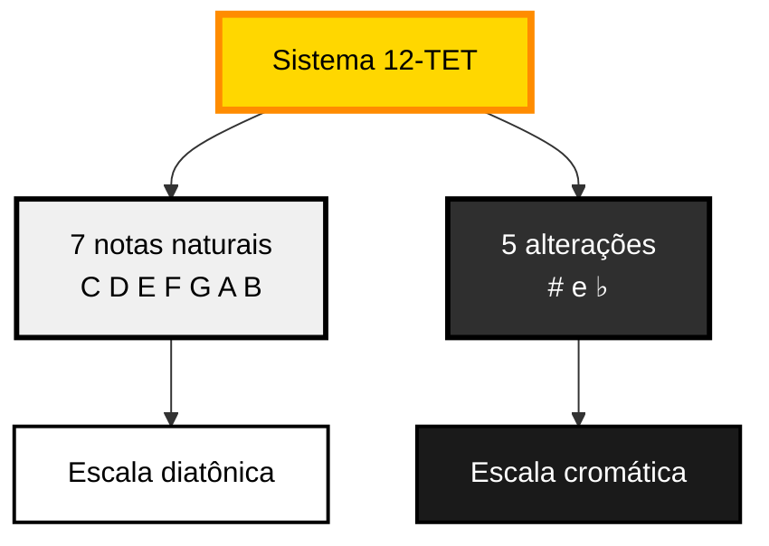
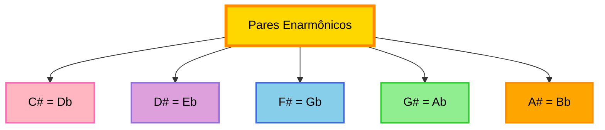
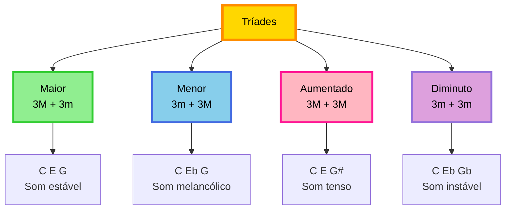
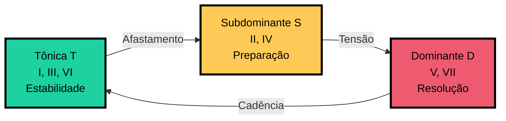

# Conceitos Básicos de Teoria Musical

Fundamentos de teoria musical ocidental para uso efetivo do Gingo.

**Público-alvo**

Este guia cobre conceitos essenciais de teoria musical, adequado para iniciantes com ou sem conhecimento prévio de música.

## Sistema Musical Ocidental

A música ocidental baseia-se no **sistema temperado de 12 tons** (12-TET, *twelve-tone equal temperament*), onde a oitava é dividida em 12 semitons equidistantes. Este sistema permite transposição e modulação uniformes entre todas as tonalidades.



---

## 1. Notas Musicais

**Notas musicais** são os elementos fundamentais da teoria musical. No sistema ocidental, existem 7 notas naturais que formam a base da escala diatônica.

### Notação Anglo-Saxônica

O Gingo utiliza notação anglo-saxônica (internacional):

| Anglo-Saxônica | Latina | Posição |
|----------------|--------|---------|
| C | Dó | 1 |
| D | Ré | 2 |
| E | Mi | 3 |
| F | Fá | 4 |
| G | Sol | 5 |
| A | Lá | 6 |
| B | Si | 7 |

**Notação no Gingo**

```python
from gingo import Note

# Construtor aceita notação anglo-saxônica
nota = Note("C")    # Dó
print(nota.name())  # "C"

# Cálculo de frequência (afinação padrão A4 = 440 Hz)
freq = nota.frequency(4)  # C4 (Dó central)
print(f"{freq:.2f} Hz")   # 261.63 Hz
```

### Ciclo de Oitavas

As notas repetem-se em **oitavas**, formando um ciclo infinito de mesmas classes de altura (*pitch classes*) em diferentes registros:

```
...  C2  D2  E2  F2  G2  A2  B2  C3  D3  E3  F3  G3  A3  B3  C4  ...
                                                    └─ Dó central
```

**Para músicos avançados**

A oitava (intervalo de 12 semitons) representa uma relação de frequência de 2:1. No sistema temperado, cada semitom corresponde a uma razão de 2^(1/12) ≈ 1.05946.

### Alterações Cromáticas

Notas naturais podem ser alteradas por **acidentes**:

- **Sustenido (#)**: eleva a nota em 1 semitom
- **Bemol (♭ ou b)**: abaixa a nota em 1 semitom
- **Dobrado sustenido (##)**: eleva 2 semitons
- **Dobrado bemol (♭♭)**: abaixa 2 semitons
- **Bequadro (♮)**: cancela alterações

```python
from gingo import Note

# Notas alteradas
cis = Note("C#")   # Dó sustenido
reb = Note("Db")   # Ré bemol
print(f"C# = {cis.semitone()} semitons")  # 1
print(f"Db = {reb.semitone()} semitons")  # 1
```

### Enarmonia

**Notas enarmônicas** são notas com nomes diferentes mas mesma altura sonora. No sistema temperado, C# e Db produzem exatamente a mesma frequência.



**Resolução Enarmônica no Gingo**

O Gingo resolve enarmonia automaticamente baseado no contexto harmônico. Por exemplo, Db minor usa Fb (não E) para manter a ortografia formal da escala.

```python
from gingo import Scale

# Escala usa ortografia correta
dbm = Scale("Db", "minor")
notas = [n.name() for n in dbm.notes()]
# ['Db', 'Eb', 'Fb', 'Gb', 'Ab', 'Bbb', 'Cb']
#             ^-- Fb, não E

# Forma natural (canonizada)
natural = [n.natural() for n in dbm.notes()]
# ['C#', 'D#', 'E', 'F#', 'G#', 'A', 'B']
```

---

## 2. Intervalos

**Intervalo** é a distância entre duas notas, medida em **semitons** (a menor distância no sistema temperado).

### Classificação por Distância

| Intervalo | Semitons | Exemplo (de C) |
|-----------|----------|----------------|
| Uníssono | 0 | C → C |
| Segunda menor | 1 | C → Db |
| Segunda maior | 2 | C → D |
| Terça menor | 3 | C → Eb |
| Terça maior | 4 | C → E |
| Quarta justa | 5 | C → F |
| Quarta aumentada | 6 | C → F# |
| Quinta diminuta | 6 | C → Gb |
| Quinta justa | 7 | C → G |
| Sexta menor | 8 | C → Ab |
| Sexta maior | 9 | C → A |
| Sétima menor | 10 | C → Bb |
| Sétima maior | 11 | C → B |
| Oitava | 12 | C → C |

### Qualidade dos Intervalos

Intervalos são classificados por **qualidade**:

- **Maiores (M)** e **menores (m)**: segundas, terças, sextas, sétimas
- **Justos (P)**: uníssonos, quartas, quintas, oitavas
- **Aumentados (+)** e **diminutos (°)**: alterações das categorias acima

**Notação de Intervalos**

O Gingo suporta notação latina e anglo-saxônica:

```python
from gingo import Interval

# Construção por semitons
terça_maior = Interval(4)
print(terça_maior)  # "3M"

# Construção por nome (latino)
quinta = Interval("5J")  # Quinta justa

# Conversão anglo-saxônica
print(quinta.anglo_saxon())  # "P5" (Perfect fifth)

# Consulta de semitons
print(quinta.semitones())    # 7
```

### Inversão de Intervalos

A **inversão** de um intervalo I de n semitons é um intervalo de (12 - n) semitons:

- Terça maior (4) ↔ Sexta menor (8)
- Quarta justa (5) ↔ Quinta justa (7)
- Segunda maior (2) ↔ Sétima menor (10)

---

## 3. Acordes

**Acorde** é a sobreposição simultânea de 3 ou mais notas. Acordes são construídos por **intervalos** a partir de uma nota fundamental (*root*).

### Tríades

**Tríades** são acordes de 3 notas formados por terças superpostas:

| Tipo | Fórmula (intervalos) | Exemplo (C) | Estrutura |
|------|----------------------|-------------|-----------|
| Maior (M) | 3M + 3m | C E G | Terça maior + quinta justa |
| Menor (m) | 3m + 3M | C Eb G | Terça menor + quinta justa |
| Aumentado (aug) | 3M + 3M | C E G# | Duas terças maiores |
| Diminuto (dim) | 3m + 3m | C Eb Gb | Duas terças menores |



### Tétrades (Sétimas)

**Tétrades** são acordes de 4 notas com adição de sétima:

| Tipo | Fórmula | Exemplo (C) |
|------|---------|-------------|
| Maior com 7ª maior (M7) | 1 3M 5J 7M | C E G B |
| Dominante (7) | 1 3M 5J 7m | C E G Bb |
| Menor com 7ª (m7) | 1 3m 5J 7m | C Eb G Bb |
| Meio-diminuto (m7b5) | 1 3m 5dim 7m | C Eb Gb Bb |
| Diminuto (dim7) | 1 3m 5dim 7dim | C Eb Gb Bbb |

**Acordes no Gingo**

```python
from gingo import Chord

# Construção por símbolo
cm7 = Chord("Cm7")
print([n.name() for n in cm7.notes()])
# ['C', 'Eb', 'G', 'Bb']

# Informações do acorde
print(cm7.root())           # Note("C")
print(cm7.type())           # "m7"
print(cm7.interval_labels()) # ['P1', '3m', '5J', '7m']

# Identificação reversa
chord = Chord.identify(["C", "E", "G"])
print(chord.name())  # "CM"
```

### Inversões

**Inversões** alteram a ordem das notas sem mudar o acorde:

- **Fundamental**: raiz no baixo (C E G)
- **1ª inversão**: terça no baixo (E G C)
- **2ª inversão**: quinta no baixo (G C E)

```python
from gingo import Chord

cm = Chord("CM")
print([n.name() for n in cm.inversion(0)])  # ['C', 'E', 'G']
print([n.name() for n in cm.inversion(1)])  # ['E', 'G', 'C']
print([n.name() for n in cm.inversion(2)])  # ['G', 'C', 'E']
```

---

## 4. Escalas

**Escala** é uma sequência ordenada de notas dentro de uma oitava. Escalas definem o material melódico e harmônico de uma tonalidade.

### Escalas Diatônicas

A **escala diatônica** tem 7 notas organizadas em padrões específicos de tons (T) e semitons (S):

| Escala | Padrão | Exemplo (C) |
|--------|--------|-------------|
| Maior | T T S T T T S | C D E F G A B |
| Menor Natural | T S T T S T T | C D Eb F G Ab Bb |
| Menor Harmônica | T S T T S 3S S | C D Eb F G Ab B |
| Menor Melódica | T S T T T T S | C D Eb F G A B |

**Escala Maior**

A escala maior é o paradigma central da música tonal ocidental. Sua estrutura intervalar (T T S T T T S) define as relações funcionais entre os graus.

### Modos da Escala Maior

Os **modos gregos** são rotações da escala maior, cada um iniciando em um grau diferente:

| Modo | Grau | Padrão | Caráter |
|------|------|--------|---------|
| Iônico | I | T T S T T T S | Mesmo que maior |
| Dórico | II | T S T T T S T | Menor com 6ª maior |
| Frígio | III | S T T T S T T | Menor com 2ª menor |
| Lídio | IV | T T T S T T S | Maior com 4ª aumentada |
| Mixolídio | V | T T S T T S T | Maior com 7ª menor |
| Eólio | VI | T S T T S T T | Menor natural |
| Lócrio | VII | S T T S T T T | Diminuto |

```python
from gingo import Scale

# Escala maior
c_major = Scale("C", "major")
print([n.name() for n in c_major.notes()])
# ['C', 'D', 'E', 'F', 'G', 'A', 'B']

# Modo dórico (mesmo parent, modo 2)
d_dorian = Scale("D", "dorian")
print([n.name() for n in d_dorian.notes()])
# ['D', 'E', 'F', 'G', 'A', 'B', 'C']
#  ^-- mesmas notas que C major, rotacionadas

# Navegação entre modos
print(c_major.mode(2))  # Scale("D", "dorian")
print(c_major.mode("lydian"))  # Scale("F", "lydian")
```

### Graus da Escala

Cada nota de uma escala ocupa um **grau** com função específica:

| Grau | Nome | Função | Exemplo (C major) |
|------|------|--------|-------------------|
| I | Tônica | Centro tonal | C |
| II | Supertônica | Tensão leve | D |
| III | Mediante | Define modo | E |
| IV | Subdominante | Preparação | F |
| V | Dominante | Máxima tensão | G |
| VI | Superdominante | Relativa | A |
| VII | Sensível | Conduz à tônica | B |

**Acesso por Grau**

```python
from gingo import Scale

s = Scale("C", "major")

# Acessar graus (1-indexed)
print(s.degree(1))     # Note("C")  - tônica
print(s.degree(5))     # Note("G")  - dominante

# Encadeamento (V de V)
print(s.degree(5, 5))  # Note("D")  - dominante da dominante
```

### Escalas Pentatônicas

**Escalas pentatônicas** são subconjuntos de 5 notas das escalas diatônicas:

- **Maior pentatônica**: graus 1, 2, 3, 5, 6
- **Menor pentatônica**: graus 1, 3, 4, 5, 7

```python
from gingo import Scale

# Pentatônicas são variações modais
c_penta = Scale("C", "major pentatonic")
print([n.name() for n in c_penta.notes()])
# ['C', 'D', 'E', 'G', 'A']  -- sem F e B

# Conversão
c_major = Scale("C", "major")
c_penta = c_major.pentatonic()
```

---

## 5. Campo Harmônico

**Campo harmônico** é o conjunto de acordes derivados dos graus de uma escala. Cada grau gera uma tríade (ou tétrade) formada por terças superpostas.

### Campo de Dó Maior

| Grau | Tríade | Tétrade | Função |
|------|--------|---------|--------|
| I | CM | CM7 | Tônica |
| II | Dm | Dm7 | Subdominante |
| III | Em | Em7 | Tônica relativa |
| IV | FM | FM7 | Subdominante |
| V | GM | G7 | Dominante |
| VI | Am | Am7 | Tônica relativa |
| VII | Bdim | Bm7b5 | Dominante |

```python
from gingo import Field, ScaleType

# Criar campo harmônico
campo = Field("C", ScaleType.Major)

# Tríades
triades = [c.name() for c in campo.triads()]
print(triades)
# ['CM', 'Dm', 'Em', 'FM', 'GM', 'Am', 'Bdim']

# Tétrades
tetrades = [c.name() for c in campo.sevenths()]
print(tetrades)
# ['CM7', 'Dm7', 'Em7', 'FM7', 'G7', 'Am7', 'Bm7b5']

# Funções harmônicas
funcoes = [f.short() for f in campo.functions()]
print(funcoes)
# ['T', 'S', 'T', 'S', 'D', 'T', 'D']
```

### Funções Harmônicas

Os acordes do campo harmônico exercem três **funções**:



- **Tônica (T)**: centro tonal, repouso
- **Subdominante (S)**: movimento, preparação
- **Dominante (D)**: tensão, resolução para tônica

**Análise Funcional**

```python
from gingo import Field, Chord, HarmonicFunction

campo = Field("C", "major")

# Obter função de um acorde
print(campo.function("I"))    # HarmonicFunction.Tonic
print(campo.function("V7"))   # HarmonicFunction.Dominant

# Acordes por função
tonics = campo.chords_with_function(HarmonicFunction.Tonic)
print([c.name() for c in tonics])  # ['CM', 'Em', 'Am']
```

### Acordes Aplicados

**Acordes aplicados** (ou secundários) são dominantes temporárias de graus diatônicos:

- V7/II: dominante do II grau (D7 em C major)
- V7/IV: dominante do IV grau (C7 em C major)
- V7/V: dominante do V grau (D7 em C major)

```python
from gingo import Field

campo = Field("C", "major")

# Acessar acorde aplicado
v7_of_4 = campo.applied("V7", 4)  # V7/IV
print(v7_of_4.name())  # "C7"
```

---

## 6. Progressões Harmônicas

**Progressões harmônicas** são sequências de acordes que criam movimento tonal. O Gingo implementa a **Teoria das Árvores Harmônicas** de José de Alencar para validação de progressões.

### Progressões Comuns

| Nome | Graus | Exemplo (C) | Uso |
|------|-------|-------------|-----|
| II-V-I | IIm - V7 - I | Dm7 - G7 - CM | Cadência do jazz |
| I-IV-V | I - IV - V | C - F - G | Blues, rock |
| I-V-vi-IV | I - V - vi - IV | C - G - Am - F | Pop moderno |
| I-vi-ii-V | I - vi - ii - V | C - Am - Dm - G | Progressão circular |

```python
from gingo import Tree, ScaleType, Progression

# Criar árvore harmônica (especificando tradição)
tree = Tree("C", ScaleType.Major, "harmonic_tree")

# Validar progressão
valid = tree.is_valid(["IIm", "V7", "I"])
print(valid)  # True

# Encontrar caminho mais curto
path = tree.shortest_path("I", "V7")
print(path)  # ['I', 'V7']

# Obter todos os branches
branches = tree.branches()
print(branches[:5])
# ['I', 'IIm', 'IIIm', 'IV', 'V7', ...]

# Usar Progression para análise cross-tradition
prog = Progression("C", "major")
match = prog.identify(["IIm", "V7", "I"])
print(match.tradition)  # "harmonic_tree"
print(match.schema)     # "descending"
```

### Movimento das Fundamentais

O **movimento das fundamentais** (*root motion*) classifica a distância intervalar entre raízes de acordes consecutivos:

- **Quinta descendente** (V → I): resolução forte
- **Segunda ascendente** (ii → iii): movimento fraco
- **Terça descendente** (I → vi): deceptive

**Análise de Progressão**

```python
from gingo import Field, Chord

campo = Field("C", "major")

# Comparar dois acordes
r = campo.compare(Chord("Dm"), Chord("GM"))

print(f"Graus: {r.degree_a} → {r.degree_b}")  # 2 → 5
print(f"Funções: {r.function_a.short()} → {r.function_b.short()}")  # S → D
print(f"Movimento: {r.root_motion}")  # ascending_fourth
```

---

## Referências

Para aprofundamento teórico, consulte:

- [Referências Bibliográficas](../referencias.md) - Obras que fundamentam o Gingo
- [API Reference](../api/referencia.md) - Documentação completa das classes
- [Teoria das Árvores Harmônicas](.old/arvore/teoria_arvores_harmonicas.md) - Base teórica do módulo Tree

**Próximos Passos**

- **[Primeiros Passos](primeiros-passos.md)**: Exemplos práticos de código
- **[Introdução](introducao.md)**: Visão geral da biblioteca
- **[Tutoriais](../tutoriais/notas.md)**: Guias detalhados de cada classe
