# Exemplos Praticos

Exemplos de uso real cobrindo todas as funcionalidades do Gingo.
Cada secao mostra a API Python, a CLI, e aplicacoes musicais concretas.

---

## 1. Fretboard — Digitacoes de violao

O `Fretboard` modela o braco de instrumentos de cordas e calcula digitacoes
otimas usando o sistema CAGED. Suporta violao (6 cordas), cavaquinho (4 cordas),
bandolim (4 cordas) e instrumentos customizados.

### Digitacao de um acorde

```python
from gingo import Fretboard, Chord

fb = Fretboard.violao()

# Digitacao otima para Am (a melhor entre todas as posicoes)
f = fb.fingering(Chord("Am"))
print(f)              # Fingering: X 0 2 2 1 0
print(f.chord_name)   # "Am"
print(f.base_fret)    # 1
print(f.barre)        # 0 (sem pestana)

# Detalhes de cada corda
for s in f.strings:
    if s.action.name == "Open":
        print(f"  Corda {s.string}: solta ({fb.note_at(s.string, 0)})")
    elif s.action.name == "Fretted":
        print(f"  Corda {s.string}: casa {s.fret} ({fb.note_at(s.string, s.fret)})")
    else:
        print(f"  Corda {s.string}: muda")

# Notas MIDI da digitacao (para sintese ou MIDI export)
print(f.midi_notes)   # [45, 52, 57, 60, 64]
```

**Saida:**

```
Am fingering
chord_name: Am
base_fret: 1
barre: 0
  Corda 1: solta (E)
  Corda 2: casa 1 (C)
  Corda 3: casa 2 (A)
  Corda 4: casa 2 (E)
  Corda 5: solta (A)
  Corda 6: muda
midi_notes: [45, 52, 57, 60, 64]
```

### Todas as digitacoes possiveis

```python
from gingo import Fretboard, Chord

fb = Fretboard.violao()

# O Gingo encontra TODAS as digitacoes validas e rankeia por conforto
for i, fig in enumerate(fb.fingerings(Chord("GM")), 1):
    print(f"{i}. {fig} (base: casa {fig.base_fret}, barre: {fig.barre})")
```

### Pestanas (barre chords)

```python
from gingo import Fretboard, Chord

fb = Fretboard.violao()

# Acordes com pestana — o algoritmo CAGED encontra automaticamente
acordes_barre = ["FM", "BbM", "Bm", "F#m", "C#M", "AbM"]

for nome in acordes_barre:
    f = fb.fingering(Chord(nome))
    barre = "pestana" if f.barre else "sem pestana"
    print(f"{nome:5s}: {f}  ({barre}, casa {f.base_fret})")
```

**Saida:**

```
FM   : FM fingering   (pestana, casa 1)
BbM  : BbM fingering  (pestana, casa 1)
Bm   : Bm fingering   (pestana, casa 2)
F#m  : F#m fingering  (pestana, casa 2)
C#M  : C#M fingering  (pestana, casa 4)
AbM  : AbM fingering  (pestana, casa 4)
```

### Capo — transpor com capotraste

```python
from gingo import Fretboard, Chord

fb = Fretboard.violao()

# Com capo na casa 2, as formas ficam mais simples
fb_capo2 = fb.capo(2)
print(fb_capo2.name())   # "violao (capo 2)"

# Am shape com capo 2 = Bm (transposto 2 semitons)
print(fb_capo2.fingering(Chord("Bm")))

# Comparar: Bm sem capo vs com capo 2
print(f"Bm sem capo: {fb.fingering(Chord('Bm'))}")
print(f"Bm com capo 2: {fb_capo2.fingering(Chord('Bm'))}")
```

### Posicoes de escala no braco

```python
from gingo import Fretboard, Scale

fb = Fretboard.violao()

# C maior pentatonica nas casas 0-12
escala = Scale("C", "major pentatonic")
posicoes = fb.scale_positions(escala, 0, 12)

# Organizar por corda
for corda in range(1, 7):
    notas = [p for p in posicoes if p.string == corda]
    casas = ", ".join(f"{p.fret}({p.note})" for p in notas)
    print(f"  Corda {corda}: {casas}")
```

**Saida:**

```
  Corda 1: 0(E), 3(G), 5(A), 8(C), 10(D), 12(E)
  Corda 2: 1(C), 3(D), 5(E), 8(G), 10(A)
  Corda 3: 0(G), 2(A), 5(C), 7(D), 9(E), 12(G)
  Corda 4: 0(D), 2(E), 5(G), 7(A), 10(C), 12(D)
  Corda 5: 0(A), 3(C), 5(D), 7(E), 10(G), 12(A)
  Corda 6: 0(E), 3(G), 5(A), 8(C), 10(D), 12(E)
```

### Encontrar uma nota no braco inteiro

```python
from gingo import Fretboard, Note

fb = Fretboard.violao()

# Onde fica o La (A) no braco?
for p in fb.positions(Note("A")):
    print(f"  Corda {p.string}, casa {p.fret}: {p.note}{p.octave} (MIDI {p.midi})")
```

### Mapa do braco — nota em cada posicao

```python
from gingo import Fretboard

fb = Fretboard.violao()

# Primeiras 5 casas de cada corda
for corda in range(1, 7):
    notas = [f"{str(fb.note_at(corda, casa)):2s}" for casa in range(6)]
    print(f"  Corda {corda}: {' | '.join(notas)}")
```

**Saida:**

```
  Corda 1: E  | F  | F# | G  | G# | A
  Corda 2: B  | C  | C# | D  | D# | E
  Corda 3: G  | G# | A  | A# | B  | C
  Corda 4: D  | D# | E  | F  | F# | G
  Corda 5: A  | A# | B  | C  | C# | D
  Corda 6: E  | F  | F# | G  | G# | A
```

### Identificar acorde por posicoes

```python
from gingo import Fretboard

fb = Fretboard.violao()

# Voce esta pressionando estas posicoes — que acorde e?
# (corda, casa): (5,3) (4,2) (3,0) (2,0) (1,0)
acorde = fb.identify([(5, 3), (4, 2), (3, 0), (2, 0), (1, 0)])
print(f"Acorde identificado: {acorde}")   # CM
```

### Cavaquinho e bandolim

```python
from gingo import Fretboard, Chord, Scale

# Factory methods para instrumentos brasileiros
cav = Fretboard.cavaquinho()
band = Fretboard.bandolim()

print(f"Cavaquinho: {cav.num_strings()} cordas, {cav.num_frets()} trastes")
print(f"Bandolim: {band.num_strings()} cordas, {band.num_frets()} trastes")

# Digitacoes no cavaquinho
for nome in ["CM", "GM", "Am", "Dm", "FM"]:
    f = cav.fingering(Chord(nome))
    print(f"  {nome}: {f}")

# Escala no bandolim
posicoes = band.scale_positions(Scale("A", "minor pentatonic"), 0, 7)
print(f"\nA minor penta no bandolim: {len(posicoes)} posicoes")
```

### Instrumento customizado

```python
from gingo import Fretboard, Chord

# Fretboard(nome, open_midi, num_frets)
# Ukulele: G4=67, C4=60, E4=64, A4=69
uke = Fretboard("ukulele", [67, 60, 64, 69], 12)

print(f"Strings: {uke.num_strings()}, Frets: {uke.num_frets()}")
print(f"CM: {uke.fingering(Chord('CM'))}")
print(f"Am: {uke.fingering(Chord('Am'))}")
print(f"FM: {uke.fingering(Chord('FM'))}")

# Baixo: E1=28, A1=33, D2=38, G2=43
bass = Fretboard("baixo", [28, 33, 38, 43], 20)
print(f"\nBaixo: {bass.num_strings()} cordas, {bass.num_frets()} trastes")
```

### CLI

```bash
gingo fretboard chord Am               # digitacao padrao
gingo fretboard chord FM               # pestana automatica
gingo fretboard chord GM --all         # todas as digitacoes
gingo fretboard scale "C major" 0 12   # posicoes no braco
gingo fretboard scale "A blues" 5 12   # blues a partir da casa 5
```

---

## 2. FretboardSVG — Diagramas visuais

O `FretboardSVG` gera imagens SVG de chord boxes, fretboards completos,
campos harmonicos e progressoes. Suporta orientacao horizontal/vertical
e lateralidade destro/canhoto.

### Chord box (diagrama de acorde)

```python
from gingo import Fretboard, FretboardSVG, Chord

fb = Fretboard.violao()

# Chord box padrao (vertical, destro)
am_svg = FretboardSVG.chord(fb, Chord("Am"))
FretboardSVG.write(am_svg, "am_chord.svg")

# Acorde com pestana
fm_svg = FretboardSVG.chord(fb, Chord("FM"))
FretboardSVG.write(fm_svg, "fm_barre.svg")
```

**Resultado:**

<div style="display: flex; gap: 16px; align-items: flex-start;">
<figure>
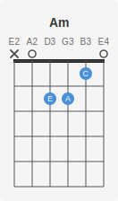
<figcaption>Am (sem pestana)</figcaption>
</figure>
<figure>
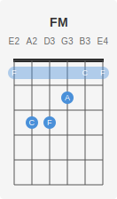
<figcaption>FM (pestana)</figcaption>
</figure>
</div>

### Chord box a partir de um Fingering

```python
from gingo import Fretboard, FretboardSVG, Chord

fb = Fretboard.violao()

# Pegar uma digitacao especifica (ex: segunda melhor)
figs = fb.fingerings(Chord("CM"))
if len(figs) > 1:
    second_best = figs[1]
    svg = FretboardSVG.fingering(fb, second_best)
    FretboardSVG.write(svg, "cm_alt.svg")
```

### Escala no braco completo (horizontal)

```python
from gingo import Fretboard, FretboardSVG, Scale

fb = Fretboard.violao()

# Braco horizontal com notas da escala
blues = Scale("A", "blues")
svg = FretboardSVG.scale(fb, blues)
FretboardSVG.write(svg, "a_blues.svg")
```

**Resultado:**

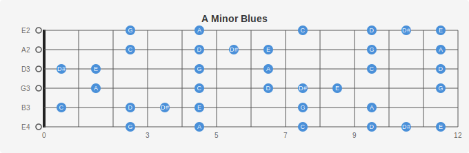

### Nota unica no braco

```python
from gingo import Fretboard, FretboardSVG, Note

fb = Fretboard.violao()

# Todas as posicoes de E no braco
svg = FretboardSVG.note(fb, Note("A"))
FretboardSVG.write(svg, "all_A.svg")
```

**Resultado:**

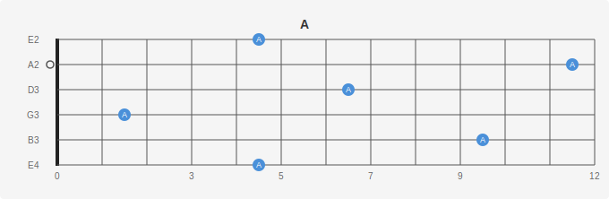

### Posicoes arbitrarias

```python
from gingo import Fretboard, FretboardSVG, FretPosition

fb = Fretboard.violao()

# Marcar posicoes especificas (ex: shape de Am pentatonica, posicao 5)
posicoes = [
    FretPosition(6, 5), FretPosition(6, 8),   # corda 6
    FretPosition(5, 5), FretPosition(5, 7),   # corda 5
    FretPosition(4, 5), FretPosition(4, 7),   # corda 4
    FretPosition(3, 5), FretPosition(3, 7),   # corda 3
    FretPosition(2, 5), FretPosition(2, 8),   # corda 2
    FretPosition(1, 5), FretPosition(1, 8),   # corda 1
]
svg = FretboardSVG.positions(fb, posicoes)
FretboardSVG.write(svg, "am_penta_pos5.svg")
```

### Campo harmonico em grid

```python
from gingo import Fretboard, FretboardSVG, Field, Layout

fb = Fretboard.violao()

# Grid: 7 chord boxes em grade (ideal para estudo)
campo = Field("G", "major")
svg = FretboardSVG.field(fb, campo, layout=Layout.Grid)
FretboardSVG.write(svg, "g_major_grid.svg")
```

**Resultado (Grid):**

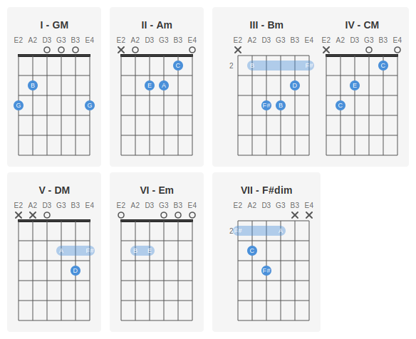

### Progressao especifica

```python
from gingo import Fretboard, FretboardSVG, Field

fb = Fretboard.violao()
campo = Field("C", "major")

# Progressao I-V-vi-IV (pop)
svg = FretboardSVG.progression(fb, campo, ["I", "V", "vi", "IV"])
FretboardSVG.write(svg, "pop_progression.svg")
```

**Resultado (I-V-vi-IV):**

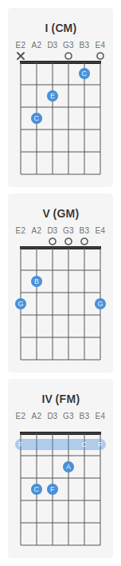

### Diagramas para canhoto

```python
from gingo import Fretboard, FretboardSVG, Chord, Scale, Handedness, Orientation

fb = Fretboard.violao()

# Chord box canhoto
svg = FretboardSVG.chord(fb, Chord("Em"), handedness=Handedness.LeftHanded)
FretboardSVG.write(svg, "em_left.svg")
```

**Resultado:**

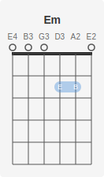

### Fretboard horizontal para canhoto

```python
from gingo import Fretboard, FretboardSVG, Scale, Orientation, Handedness

fb = Fretboard.violao()

# Braco horizontal canhoto
svg = FretboardSVG.scale(
    fb,
    Scale("E", "blues"),
    orientation=Orientation.Horizontal,
    handedness=Handedness.LeftHanded
)
FretboardSVG.write(svg, "blues_left.svg")
```

### Fretboard vazio (gabarito)

```python
from gingo import Fretboard, FretboardSVG, Orientation

fb = Fretboard.violao()

# Braco vazio para preencher a mao
svg = FretboardSVG.full(fb, orientation=Orientation.Horizontal)
FretboardSVG.write(svg, "blank_fretboard.svg")
```

### CLI

```bash
gingo fretboard chord Am --svg am.svg          # chord box
gingo fretboard chord Am --svg am_left.svg --left  # canhoto
gingo fretboard scale "C major" --svg          # escala horizontal
gingo fretboard scale "A blues" --svg --horizontal # horizontal explicito
gingo fretboard field "G major" --svg          # campo em grid
```

---

## 3. Piano — Voicings e teclado

O `Piano` modela um teclado fisico e calcula voicings em tres estilos:
Close (posicao cerrada), Open (raiz oitava abaixo) e Shell (root+3+7).

### Construcao e range

```python
from gingo import Piano

# Pianos de diferentes tamanhos
p25 = Piano(25)   # 2 oitavas: C3-C5 (compacto, ideal para exemplos)
p44 = Piano(44)   # 3.5 oitavas: D2-A5
p61 = Piano(61)   # 5 oitavas: C2-C7 (teclado comum)
p88 = Piano(88)   # Piano de concerto: A0-C8

for p in [p25, p44, p61, p88]:
    lo = p.lowest()
    hi = p.highest()
    print(f"Piano({p.num_keys}): {lo.note}{lo.octave} (MIDI {lo.midi})"
          f" ate {hi.note}{hi.octave} (MIDI {hi.midi})")
```

**Saida:**

```
Piano(25): C3 (MIDI 48) ate C5 (MIDI 72)
Piano(44): D2 (MIDI 38) ate A5 (MIDI 81)
Piano(61): F#1 (MIDI 30) ate F#6 (MIDI 90)
Piano(88): A0 (MIDI 21) ate C8 (MIDI 108)
```

### Voicings — tres estilos

```python
from gingo import Piano, Chord

p = Piano(25)

# Voicing padrao (close)
v = p.voicing(Chord("CM"))
teclas = ", ".join(f"{k.note}{k.octave}" for k in v.keys)
print(f"CM voicing: {teclas}")   # C4, E4, G4

# Todos os voicings disponiveis (close, open, shell)
for v in p.voicings(Chord("CM")):
    teclas = ", ".join(f"{k.note}{k.octave}" for k in v.keys)
    print(f"  {v.style.name:6s}: {teclas}")

# Close: C4 E4 G4       (posicao cerrada)
# Open:  C3 E4 G4       (raiz 1 oitava abaixo)
# Shell: C4 E4 G4       (raiz + terca + setima, sem quinta em tetrades)
```

**Saida:**

```
CM voicing: C4, E4, G4
  Close : C4, E4, G4
  Open  : C3, E4, G4
  Shell : C4, E4, G4
```

### Voicings de jazz

```python
from gingo import Piano, Chord

p = Piano(25)

# Voicings para acordes de jazz
jazz_chords = ["Dm7", "G7", "C7M", "F7M", "Bm7(b5)", "E7", "Am7"]

print("Acordes de C major:\n")
for nome in jazz_chords:
    v = p.voicing(Chord(nome))
    teclas = ", ".join(f"{k.note}{k.octave}" for k in v.keys)
    print(f"  {nome:10s}: {teclas}")
```

**Saida:**

```
  Dm7       : D4, F4, A4, C5
  G7        : G4, B4
  C7M       : C4, E4, G4, B4
  F7M       : F4, A4, C5
  Am7       : A4, C5
```

### Todos os voicings e inversoes

```python
from gingo import Piano, Chord

p = Piano(25)

# Todas as formas de tocar CM neste piano
for v in p.voicings(Chord("CM")):
    teclas = ", ".join(f"{k.note}{k.octave}" for k in v.keys)
    print(f"  {v.style.name:6s} inv.{v.inversion}: {teclas}")

# Piano maior revela mais voicings
p88 = Piano(88)
for v in p88.voicings(Chord("CM")):
    teclas = ", ".join(f"{k.note}{k.octave}" for k in v.keys)
    print(f"  {v.style.name:6s} inv.{v.inversion}: {teclas}")
```

### Teclas de uma escala

```python
from gingo import Piano, Scale

p = Piano(25)
escala = Scale("C", "major")

# Quais teclas tocar para a escala de C maior?
for k in p.scale_keys(escala):
    cor = "branca" if k.white else "preta"
    print(f"  {k.note}{k.octave}: tecla {cor}, posicao {k.position} (MIDI {k.midi})")
```

**Saida:**

```
  C4: tecla branca (MIDI 60)
  D4: tecla branca (MIDI 62)
  E4: tecla branca (MIDI 64)
  F4: tecla branca (MIDI 65)
  G4: tecla branca (MIDI 67)
  A4: tecla branca (MIDI 69)
  B4: tecla branca (MIDI 71)
```

### Consultar tecla individual

```python
from gingo import Piano, Note

p = Piano(88)

# Info sobre uma tecla especifica
k = p.key(Note("A"), 4)
print(f"La 4: MIDI {k.midi}, posicao {k.position}, "
      f"{'branca' if k.white else 'preta'}")

# Todas as teclas de C no piano
for k in p.keys(Note("C")):
    print(f"  C{k.octave}: MIDI {k.midi}")
```

### Identificar acorde por MIDI

```python
from gingo import Piano

p = Piano(88)

# O aluno pressionou estas teclas — que acorde e?
acorde = p.identify([60, 64, 67])      # C4, E4, G4
print(f"MIDI [60, 64, 67] = {acorde}")  # CM

acorde = p.identify([57, 60, 64, 67])  # A3, C4, E4, G4
print(f"MIDI [57, 60, 64, 67] = {acorde}")  # Am7
```

**Saida:**

```
MIDI [60, 64, 67] = CM
MIDI [57, 60, 64, 67] = Am7
```

### Verificar range

```python
from gingo import Piano

p = Piano(25)

# A nota esta no range deste teclado?
print(p.in_range(60))   # True  — C4 esta no Piano(25)
print(p.in_range(21))   # False — A0 nao esta no Piano(25)
print(p.in_range(84))   # False — C6 nao esta no Piano(25)
```

---

## 4. PianoSVG — Visualizacao do teclado

O `PianoSVG` gera imagens SVG interativas com HTML5 data attributes
(`data-midi`, `data-note`, `data-octave`) para integracao com JavaScript.

### Acorde destacado no teclado

```python
from gingo import Piano, PianoSVG, Chord

p = Piano(25)

# Teclas de Am7 destacadas em azul
svg = PianoSVG.chord(p, Chord("Am7"))
PianoSVG.write(svg, "piano_am7.svg")
```

**Resultado:**

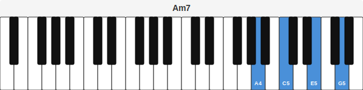

```python
# Piano completo com acorde
p88 = Piano(88)
svg = PianoSVG.chord(p88, Chord("CM"))
PianoSVG.write(svg, "piano_full_cm.svg")
```

**Resultado (88 teclas):**


### Voicing especifico no teclado

```python
from gingo import Piano, PianoSVG, Chord

p = Piano(25)

# Visualizar voicing padrao
v = p.voicing(Chord("Dm7"))
svg = PianoSVG.voicing(p, v)
PianoSVG.write(svg, "piano_dm7.svg")
```

**Resultado:**

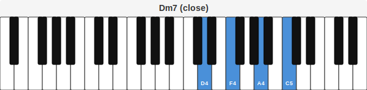

### Escala no teclado

```python
from gingo import Piano, PianoSVG, Scale

p = Piano(25)

# Escalas visuais para estudo
for nome in ["C major", "A natural minor", "C blues", "C harmonic minor"]:
    escala = Scale(*nome.split(" ", 1))
    svg = PianoSVG.scale(p, escala)
    filename = nome.replace(" ", "_")
    PianoSVG.write(svg, f"piano_{filename}.svg")
```

**Resultado (C major):**

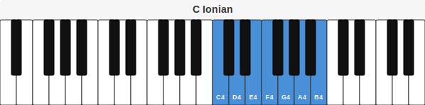

### Campo harmonico em pianos empilhados

```python
from gingo import Piano, PianoSVG, Field

p = Piano(25)

# 7 teclados empilhados — um por grau do campo
campo = Field("C", "major")
svg = PianoSVG.field(p, campo)
PianoSVG.write(svg, "piano_field_cmaj.svg")
```

**Resultado:**


### Progressao

```python
from gingo import Piano, PianoSVG, Field

p = Piano(25)
campo = Field("C", "major")

# Progressao ii-V-I em teclados empilhados
svg = PianoSVG.progression(p, campo, ["ii", "V", "I"])
PianoSVG.write(svg, "piano_251.svg")
```

**Resultado:**

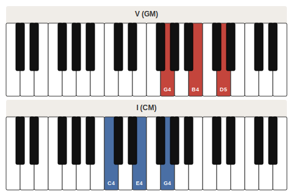

### Nota individual e teclas MIDI

```python
from gingo import Piano, PianoSVG, Note

p = Piano(25)

# Nota individual
svg = PianoSVG.note(p, Note("E"))
PianoSVG.write(svg, "piano_e.svg")

# Teclas por numero MIDI (util para MIDI controllers)
svg = PianoSVG.midi(p, [60, 64, 67])
PianoSVG.write(svg, "piano_ceg_midi.svg")
```

**Resultado (nota E):**

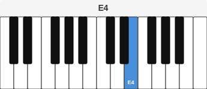

**Resultado (MIDI 60, 64, 67):**

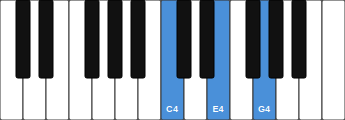

### Integracao com JavaScript

O SVG gerado inclui atributos HTML5 em cada tecla:

```html
<rect id="key-60" class="w h" data-midi="60" data-note="C" data-octave="4" .../>
```

Isso permite interatividade com JavaScript/D3/React:

```javascript
// Exemplo: destacar tecla ao clicar
document.querySelectorAll('[data-midi]').forEach(key => {
    key.addEventListener('click', () => {
        const midi = key.dataset.midi;
        const note = key.dataset.note;
        console.log(`Pressionou ${note} (MIDI ${midi})`);
    });
});
```

---

## 5. MusicXML — Exportacao para partitura

O `MusicXML` serializa objetos do Gingo para MusicXML 4.0, compativel
com MuseScore, Finale, Sibelius, Dorico e qualquer editor que suporte
o formato.

### Nota, acorde e escala

```python
from gingo import MusicXML, Note, Chord, Scale

# Nota individual
xml = MusicXML.note(Note("C"))
MusicXML.write(xml, "nota_do.musicxml")

# Acorde
MusicXML.write(MusicXML.chord(Chord("Am7")), "am7.musicxml")

# Escala completa (ascendente)
MusicXML.write(MusicXML.scale(Scale("C", "major")), "c_major.musicxml")
```

**Saida (trecho do XML gerado):**

```xml
<?xml version="1.0" encoding="UTF-8"?>
<!DOCTYPE score-partwise PUBLIC "-//Recordare//DTD MusicXML 4.0 Partwise//EN"
  "http://www.musicxml.org/dtds/partwise.dtd">
<score-partwise version="4.0">
  <work>
    <work-title>C4</work-title>
  </work>
  <identification>
    <encoding>
      <software>Gingo</software>
    </encoding>
  </identification>
  ...
</score-partwise>
```

Os arquivos `.musicxml` abrem diretamente no **MuseScore**, **Finale**, **Sibelius** e **Dorico**.

### Campo harmonico

```python
from gingo import MusicXML, Field

# Campo de G maior — 7 acordes em partitura
MusicXML.write(MusicXML.field(Field("G", "major")), "g_field.musicxml")

# Campo de A menor harmonico
MusicXML.write(
    MusicXML.field(Field("A", "harmonic minor")),
    "am_harm_field.musicxml"
)
```

### Sequencia com ritmo

```python
from gingo import (
    MusicXML, Sequence, NoteEvent, ChordEvent, Rest,
    Duration, Tempo, Note, Chord
)

# Criar uma melodia simples
seq = Sequence(Tempo(120))
melodia = ["C", "D", "E", "F", "G", "A", "B", "C"]

for nota in melodia[:-1]:
    seq.add(NoteEvent(Note(nota), Duration("quarter")))

# Ultima nota mais longa
seq.add(NoteEvent(Note("C"), Duration("whole")))

MusicXML.write(MusicXML.sequence(seq), "melodia.musicxml")
# Abra no MuseScore para ver e ouvir a partitura
```

### Progressao com acordes ritmados

```python
from gingo import (
    MusicXML, Sequence, ChordEvent, Rest,
    Duration, Tempo, Chord
)

# ii-V-I em semibreves
seq = Sequence(Tempo(100))
seq.add(ChordEvent(Chord("Dm7"), Duration("whole")))
seq.add(ChordEvent(Chord("G7"), Duration("whole")))
seq.add(ChordEvent(Chord("C7M"), Duration("whole")))
seq.add(Rest(Duration("whole")))

MusicXML.write(MusicXML.sequence(seq), "jazz_251.musicxml")
```

---

## 6. Progression — Analise cross-tradition

O `Progression` e o coordenador de analise harmonica. Ele conhece
multiplas tradicoes (arvore harmonica brasileira e jazz) e pode
identificar, deduzir e prever progressoes.

### Tradicoes disponiveis

```python
from gingo import Progression

for t in Progression.traditions():
    print(f"{t.name}")
    print(f"  {t.description}")
```

**Saida:**

```
harmonic_tree
  Harmonic Tree — José de Alencar Soares' model for Brazilian Popular Music harmonic progressions.
jazz
  Jazz — Common chord progressions from the jazz tradition, including ii-V-I patterns, turnarounds, and backdoor progressions.
```

### Identificar uma progressao

As branches precisam corresponder aos nos do grafo da tradicao. Use `tree.branches()`
para ver todas as branches validas.

```python
from gingo import Progression

prog = Progression("C", "major")

# Turnaround jazz: I-VIm-IIm-V7
match = prog.identify(["I", "VIm", "IIm", "V7"])
print(f"Tradicao: {match.tradition}")
print(f"Schema: {match.schema}")
print(f"Score: {match.score:.2f}")
print(f"Matched: {match.matched}/{match.total}")

# Cadencia direta: I-V7-I
match = prog.identify(["I", "V7", "I"])
print(f"\nDireta: {match.tradition}/{match.schema} "
      f"score={match.score:.2f}")
```

**Saida:**

```
Tradicao: jazz
Schema: turnaround
Score: 1.00
Matched: 3/3

Direta: harmonic_tree/direct score=1.00
```

### Deduzir progressao (multiplos resultados ranqueados)

```python
from gingo import Progression

prog = Progression("C", "major")

# Dadas estas branches, quais schemas se encaixam?
matches = prog.deduce(["I", "VIm", "IIm", "V7"], limit=5)
for m in matches:
    print(f"  {m.tradition}/{m.schema}: "
          f"score={m.score:.2f}, matched={m.matched}/{m.total}")
```

**Saida:**

```
  jazz/turnaround: score=1.00, matched=3/3
  harmonic_tree/: score=0.67, matched=2/3
```

### Prever proximo acorde

```python
from gingo import Progression

prog = Progression("C", "major")

# Dado IIm-V7, o que vem depois?
sugestoes = prog.predict(["IIm", "V7"])
for s in sugestoes:
    print(f"  Proximo: {s.next:8s} "
          f"(confianca: {s.confidence:.0%}, "
          f"via {s.tradition}/{s.schema})")
```

**Saida:**

```
  Proximo: I        (confianca: 100%, via jazz/ii-V-I)
  Proximo: I        (confianca: 48%, via harmonic_tree/descending)
```

### Serializacao para JSON

```python
import json
from gingo import Progression

prog = Progression("C", "major")
match = prog.identify(["I", "VIm", "IIm", "V7"])
print(json.dumps(match.to_dict(), indent=2))
```

### CLI

```bash
gingo progression "C major" --identify "I,VIm,IIm,V7"
gingo progression "C major" --deduce "I,V7,I"
gingo progression "C major" --predict "IIm,V7"
gingo progression "A natural minor" --identify "I,V7,I"
```

---

## 7. Tree — Arvore harmonica

O `Tree` modela a arvore de transicoes harmonicas de uma tradicao
especifica (grafo direcionado de acordes). Permite explorar caminhos,
validar sequencias e gerar visualizacoes.

### Explorar a arvore

```python
from gingo import Progression, HarmonicFunction

prog = Progression("C", "major")
tree = prog.tree("harmonic_tree")

# Metadata
t = tree.tradition()
print(f"Tradicao: {t.name}")
print(f"Descricao: {t.description}")

# Branches (nos do grafo) — primeiras 10
branches = tree.branches()
print(f"\nBranches ({len(branches)}):")
for b in branches[:10]:
    func = tree.function(b)
    print(f"  {b:20s} -> {func.name}")
```

**Saida:**

```
Tradicao: harmonic_tree
Descricao: Harmonic Tree — José de Alencar Soares' model for Brazilian
           Popular Music harmonic progressions.

Branches (27):
  I                    -> Tonic
  IIm / IV             -> Subdominant
  IIm7(b5) / IIm       -> Subdominant
  IIm7(11) / IV        -> Subdominant
  SUBV7 / IV           -> Dominant
  V7 / IV              -> Dominant
  VIm                  -> Tonic
  V7 / IIm             -> Dominant
  Idim                 -> Tonic
  #Idim                -> Tonic
```

### Branches por funcao harmonica

```python
from gingo import Progression, HarmonicFunction

prog = Progression("C", "major")
tree = prog.tree("harmonic_tree")

# Quais branches tem funcao tonica?
print("Tonica:")
for b in tree.branches_with_function(HarmonicFunction.Tonic):
    print(f"  {b}")

# Subdominante?
print("\nSubdominante:")
for b in tree.branches_with_function(HarmonicFunction.Subdominant):
    print(f"  {b}")

# Dominante?
print("\nDominante:")
for b in tree.branches_with_function(HarmonicFunction.Dominant):
    print(f"  {b}")
```

**Saida:**

```
Tonica:
  I
  VIm
  Idim
  #Idim
  bIIIdim
  bVI

Subdominante:
  IIm / IV
  IIm7(b5) / IIm
  IIm7(11) / IV
  IV#dim
  IV
  IIm
  IVm
  IIm7(b5)
  II#dim

Dominante:
  SUBV7 / IV
  V7 / IV
  V7 / IIm
  V7 / V
  bVII
  SUBV7
  V7
  V7 / VI
  V7 / Im
  V7 / III
  V7 / bIII
  V7 / bVI
```

### Schemas (padroes nomeados)

```python
from gingo import Progression

prog = Progression("C", "major")
tree = prog.tree("harmonic_tree")

for s in tree.schemas()[:5]:
    print(f"{s.name}")
    print(f"  {s.description}")
    print(f"  Branches: {s.branches}")
    print()
```

**Saida:**

```
descending
  Main descending path (por baixo)
  Branches: ['I', 'V7 / IIm', 'IIm', 'V7', 'I']

ascending
  Ascending path through IV (por cima)
  Branches: ['I', 'V7 / IV', 'IV', 'V7', 'I']

direct
  Direct resolution I-V7-I
  Branches: ['I', 'V7', 'I']

extended_descending
  Extended descending with applied IIm7(b5)
  Branches: ['I', 'IIm7(b5) / IIm', 'V7 / IIm', 'IIm', 'V7', 'I']

subdominant_prep
  Subdominant preparation via IIm/IV
  Branches: ['I', 'IIm / IV', 'V7 / IV', 'IV', 'V7', 'I']
```

### Caminhos e validacao

```python
from gingo import Progression

prog = Progression("C", "major")
tree = prog.tree("harmonic_tree")

# Esta sequencia e valida na arvore?
print(tree.is_valid(["I", "V7", "I"]))          # True (cadencia direta)
print(tree.is_valid(["I", "#Idim", "IIm"]))     # True (passagem cromatica)

# Caminho mais curto de I ate IIm
caminho = tree.shortest_path("I", "IIm")
print(f"I -> IIm: {' -> '.join(caminho)}")

# Explorar paths a partir de I
for path in tree.paths("I")[:5]:
    print(f"  {path.branch} -> {path.chord} "
          f"({', '.join(path.note_names)})")
```

**Saida:**

```
True
True
I -> IIm: I -> #Idim -> IIm
  I -> CM (['C', 'E', 'G'])
  IIm / IV -> Gm (['G', 'Bb', 'D'])
  IIm7(b5) / IIm -> Em7(b5) (['E', 'G', 'Bb', 'D'])
  IIm7(11) / IV -> Gm7(11) (['G', 'Bb', 'D', 'F', 'C'])
  VIm -> Am (['A', 'C', 'E'])
```

### Visualizar como diagrama

```python
from gingo import Progression

prog = Progression("C", "major")
tree = prog.tree("harmonic_tree")

# Gerar diagrama Mermaid (cole em mermaid.live)
mermaid = tree.to_mermaid()
with open("harmonic_tree.mmd", "w") as f:
    f.write(mermaid)

# Gerar DOT (Graphviz)
dot = tree.to_dot()
with open("harmonic_tree.dot", "w") as f:
    f.write(dot)
# Converter: dot -Tpng harmonic_tree.dot -o harmonic_tree.png
```

### Ouvir a arvore

```python
from gingo import Progression

prog = Progression("C", "major")

# Ouvir progressao da arvore
tree = prog.tree("harmonic_tree")
tree.play()

# Jazz
jazz = prog.tree("jazz")
jazz.play()

# Exportar
tree.to_wav("harmonic_tree.wav")
```

### CLI

```bash
gingo tree "C major" harmonic_tree              # explorar arvore
gingo tree "C major" jazz                       # arvore jazz
gingo tree "A natural minor" harmonic_tree      # menor
```

---

## 8. Comparacao — Relacoes entre acordes

### Comparacao absoluta (18 dimensoes)

```python
from gingo import Chord

r = Chord("CM").compare(Chord("Am"))

# Notas
print(f"Notas em comum: {r.common_notes}")     # [C, E]
print(f"Exclusivas A: {r.exclusive_a}")         # [G]
print(f"Exclusivas B: {r.exclusive_b}")         # [A]

# Raizes
print(f"Distancia de raiz: {r.root_distance}")  # 3 (semitons, arco curto)
print(f"Direcao: {r.root_direction}")            # -3

# Qualidade
print(f"Mesma qualidade: {r.same_quality}")      # False (M vs m)
print(f"Mesmo tamanho: {r.same_size}")           # True (ambos triades)
print(f"Enarmonico: {r.enharmonic}")             # False

# Neo-Riemannian (Cohn 2012)
print(f"Transformacao: {r.transformation}")      # R (Relative)

# Voice leading (Tymoczko 2011)
print(f"Voice leading: {r.voice_leading} st")    # 2

# Interval vector (Forte 1973)
print(f"IV(CM): {r.interval_vector_a}")          # [0, 0, 1, 1, 1, 0]
print(f"IV(Am): {r.interval_vector_b}")          # [0, 0, 1, 1, 1, 0]
print(f"Mesmo IV: {r.same_interval_vector}")     # True

# Transposicao T_n (Lewin 1987)
print(f"T_n: {r.transposition}")                 # -1 (nao e transposicao)

# Dissonancia (Plomp & Levelt 1965 / Sethares 1998)
print(f"Dissonancia CM: {r.dissonance_a:.4f}")
print(f"Dissonancia Am: {r.dissonance_b:.4f}")
```

**Saida:**

```
Notas em comum: [C, E]
Exclusivas A: [G]
Exclusivas B: [A]
Distancia de raiz: 3
Direcao: -3
Mesma qualidade: False
Mesmo tamanho: True
Enarmonico: False
Transformacao: R
Voice leading: 2 st
IV(CM): [0, 0, 1, 1, 1, 0]
IV(Am): [0, 0, 1, 1, 1, 0]
Mesmo IV: True
T_n: -1
Dissonancia CM: 0.1826
Dissonancia Am: 0.1027
```

### Transformacoes neo-Riemannianas

```python
from gingo import Chord

# Fundamentais: P, L, R
pares = [
    ("CM", "Cm", "P"),    # Parallel: terca muda
    ("CM", "Em", "L"),    # Leading-tone: raiz desce 1 semitom
    ("CM", "Am", "R"),    # Relative: quinta sobe 1 tom
]

for a, b, esperado in pares:
    r = Chord(a).compare(Chord(b))
    print(f"{a} -> {b}: {r.transformation} (esperado: {esperado})")

# Composicoes de 2 passos
print()
print(f"CM -> AM: {Chord('CM').compare(Chord('AM')).transformation}")   # RP
print(f"CM -> EM: {Chord('CM').compare(Chord('EM')).transformation}")   # LP
print(f"CM -> G#M: {Chord('CM').compare(Chord('G#M')).transformation}") # PL
```

**Saida:**

```
CM -> Cm: P (esperado: P)
CM -> Em: L (esperado: L)
CM -> Am: R (esperado: R)

CM -> AM: RP
CM -> EM: LP
```

### Comparacao contextual (21 dimensoes)

```python
from gingo import Field, Chord

f = Field("C", "major")

# Diatonico: I -> V (cadencia autentica)
r = f.compare(Chord("CM"), Chord("GM"))
print(f"Graus: {r.degree_a} -> {r.degree_b}")         # 1 -> 5
print(f"Funcoes: {r.function_a} -> {r.function_b}")    # Tonic -> Dominant
print(f"Mesma funcao: {r.same_function}")               # False
print(f"Root motion: {r.root_motion}")                  # ascending_fifth
print(f"Diatonico A: {r.diatonic_a}")                   # True
print(f"Diatonico B: {r.diatonic_b}")                   # True

# Dominante secundaria
r = f.compare(Chord("D7"), Chord("GM"))
print(f"\nD7 -> GM:")
print(f"  Dominante secundaria: {r.secondary_dominant}")  # a_is_V7_of_b

# Diminuta aplicada (Gauldin 1997)
r = f.compare(Chord("Bdim"), Chord("CM"))
print(f"\nBdim -> CM:")
print(f"  Diminuta aplicada: {r.applied_diminished}")      # a_is_viidim_of_b

# Substituicao tritonal
r = f.compare(Chord("G7"), Chord("C#7"))
print(f"\nG7 -> C#7:")
print(f"  Tritone sub: {r.tritone_sub}")                    # True

# Mediante cromatica (Cohn 2012)
r = f.compare(Chord("CM"), Chord("EM"))
print(f"\nCM -> EM:")
print(f"  Mediante cromatica: {r.chromatic_mediant}")       # upper
```

**Saida:**

```
Graus: 1 -> 5
Funcoes: Tonic -> Dominant
Mesma funcao: False
Root motion: ascending_fifth
Diatonico A: True
Diatonico B: True

D7 -> GM:
  Dominante secundaria: a_is_V7_of_b

Bdim -> CM:
  Diminuta aplicada: a_is_viidim_of_b

G7 -> C#7:
  Tritone sub: True

CM -> EM:
  Mediante cromatica: upper
```

### Emprestimo modal e acorde pivot

```python
from gingo import Field, Chord

f = Field("C", "major")

# Fm nao pertence a C maior — e emprestado!
r = f.compare(Chord("CM"), Chord("Fm"))
print(f"Fm e diatonico? {r.diatonic_b}")                    # False
print(f"Emprestado de: {r.borrowed_b.scale_type}")           # NaturalMinor
print(f"Grau na origem: {r.borrowed_b.degree}")              # 4
print(f"Funcao na origem: {r.borrowed_b.function.name}")   # Subdominant
print(f"Notas estrangeiras: {r.foreign_b}")                  # [G#] (= Ab)

# Am e acorde pivot (pertence a mais de uma tonalidade)
r = f.compare(Chord("CM"), Chord("Am"))
print(f"\nAm como pivot:")
for p in r.pivot[:3]:
    print(f"  {p.tonic} {p.scale_type}: grau {p.degree_a} -> {p.degree_b}")
```

**Saida:**

```
Fm e diatonico? False
Emprestado de: NaturalMinor
Grau na origem: 4
Funcao na origem: Subdominant
Notas estrangeiras: [Ab]

Am como pivot:
  C Major: grau 1 -> 6
  C MelodicMinor: grau 1 -> 6
  C# HarmonicMinor: grau 7 -> 6
```

### Serializacao

```python
import json
from gingo import Chord, Field

# Absoluta
d = Chord("CM").compare(Chord("Am")).to_dict()
print(json.dumps(d, indent=2, default=str))

# Contextual
f = Field("C", "major")
d = f.compare(Chord("CM"), Chord("GM")).to_dict()
print(json.dumps(d, indent=2, default=str))
```

### CLI

```bash
gingo compare CM Am                      # absoluta
gingo compare CM GM --field "C major"    # contextual
gingo compare CM Fm --field "C major"    # emprestimo modal
gingo compare D7 GM --field "C major"    # dominante secundaria
```

---

## 9. Ritmo — Duracoes, tempo e sequencia

### Duracoes racionais

```python
from gingo import Duration

# Por nome
semibreve = Duration("whole")      # 4 beats
minima = Duration("half")          # 2 beats
seminima = Duration("quarter")     # 1 beat
colcheia = Duration("eighth")      # 0.5 beat
semicolcheia = Duration("sixteenth")  # 0.25 beat

# Info
print(f"Seminima: {seminima.beats()} beats, {seminima.name()}")

# Com ponto de aumento (multiplica por 1.5)
seminima_pont = Duration("quarter", 1)   # 1 ponto
print(f"Seminima pontuada: {seminima_pont.beats()} beats")   # 1.5

# Duplo ponto (multiplica por 1.75)
minima_dpp = Duration("half", 2)   # 2 pontos
print(f"Minima duplo ponto: {minima_dpp.beats()} beats")     # 3.5
```

**Saida:**

```
Seminima: 1.0 beats, quarter
Seminima pontuada: 1.5 beats
Minima duplo ponto: 3.5 beats
```

### Tempo (BPM e marcacoes italianas)

```python
from gingo import Tempo

t = Tempo(130)
print(f"BPM: {t.bpm()}")
print(f"Marcacao: {t.marking()}")        # "Allegro"
print(f"ms por beat: {t.ms_per_beat()}")  # ~461

# Converter marcacao para BPM
print(f"Adagio: {Tempo.marking_to_bpm('Adagio')} BPM")    # 65
print(f"Allegro: {Tempo.marking_to_bpm('Allegro')} BPM")   # 138
```

**Saida:**

```
BPM: 130.0
Marcacao: Allegro
ms por beat: 462
Adagio: 65.0 BPM
Allegro: 138.0 BPM
```

### Formula de compasso

```python
from gingo import TimeSignature

ts = TimeSignature(4, 4)
print(f"Compasso: {ts.signature()}")        # (4, 4)
print(f"Nome: {ts.common_name()}")           # "common time"
print(f"Classificacao: {ts.classification()}")  # "simple"
print(f"Beats por compasso: {ts.beats_per_bar()}")
print(f"Duracao do compasso: {ts.bar_duration()}")  # Duration("whole")

# Outros compassos
for b, u in [(3, 4), (6, 8), (5, 4), (7, 8)]:
    ts = TimeSignature(b, u)
    print(f"  {ts.common_name():12s}: {ts.classification()}")
```

**Saida:**

```
Compasso: (4, 4)
Nome: common time
Classificacao: simple
Beats por compasso: 4
Duracao do compasso: whole
  3/4         : simple
  6/8         : compound
  5/4         : simple
  7/8         : simple
```

### Sequencia musical completa

```python
from gingo import (
    Sequence, NoteEvent, ChordEvent, Rest,
    Duration, Tempo, TimeSignature, Note, Chord
)

# Criar sequencia
seq = Sequence(Tempo(120), TimeSignature(4, 4))

# Melodia: C-E-G pausa CM (semibreve)
seq.add(NoteEvent(Note("C"), Duration("quarter")))
seq.add(NoteEvent(Note("E"), Duration("quarter")))
seq.add(NoteEvent(Note("G"), Duration("quarter")))
seq.add(Rest(Duration("quarter")))
seq.add(ChordEvent(Chord("CM"), Duration("whole")))

# Info
print(f"Compassos: {seq.bar_count()}")
print(f"Duracao total: {seq.total_duration()} beats")
print(f"Em segundos: {seq.total_seconds():.1f}s")

# Ouvir e exportar
seq.play()
seq.to_wav("sequencia.wav")

# Transpor +5 semitons (C major -> F major)
seq.transpose(5)
seq.play()
```

**Saida:**

```
Compassos: 2
Duracao total: 8.0 beats
Em segundos: 4.0s
```

### CLI

```bash
gingo duration quarter                    # info da duracao
gingo duration quarter --dotted           # pontuada
gingo tempo 120                           # info do tempo
gingo timesig 4 4                         # formula de compasso
```

---

## 10. Audio — Sintese e playback

### Ouvir qualquer objeto

```python
from gingo import Note, Chord, Scale, Field

# Tudo tem .play() e .to_wav()
Note("C").play()
Chord("Am7").play()
Scale("C", "major").play()
Field("C", "major").play()
```

### Controlar timbre e velocidade

```python
from gingo import Note, Chord, Scale

# Waveforms: sine (padrao), square, sawtooth, triangle
Note("A").play(waveform="triangle", octave=5)
Chord("CM").play(waveform="square", strum=0.05)
Scale("A", "blues").play(duration=0.3, gap=0.05, waveform="sawtooth")
```

### Funcao standalone play()

```python
from gingo.audio import play

# Progressao pop
play(["CM", "GM", "Am", "FM"], duration=0.8, waveform="triangle")

# Progressao jazz com strum
play(["Dm7", "G7", "C7M"], duration=1.0, strum=0.04)
```

### Exportar para WAV

```python
from gingo import Chord, Scale

Chord("Am7").to_wav("am7.wav")
Scale("C", "major").to_wav("c_major.wav", duration=0.3)
```

### CLI

```bash
gingo note A --play --waveform triangle
gingo chord Am7 --play --strum 0.06
gingo scale "C major" --play --gap 0.08
gingo field "C major" --play
gingo note C --wav do.wav
```

---

## Caso de uso: Analise de uma musica

Exemplo completo analisando "Let It Be" (Beatles):

```python
from gingo import (
    Field, Chord, Scale,
    Fretboard, FretboardSVG, Piano, PianoSVG, MusicXML
)

# 1. Acordes da musica
acordes = ["CM", "GM", "Am", "FM"]
print("Acordes: " + " - ".join(acordes))

# 2. Descobrir a tonalidade
matches = Field.deduce(acordes)
campo = matches[0].field
print(f"Tonalidade: {campo}")  # C major

# 3. Funcoes harmonicas
print("\nAnalise funcional:")
for a in acordes:
    func = campo.function(a)
    role = campo.role(a)
    print(f"  {a:4s}: {func.name:13s} ({func.short}) — {role}")

# 4. Digitacoes no violao
fb = Fretboard.violao()
svg_fb = FretboardSVG

print("\nDigitacoes:")
for a in acordes:
    fig = fb.fingering(Chord(a))
    print(f"  {a}: {fig}")

# 5. SVGs de chord boxes
for a in acordes:
    svg = FretboardSVG.chord(fb, Chord(a))
    FretboardSVG.write(svg, f"letitbe_{a.lower()}.svg")

# 6. Progressao em fretboard
svg = FretboardSVG.progression(fb, campo, ["I", "V", "vi", "IV"])
FretboardSVG.write(svg, "letitbe_progression.svg")

# 7. Voicings no piano
p = Piano(25)
print("\nVoicings (piano):")
for a in acordes:
    v = p.voicing(Chord(a))
    teclas = ", ".join(f"{k.note}{k.octave}" for k in v.keys)
    print(f"  {a}: {teclas}")

# 8. SVGs de piano
for a in acordes:
    svg = PianoSVG.chord(p, Chord(a))
    PianoSVG.write(svg, f"letitbe_piano_{a.lower()}.svg")

# 9. Escala para improviso
penta = Scale("C", "major pentatonic")
print(f"\nEscala para solo: {penta.notes()}")

svg = FretboardSVG.scale(fb, penta)
FretboardSVG.write(svg, "letitbe_solo.svg")

# 10. MusicXML do campo
MusicXML.write(MusicXML.field(campo), "letitbe_campo.musicxml")
```

**Saida:**

```
Acordes: CM - GM - Am - FM
Tonalidade: C major

Analise funcional:
  CM  : Tonic         (T) — primary
  GM  : Dominant      (D) — primary
  Am  : Tonic         (T) — relative of I
  FM  : Subdominant   (S) — primary

Digitacoes:
  CM: X 0 2 2 1 0
  GM: 3 2 0 0 0 3
  Am: X 0 2 2 1 0
  FM: 1 1 2 3 3 1

Voicings (piano):
  CM: C4, E4, G4
  GM: G4, B4
  Am: A4, C5
  FM: F4, A4, C5

Escala para solo: [C, D, E, G, A]
```

---

## Caso de uso: Estudo comparativo de tonalidades

```python
from gingo import Field, Chord

# C major vs A minor (relativos)
c_maj = Field("C", "major")
a_min = Field("A", "natural minor")

print("C Major vs A Minor\n")

# Tabela lado a lado
print(f"{'Grau':5s} {'C Major':10s} {'A Minor':10s}")
print("-" * 30)
for i in range(1, 8):
    tc = c_maj.chord(i)
    ta = a_min.chord(i)
    print(f"  {i:3d}  {tc.name():10s} {ta.name():10s}")

# Acordes em comum
print("\nAcordes em comum:")
acordes_c = {c_maj.chord(i).name() for i in range(1, 8)}
acordes_a = {a_min.chord(i).name() for i in range(1, 8)}
comuns = acordes_c & acordes_a
for nome in sorted(comuns):
    print(f"  {nome}")
```

**Saida:**

```
C Major vs A Minor

Grau  C Major    A Minor
------------------------------
    1  CM         Am
    2  Dm         Bdim
    3  Em         CM
    4  FM         Dm
    5  GM         Em
    6  Am         FM
    7  Bdim       GM

Acordes em comum:
  Am
  Bdim
  CM
  Dm
  Em
  FM
  GM
```

C major e A natural minor sao relativos — compartilham
**todos os 7 acordes**, apenas em graus diferentes!

```python
from gingo import Chord

# Comparar V de cada campo usando Chord.compare (absoluta)
v_cmaj = c_maj.chord(5)   # GM
v_amin = a_min.chord(5)   # Em
r = v_cmaj.compare(v_amin)

print(f"V(C maj) = {v_cmaj.name()}")
print(f"V(A min) = {v_amin.name()}")
print(f"Transformacao: {r.transformation}")
print(f"Voice leading: {r.voice_leading} st")

# Comparacao contextual: mesmos acordes no campo de C major
rc = c_maj.compare(v_cmaj, v_amin)
print(f"Root motion: {rc.root_motion}")
print(f"Funcoes: {rc.function_a.name} -> {rc.function_b.name}")
print(f"Mediante cromatica: {rc.chromatic_mediant}")
```

**Saida:**

```
V(C maj) = GM
V(A min) = Em
Transformacao: R
Voice leading: 2 st
Root motion: descending_third
Funcoes: Dominant -> Tonic
Mediante cromatica: lower
```

---

## Caso de uso: Gerar material visual de estudo

Script que gera SVGs de violao e piano + MusicXML para uma tonalidade:

```python
from gingo import (
    Field, Scale, Chord,
    Fretboard, FretboardSVG, Piano, PianoSVG, MusicXML,
    Layout
)

tonica = "G"
tipo = "major"
campo = Field(tonica, tipo)
escala = Scale(tonica, tipo)

# ---- Violao ----
fb = Fretboard.violao()

# Campo harmonico em grid
FretboardSVG.write(
    FretboardSVG.field(fb, campo, layout=Layout.Grid),
    f"{tonica}_{tipo}_field_guitar.svg"
)

# Escala no braco
FretboardSVG.write(
    FretboardSVG.scale(fb, escala),
    f"{tonica}_{tipo}_scale_guitar.svg"
)

# Pentatonica
penta = Scale(tonica, "major pentatonic")
FretboardSVG.write(
    FretboardSVG.scale(fb, penta),
    f"{tonica}_{tipo}_penta_guitar.svg"
)

# Cada acorde individual
for i in range(1, 8):
    acorde = campo.chord(i)
    FretboardSVG.write(
        FretboardSVG.chord(fb, acorde),
        f"{tonica}_{tipo}_{i}_{acorde.name()}_guitar.svg"
    )

# ---- Piano ----
p = Piano(25)

# Campo no piano
PianoSVG.write(
    PianoSVG.field(p, campo),
    f"{tonica}_{tipo}_field_piano.svg"
)

# Escala no piano
PianoSVG.write(
    PianoSVG.scale(p, escala),
    f"{tonica}_{tipo}_scale_piano.svg"
)

# ---- MusicXML ----
MusicXML.write(
    MusicXML.field(campo),
    f"{tonica}_{tipo}_field.musicxml"
)

MusicXML.write(
    MusicXML.scale(escala),
    f"{tonica}_{tipo}_scale.musicxml"
)

print(f"Material de estudo de {tonica} {tipo} gerado!")
```

---

## Caso de uso: Dicionario de acordes interativo

```python
from gingo import (
    Chord, Fretboard, FretboardSVG,
    Piano, PianoSVG
)

# Todos os tipos de acorde sobre C
tipos = [
    "CM", "Cm", "C7", "C7M", "Cm7", "Cdim", "Caug",
    "Csus4", "Csus2", "C6", "Cm6", "C9", "Cm9",
    "C7(b5)", "Cm7(b5)", "Cdim7", "C7sus4"
]

fb = Fretboard.violao()
p = Piano(25)

for nome in tipos:
    chord = Chord(nome)

    # Info basica
    notas = ", ".join(str(n) for n in chord.notes())
    ivs = ", ".join(chord.interval_labels())
    print(f"\n{nome}")
    print(f"  Notas: {notas}")
    print(f"  Intervalos: {ivs}")

    # Digitacao
    fig = fb.fingering(chord)
    print(f"  Violao: {fig}")

    # Voicing piano
    v = p.voicing(chord)
    teclas = ", ".join(f"{k.note}{k.octave}" for k in v.keys)
    print(f"  Piano: {teclas}")

    # SVGs
    FretboardSVG.write(
        FretboardSVG.chord(fb, chord),
        f"dict_{nome.replace('(', '').replace(')', '')}_guitar.svg"
    )
    PianoSVG.write(
        PianoSVG.chord(p, chord),
        f"dict_{nome.replace('(', '').replace(')', '')}_piano.svg"
    )
```

**Saida (primeiros 7 tipos):**

```
CM
  Notas: C, E, G
  Intervalos: P1, 3M, 5J
  Piano: C4, E4, G4

Cm
  Notas: C, Eb, G
  Intervalos: P1, 3m, 5J
  Piano: C4, D#4, G4

C7
  Notas: C, E, G, Bb
  Intervalos: P1, 3M, 5J, 7m
  Piano: C4, E4, G4, A#4

C7M
  Notas: C, E, G, B
  Intervalos: P1, 3M, 5J, 7M
  Piano: C4, E4, G4, B4

Cm7
  Notas: C, Eb, G, Bb
  Intervalos: P1, 3m, 5J, 7m
  Piano: C4, D#4, G4, A#4

Cdim
  Notas: C, Eb, Gb
  Intervalos: P1, 3m, d5
  Piano: C4, D#4, F#4

Caug
  Notas: C, E, Ab
  Intervalos: P1, 3M, #5
  Piano: C4, E4, G#4
```

O script gera 17 chord boxes SVG para violao e 17 teclados SVG para piano,
cobrindo todos os tipos de acorde suportados pelo Gingo.

---

## Caso de uso: Cross-tradition analysis

```python
from gingo import Progression

prog = Progression("C", "major")

# Turnaround de jazz: I-VIm-IIm-V7
sequencia = ["I", "VIm", "IIm", "V7"]

# Identificar em qual tradicao se encaixa
match = prog.identify(sequencia)
print(f"Melhor match: {match.tradition}/{match.schema}")
print(f"Score: {match.score:.2f}")

# Deduzir alternativas
print("\nAlternativas:")
for m in prog.deduce(sequencia, limit=5):
    print(f"  {m.tradition}/{m.schema}: {m.score:.2f}")

# Prever continuacao
print("\nSugestoes de continuacao:")
for s in prog.predict(sequencia):
    print(f"  -> {s.next} ({s.confidence:.0%}, {s.tradition}/{s.schema})")

# Comparar schemas das duas tradicoes
jazz_tree = prog.tree("jazz")
ht_tree = prog.tree("harmonic_tree")

print(f"\nSchemas jazz ({len(jazz_tree.schemas())}):")
for s in jazz_tree.schemas():
    print(f"  {s.name}: {s.branches}")

print(f"\nSchemas harmonic_tree ({len(ht_tree.schemas())}):")
for s in ht_tree.schemas()[:5]:
    print(f"  {s.name}: {s.branches}")
```

**Saida:**

```
Melhor match: jazz/turnaround
Score: 1.00

Alternativas:
  jazz/turnaround: 1.00
  harmonic_tree/: 0.67

Sugestoes de continuacao:
  -> I (30%, harmonic_tree/)
  -> I (30%, jazz/)

Schemas jazz (5):
  ii-V-I: ['IIm', 'V7', 'I']
  turnaround: ['I', 'VIm', 'IIm', 'V7']
  backdoor: ['IVm', 'bVII', 'I']
  tritone_sub: ['IIm', 'SUBV7', 'I']
  extended_turnaround: ['IIIm', 'VIm', 'IIm', 'V7']

Schemas harmonic_tree (8):
  descending: ['I', 'V7 / IIm', 'IIm', 'V7', 'I']
  ascending: ['I', 'V7 / IV', 'IV', 'V7', 'I']
  direct: ['I', 'V7', 'I']
  extended_descending: ['I', 'IIm7(b5) / IIm', 'V7 / IIm', 'IIm', 'V7', 'I']
  subdominant_prep: ['I', 'IIm / IV', 'V7 / IV', 'IV', 'V7', 'I']
```
