# 📥 Instalação

Este guia orienta a instalação do Gingo em diferentes plataformas e ambientes.

## Requisitos do Sistema

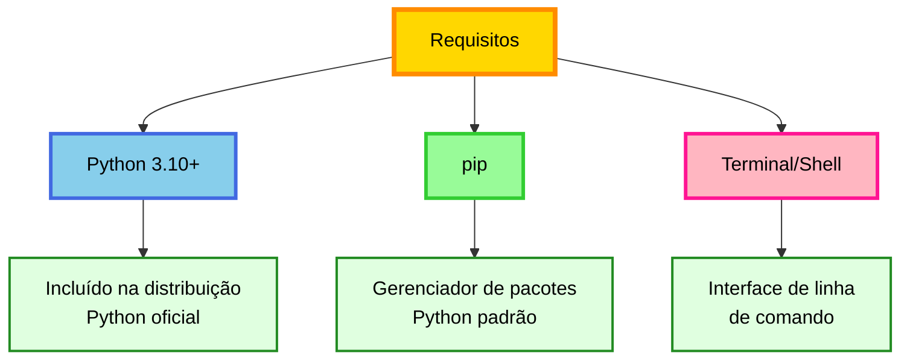

**Sobre o terminal**

O terminal é uma interface textual para comunicação com o sistema operacional:

- **Windows**: Prompt de Comando ou PowerShell
- **macOS**: Terminal
- **Linux**: Terminal (shell padrão)

## Passo 1: Verificar Instalação do Python

### Windows

1. Pressione `Win + R`
2. Digite `cmd` e pressione `Enter`
3. Execute:

```bash
python --version
```

### macOS / Linux

1. Abra o Terminal
2. Execute:

```bash
python3 --version
```

### Interpretação dos Resultados

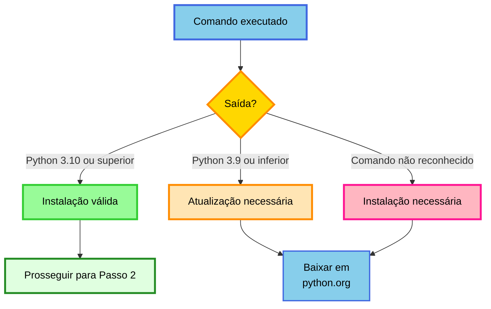

**Saída esperada**

```
Python 3.12.0
```
Qualquer versão ≥ 3.10 é compatível.

**Instalação do Python**

Se o Python não estiver instalado:

1. Acesse [python.org/downloads](https://www.python.org/downloads/)
2. Baixe o instalador apropriado
3. Execute a instalação
4. **IMPORTANTE (Windows)**: Marque a opção "Add Python to PATH"

## Passo 2: Instalar o Gingo

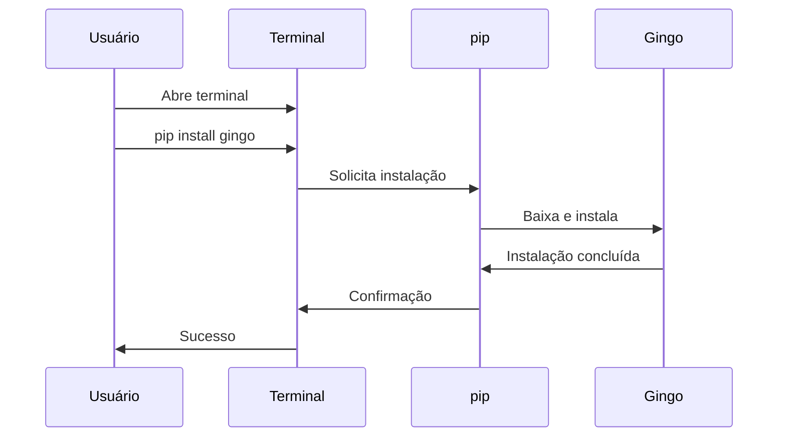

### Comando de Instalação

=== "Windows"

    ```bash
    pip install gingo
    ```

=== "macOS / Linux"

    ```bash
    pip3 install gingo
    ```

### Saída Esperada

Durante a instalação, você verá:

```
Collecting gingo
  Downloading gingo-1.0.0-cp312-cp312-win_amd64.whl (245 kB)
     ━━━━━━━━━━━━━━━━━━━━━━━━━━━━ 245.0/245.0 kB 5.2 MB/s
Installing collected packages: gingo
Successfully installed gingo-1.0.0
```

**Instalação bem-sucedida**

A mensagem `Successfully installed gingo-X.X.X` confirma a instalação.

**Erros de instalação**

Consulte a seção "Solução de Problemas" abaixo.

## Passo 3: Verificação da Instalação

### Verificação via CLI

Execute:

```bash
gingo --version
```

Saída esperada:

```
gingo 1.0.0
```

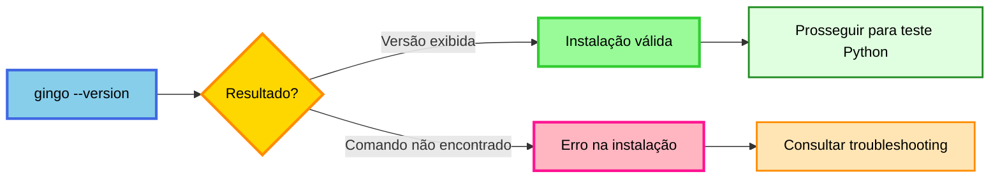

### Verificação via Python

Entre no interpretador interativo:

```bash
python
```

Ou no macOS/Linux:

```bash
python3
```

Execute:

```python
from gingo import Note, Chord, Scale
print(Note("C"))
print(Chord("C"))
print(Scale("C", "major"))
```

Saída esperada:

```
C
C
C Major
```

Para sair do interpretador:

```python
exit()
```

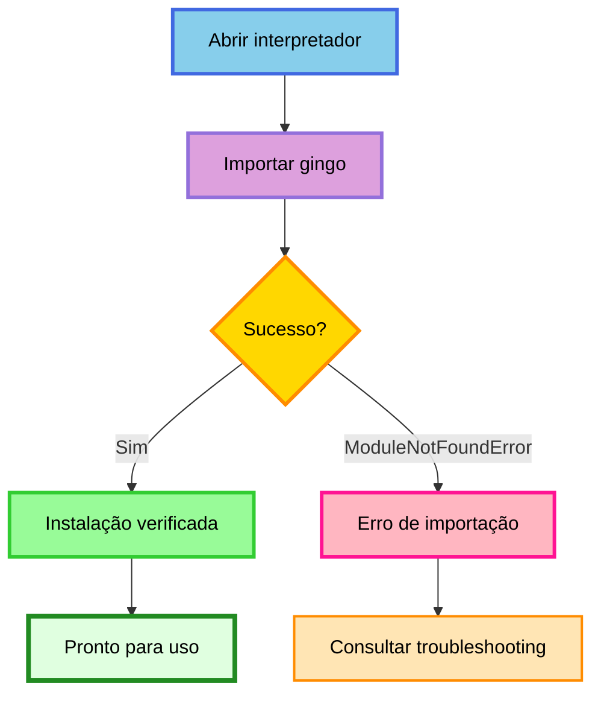

**Instalação confirmada**

Se ambos os testes foram bem-sucedidos, o Gingo está operacional.

Próximo passo: **[Conceitos Básicos](conceitos-basicos.md)**

## 🔧 Solução de Problemas

### Problema 1: "pip não é reconhecido"

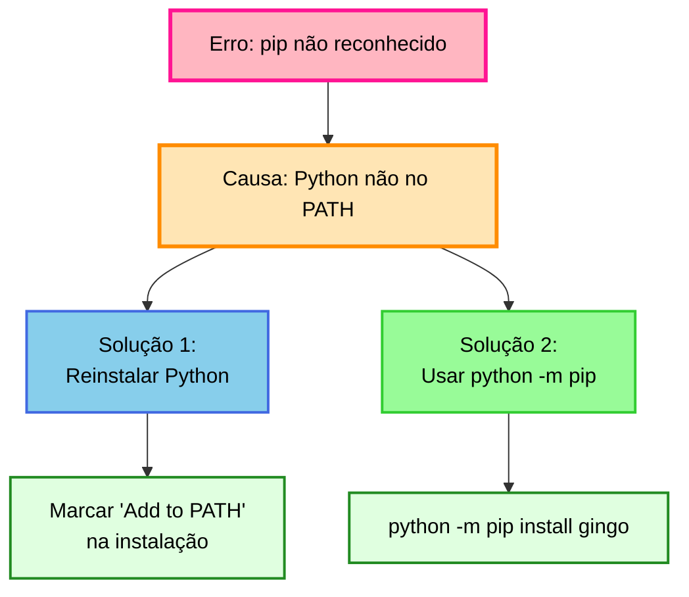

**Solução rápida**:

```bash
python -m pip install gingo
```

### Problema 2: "Permission denied" ou "Access denied"

Erro relacionado a permissões insuficientes.

**Solução**:

=== "Windows"

    Execute o terminal como Administrador:

    1. Localize "cmd" ou "PowerShell" no menu Iniciar
    2. Clique com botão direito
    3. Selecione "Executar como administrador"
    4. Execute novamente o comando de instalação

=== "macOS / Linux"

    Use `sudo` para elevar privilégios:

    ```bash
    sudo pip3 install gingo
    ```

    Digite sua senha quando solicitado (a entrada não é exibida visualmente).

### Problema 3: "No module named 'gingo'"

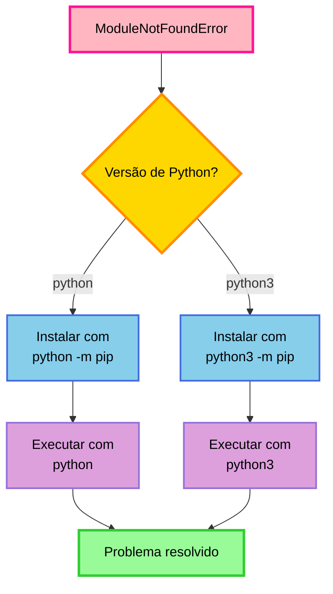

**Solução**: Consistência entre instalação e execução:

```bash
# Instalar
python -m pip install gingo

# Executar
python
>>> from gingo import Note
```

### Problema 4: Versão desatualizada do pip

Se aparecer aviso:

```bash
WARNING: You are using pip version 20.0.0; however, version 24.0 is available.
```

**Solução**: Atualizar o pip:

```bash
python -m pip install --upgrade pip
```

Após a atualização, instale o Gingo normalmente.

## 🌟 Instalação Avançada

Para desenvolvedores e casos de uso específicos.

### Instalação com Audio (playback)

```bash
pip install gingo[audio]
```

Instala `simpleaudio` para playback direto pelo alto-falante. A sintese de audio
e exportacao WAV funcionam sem dependencias extras — `gingo[audio]` e necessario
apenas para o `.play()` tocar som pelo sistema.

Sem `simpleaudio`, o Gingo tenta players do sistema (`aplay`/`paplay`/`ffplay`
no Linux, `afplay` no macOS).

### Instalação com Dependências de Teste

```bash
pip install gingo[test]
```

### Instalação Completa

```bash
pip install gingo[audio,test]
```

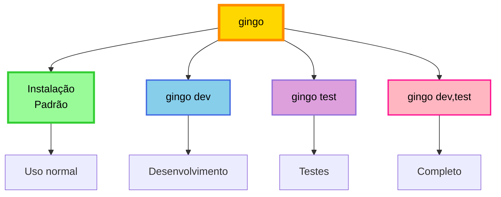

## 🆘 Suporte Adicional

Se os problemas persistirem:

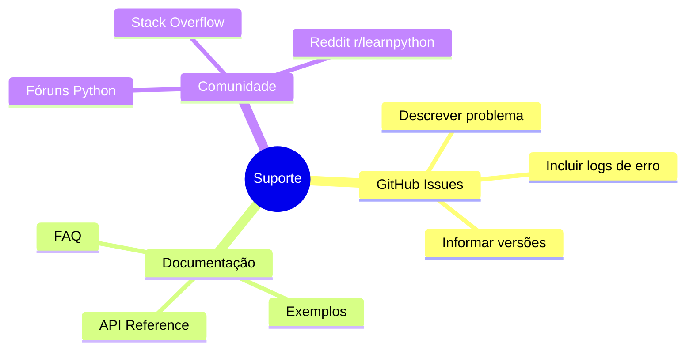

**Informações para suporte**

Ao reportar problemas, inclua:

1. Sistema operacional e versão
2. Versão do Python (`python --version`)
3. Mensagem de erro completa
4. Comandos executados

## 🎉 Instalação Concluída

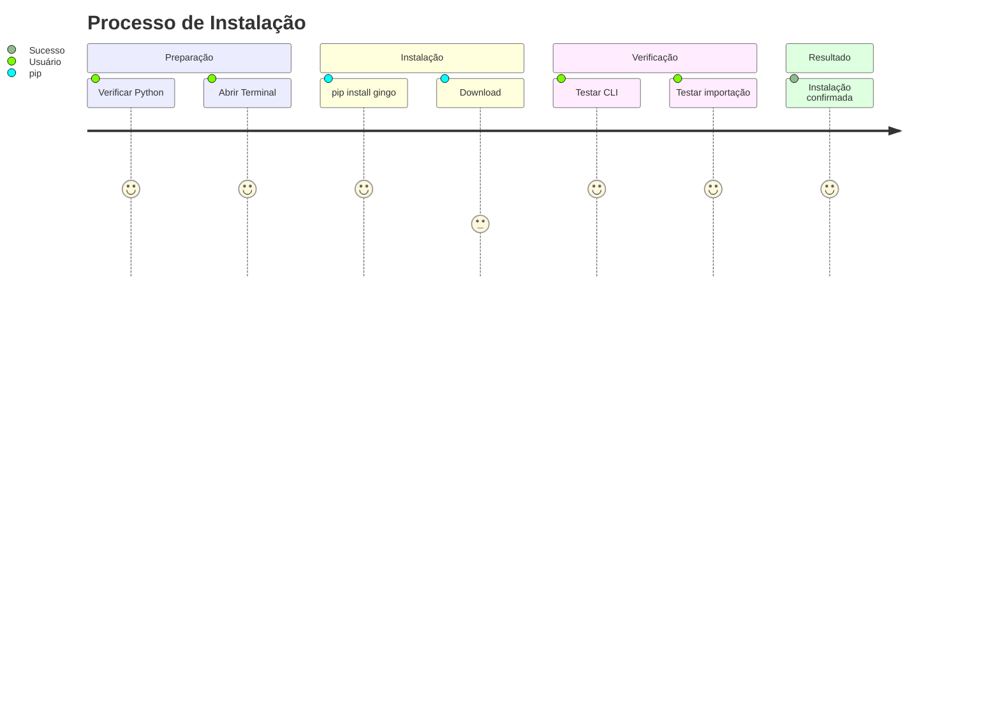

## Próximos Passos

Agora que o Gingo está instalado:

1. **[Conceitos Básicos](conceitos-basicos.md)** - Fundamentos de teoria musical
2. **[Primeiros Passos](primeiros-passos.md)** - Exemplos práticos de código
3. **[Começando](comecando.md)** - Casos de uso avançados

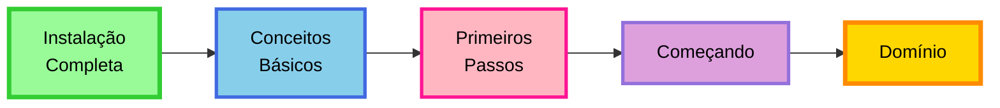

**Próxima etapa: Conceitos Básicos**

Continue para **[Conceitos Básicos](conceitos-basicos.md)** para compreender os fundamentos teóricos.

---

💡 **Dica**: Salve esta página para referência futura em caso de reinstalação ou troubleshooting.
