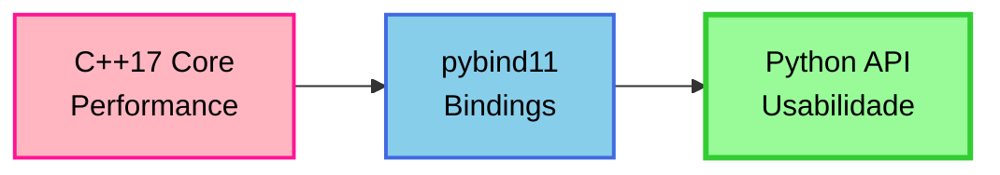

# Introdução ao Gingo

Visão geral da biblioteca e seus recursos fundamentais.

## O que é o Gingo?

**Gingo** é uma biblioteca Python para teoria musical e análise harmônica, implementada com core em C++17 e bindings Python via pybind11. Fornece ferramentas para manipulação de elementos musicais (notas, intervalos, acordes, escalas) e análise contextual de progressões harmônicas.

### Principais Recursos

- **Manipulação de notas**: criação, transposição, resolução enarmônica, cálculo de frequências
- **Análise de intervalos**: identificação, classificação, conversão entre notações
- **Construção de acordes**: tríades, tétrades, extensões, inversões, identificação reversa
- **Escalas e modos**: escalas diatônicas, modais, pentatônicas, navegação entre modos
- **Campo harmônico**: geração de acordes diatônicos, funções harmônicas (T/S/D), acordes aplicados
- **Árvores harmônicas**: validação de progressões baseada na teoria de José de Alencar
- **Análise comparativa**: chord comparison (18 dimensões), field comparison (21 dimensões)

## Arquitetura

Gingo combina **performance nativa** com **interface Python intuitiva**:



**Características técnicas:**

- Core implementado em C++17 para operações críticas de performance
- Lookup tables pré-computadas (enarmonia, escalas, acordes)
- Cached computations para consultas repetidas
- Bindings zero-copy para estruturas complexas
- API Python pythonic (snake_case, iterators, operators)

**Performance**

Operações como resolução enarmônica e construção de campos harmônicos são executadas em tempo constante O(1) graças a lookup tables otimizadas.

## Comparação de Abordagens

**Sem biblioteca especializada:**

```python
# Implementação manual de um acorde
def construir_acorde(raiz, tipo):
    # Tabela de intervalos
    intervalos = {
        'M': [0, 4, 7],      # Maior
        'm': [0, 3, 7],      # Menor
        '7': [0, 4, 7, 10],  # Dominante
        # ... 38 outros tipos
    }

    # Conversão de notas
    notas_map = {'C': 0, 'D': 2, 'E': 4, ...}

    # Cálculo manual
    raiz_num = notas_map[raiz]
    notas_acorde = []
    for intervalo in intervalos[tipo]:
        nota_num = (raiz_num + intervalo) % 12
        # Resolução enarmônica...
        # Conversão de volta para string...

    return notas_acorde
```

**Com Gingo:**

```python
from gingo import Chord

# Construção direta
acorde = Chord("CM7")
notas = [n.name() for n in acorde.notes()]  # ['C', 'E', 'G', 'B']
```

**Benefícios:**

- ✅ Sintaxe declarativa e clara
- ✅ Resolução enarmônica automática
- ✅ 42 tipos de acordes pré-definidos
- ✅ Validação de entrada
- ✅ Performance otimizada

## Fundamentos Teóricos

Gingo implementa conceitos de teoria musical acadêmica e pesquisa contemporânea:

### Teoria das Árvores Harmônicas
Base do módulo `Tree`, desenvolvida por José de Alencar. Modela progressões harmônicas como grafos direcionados onde vértices são acordes e arestas representam movimentos funcionais válidos.

### Neo-Riemannian Transformations
Implementado em `Chord.compare()`. Identifica transformações P (Parallel), L (Leading-tone exchange), R (Relative) e composições de 2 passos entre tríades maiores e menores.

### Voice Leading
Baseado em Tymoczko (2011). Calcula distância mínima de voice leading por busca exaustiva de permutações para acordes com até 7 notas.

### Interval Vectors
Segundo Allen Forte (1973). Representa estrutura intervalar de um acorde como vetor de 6 elementos contando intervalos de classe 1-6. Detecta relações Z (Z-relations).

### Dissonância Psicoacústica
Modelo de Plomp & Levelt (1965) / Sethares (1998). Calcula roughness entre pares de frequências baseado em banda crítica.

**Para professores e pesquisadores**

Referências completas e detalhes de implementação disponíveis em [referencias.md](../referencias.md).

## Casos de Uso

### Para Músicos

```python
from gingo import Field, Chord

# Identificar campo harmônico de uma progressão
campo = Field.identify(["CM", "Dm", "Em", "FM", "GM", "Am"])
print(campo)  # Field("C", Major)

# Analisar um acorde no contexto
analise = campo.compare(Chord("CM"), Chord("Am"))
print(f"Movimento: {analise.root_motion}")       # descending_third
print(f"Funções: {analise.function_a.short()}")  # T
```

### Para Estudantes

```python
from gingo import Scale

# Explorar modos gregos
c_major = Scale("C", "major")

for i in range(1, 8):
    modo = c_major.mode(i)
    print(f"{modo.mode_name()}: {[n.name() for n in modo.notes()]}")

# Ionian: ['C', 'D', 'E', 'F', 'G', 'A', 'B']
# Dorian: ['D', 'E', 'F', 'G', 'A', 'B', 'C']
# ...
```

### Para Desenvolvedores

```python
from gingo import Tree, Note, Chord, Field
import json

# Criar ferramenta de análise harmônica
def analisar_progressao(acordes_str, tonalidade, tipo):
    campo = Field(tonalidade, tipo)
    tree = Tree(tonalidade, tipo)

    # Validar progressão
    valida = tree.is_valid_progression(acordes_str)

    # Análise detalhada
    resultado = {
        'valida': valida,
        'acordes': []
    }

    for i, acorde_str in enumerate(acordes_str):
        acorde = Chord(acorde_str)
        grau = campo.degree(acorde)
        funcao = campo.function(acorde)

        resultado['acordes'].append({
            'nome': acorde_str,
            'grau': grau,
            'funcao': funcao.name() if funcao else None,
            'notas': [n.name() for n in acorde.notes()]
        })

    return json.dumps(resultado, indent=2)

# Uso
print(analisar_progressao(["Dm7", "G7", "CM7"], "C", "major"))
```

### Para Professores

```python
from gingo import Field, HarmonicFunction

# Exercício: identificar acordes por função
campo = Field("C", "major")

# Pedir aos alunos para encontrar todos os acordes tônicos
def encontrar_por_funcao(campo, funcao):
    acordes = campo.chords_with_function(funcao)
    return [(campo.degree(c), c.name()) for c in acordes]

tonicos = encontrar_por_funcao(campo, HarmonicFunction.Tonic)
print("Acordes com função tônica:")
for grau, nome in tonicos:
    print(f"  Grau {grau}: {nome}")

# Grau 1: CM
# Grau 3: Em
# Grau 6: Am
```

## Recursos Adicionais

- **[Conceitos Básicos](conceitos-basicos.md)**: Fundamentos de teoria musical
- **[Primeiros Passos](primeiros-passos.md)**: Exemplos práticos passo a passo
- **[API Reference](../api/referencia.md)**: Documentação completa de todas as classes
- **[Referências](../referencias.md)**: Bibliografia e fundamentos acadêmicos

## Instalação e Requisitos

```bash
pip install gingo
```

**Requisitos:**
- Python 3.10+
- Wheels pré-compiladas disponíveis para:
  - Linux (x86_64, arm64)
  - macOS (x86_64, arm64)
  - Windows (x86_64)

**Build from source**

Se não houver wheel para sua plataforma, pip compilará automaticamente do código-fonte. Requer:

- Compilador C++17 (gcc 7+, clang 6+, MSVC 2017+)
- CMake 3.15+
- pybind11 (instalado automaticamente via pip)

## Próximos Passos

1. **[Conceitos Básicos](conceitos-basicos.md)** - Compreender fundamentos de teoria musical
2. **[Primeiros Passos](primeiros-passos.md)** - Escrever seus primeiros programas com Gingo
3. **[Tutoriais](../tutoriais/notas.md)** - Guias detalhados de cada classe

---

**GitHub**: [github.com/sauloverissimo/gingopy](https://github.com/sauloverissimo/gingopy)
**PyPI**: [pypi.org/project/gingo](https://pypi.org/project/gingo/)
