# Primeiros Passos

Este guia apresenta os conceitos fundamentais do Gingo através de exemplos práticos e progressivos.

**O que você vai aprender**

✅ Criar notas, acordes e escalas

✅ Trabalhar com campo harmônico

✅ Realizar análises musicais básicas

## 🎯 Pré-requisitos

Certifique-se de que você possui:

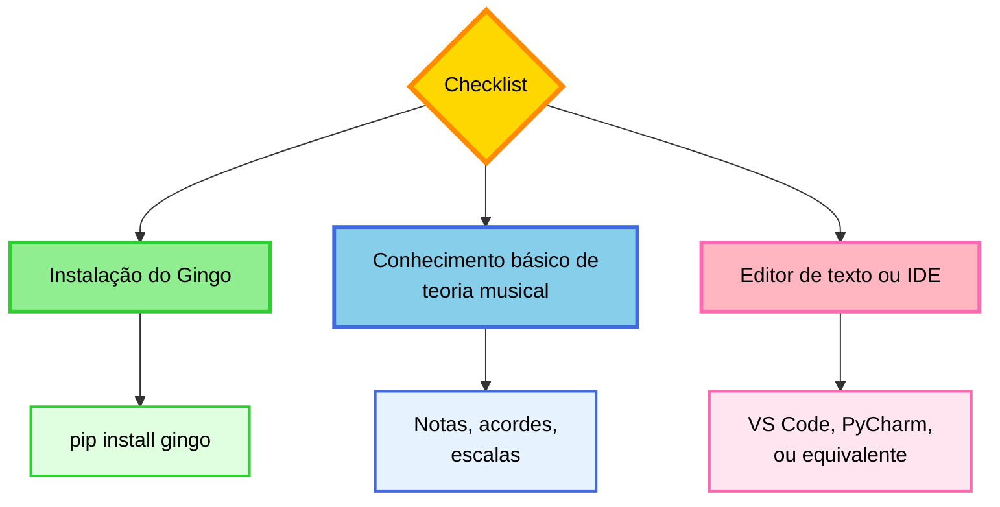

**Recomendação de IDE**

Para desenvolvimento Python, recomendamos o **VS Code** com a extensão Python da Microsoft:

- Download: [code.visualstudio.com](https://code.visualstudio.com/)

## 🎵 Passo 1: Operações com Notas

Crie um arquivo `explorando_notas.py`:

```python
from gingo import Note

# ==========================================
# 1. Criar diferentes notas
# ==========================================
print("=== 1. Criando Notas ===")

# Notas naturais
do = Note("C")
re = Note("D")
mi = Note("E")

print(f"Notas naturais: {do}, {re}, {mi}")

# Notas com alterações
do_sustenido = Note("C#")
re_bemol = Note("Db")

print(f"Com sustenido: {do_sustenido}")
print(f"Com bemol: {re_bemol}")

# ==========================================
# 2. Enarmonia - notas equivalentes
# ==========================================
print("\n=== 2. Enarmonia ===")

cis = Note("C#")
reb = Note("Db")

print(f"C# e Db são enarmonicamente equivalentes")
print(f"C# em semitons: {cis.semitones()}")
print(f"Db em semitons: {reb.semitones()}")

# ==========================================
# 3. Transposição
# ==========================================
print("\n=== 3. Transposição ===")

nota_inicial = Note("C")
print(f"Nota inicial: {nota_inicial}")

# Subir 7 semitons (quinta justa)
nota_transposta = nota_inicial.transpose(7)
print(f"Subir 7 semitons: {nota_transposta}")  # G

# Descer 2 semitons
nota_abaixo = nota_inicial.transpose(-2)
print(f"Descer 2 semitons: {nota_abaixo}")  # Bb

# ==========================================
# 4. Frequência
# ==========================================
print("\n=== 4. Frequência ===")

la = Note("A")
print(f"A nota Lá (A): {la.frequency()} Hz")

do_central = Note("C")
print(f"Dó central (C): {do_central.frequency()} Hz")
```

**Ouca o que voce codou:**

```python
from gingo import Note

# Ouvir uma nota
Note("C").play()

# Ouvir com oitava diferente
Note("A").play(octave=5)

# Exportar para WAV
Note("C").to_wav("do.wav")
```

Execute:

```bash
python explorando_notas.py
```

No terminal, voce tambem pode ouvir diretamente:

```bash
gingo note C --play
gingo note A --play --wav la.wav
```

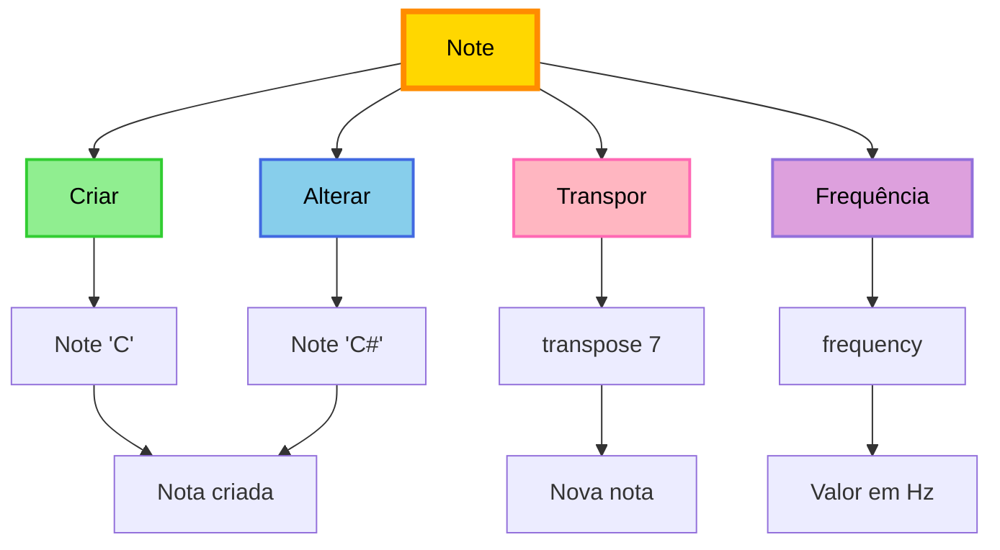

**Experimentação**

Teste diferentes valores:

- Outras notas: `"F"`, `"G#"`, `"Bb"`
- Intervalos: `transpose(3)`, `transpose(-5)`
- Análise de frequências

## 🎸 Passo 2: Construindo Acordes

Crie `meus_acordes.py`:

```python
from gingo import Chord

print("Explorando Acordes\n")

# ==========================================
# 1. Acordes Maiores e Menores
# ==========================================
print("=== 1. Maior vs Menor ===")

c_maior = Chord("C")
print(f"{c_maior:6} → {c_maior.notes()}")  # ['C', 'E', 'G']
print(f"   Qualidade: {c_maior.quality()}")

c_menor = Chord("Cm")
print(f"\n{c_menor:6} → {c_menor.notes()}")  # ['C', 'Eb', 'G']
print(f"   Qualidade: {c_menor.quality()}")

# ==========================================
# 2. Tipologia de acordes
# ==========================================
print("\n=== 2. Tipos de Acordes ===")

acordes = [
    ("C",     "Tríade maior"),
    ("Cm",    "Tríade menor"),
    ("Cdim",  "Diminuto"),
    ("Caug",  "Aumentado"),
    ("CM7",   "Maior com sétima maior"),
    ("C7",    "Dominante (sétima menor)"),
    ("Cm7",   "Menor com sétima menor"),
]

for nome, descricao in acordes:
    acorde = Chord(nome)
    print(f"{nome:6} → {acorde.notes():30} | {descricao}")

# ==========================================
# 3. Inversões de acordes
# ==========================================
print("\n=== 3. Inversões ===")

c_acorde = Chord("C")  # C E G

print(f"Estado fundamental: {c_acorde.notes()}")        # C E G
print(f"1ª inversão:        {c_acorde.inversion(1)}")   # E G C
print(f"2ª inversão:        {c_acorde.inversion(2)}")   # G C E

# ==========================================
# 4. Construção a partir de notas
# ==========================================
print("\n=== 4. Criar a partir de notas ===")

notas = ["D", "F#", "A"]
acorde = Chord(notas)
print(f"Notas {notas} formam: {acorde}")

# ==========================================
# 5. Propriedades do acorde
# ==========================================
print("\n=== 5. Propriedades ===")

am7 = Chord("Am7")
print(f"Acorde: {am7}")
print(f"  Notas: {am7.notes()}")
print(f"  Raiz: {am7.root()}")
print(f"  Qualidade: {am7.quality()}")
print(f"  Intervalos: {am7.intervals()}")
```

**Ouca o que voce codou:**

```python
from gingo import Chord

# Ouvir acordes
Chord("C").play()
Chord("Am7").play(waveform="triangle")

# Comparar maior e menor
Chord("C").play()
Chord("Cm").play()

# Exportar
Chord("Am7").to_wav("am7.wav")
```

Execute:

```bash
python meus_acordes.py
```

No terminal:

```bash
gingo chord Am7 --play --waveform triangle
gingo chord C7 --play --strum 0.06
```

### Fluxo de Criação de Acordes

```mermaid
flowchart TD
    A[Criar Acorde] --> B{Método}

    B -->|Nome| C[Chord 'C']
    B -->|Notas| D[Chord ['C', 'E', 'G']]

    C --> E[Acorde C]
    D --> E

    E --> F[Ver notas]
    E --> G[Ver intervalos]
    E --> H[Transpor]
    E --> I[Inverter]

    F --> J[notes]
    G --> K[intervals]
    H --> L[transpose]
    I --> M[inversion]

    style A fill:#FFD700,stroke:#FF8C00,stroke-width:4px,color:#000
    style B fill:#87CEEB,stroke:#4169E1,stroke-width:3px,color:#000
    style C fill:#90EE90,stroke:#32CD32,stroke-width:2px,color:#000
    style D fill:#FFB6C1,stroke:#FF69B4,stroke-width:2px,color:#000
    style E fill:#DDA0DD,stroke:#9370DB,stroke-width:3px,color:#000
```

**Exercicio: Progressao harmonica — ouca!**

Implemente a progressao **I - V - vi - IV** (C - G - Am - F) e ouca:

```python
from gingo import Chord
from gingo.audio import play

acordes = [
    Chord("C"),   # I
    Chord("G"),   # V
    Chord("Am"),  # vi
    Chord("F"),   # IV
]

print("Progressão I-V-vi-IV:")
for i, acorde in enumerate(acordes, 1):
    print(f"  {i}. {acorde:4} → {acorde.notes()}")

# Ouvir a progressao inteira
play(["CM", "GM", "Am", "FM"], duration=0.8, waveform="triangle")
```

No terminal:

```bash
gingo chord CM --play && gingo chord GM --play && gingo chord Am --play && gingo chord FM --play
```

## 🎼 Passo 3: Escalas Musicais

Crie `minhas_escalas.py`:

```python
from gingo import Scale

print("Explorando Escalas\n")

# ==========================================
# 1. Escala Maior
# ==========================================
print("=== 1. Escala Maior ===")

c_maior = Scale("C", "major")
print(f"Escala: {c_maior}")
print(f"Notas: {c_maior.notes()}")
print(f"Total: {len(c_maior.notes())} notas")

# ==========================================
# 2. Escala Menor Natural
# ==========================================
print("\n=== 2. Escala Menor ===")

a_menor = Scale("A", "natural minor")
print(f"Escala: {a_menor}")
print(f"Notas: {a_menor.notes()}")

# ==========================================
# 3. Comparação Maior e Menor
# ==========================================
print("\n=== 3. Maior vs Menor ===")

c_maj = Scale("C", "major")
c_min = Scale("C", "natural minor")

print(f"C Maior:  {c_maj.notes()}")
print(f"C Menor:  {c_min.notes()}")
print(f"\nDiferença nos graus 3, 6 e 7 (terça, sexta e sétima)")

# ==========================================
# 4. Modos da escala maior (modos gregos)
# ==========================================
print("\n=== 4. Modos Gregos ===")

modos = [
    "ionian",      # = Maior
    "dorian",
    "phrygian",
    "lydian",
    "mixolydian",
    "aeolian",     # = Menor Natural
    "locrian",
]

print("Modos de C:\n")
for modo in modos:
    escala = Scale("C", modo)
    print(f"{modo.capitalize():12} → {escala.notes()}")

# ==========================================
# 5. Escalas Especiais
# ==========================================
print("\n=== 5. Escalas Especiais ===")

especiais = [
    ("blues",          "Blues - escala de seis notas"),
    ("harmonic minor", "Menor Harmônica - sétima maior"),
    ("melodic minor",  "Menor Melódica - ascendente"),
    ("whole tone",     "Tons Inteiros - simétrica"),
]

for nome, descricao in especiais:
    escala = Scale("C", nome)
    print(f"\n{escala}")
    print(f"  {descricao}")
    print(f"  Notas: {escala.notes()}")

# ==========================================
# 6. Escalas Pentatônicas
# ==========================================
print("\n=== 6. Escalas Pentatônicas ===")

c_maior_pent = Scale("C", "major pentatonic")
c_menor_pent = Scale("C", "minor pentatonic")

print(f"Maior Pentatônica:  {c_maior_pent.notes()}")
print(f"Menor Pentatônica:  {c_menor_pent.notes()}")
print(f"\nPentatônicas contêm cinco notas (apropriadas para improvisação)")

# ==========================================
# 7. Graus da escala
# ==========================================
print("\n=== 7. Graus da Escala ===")

escala = Scale("C", "major")
print(f"Escala: {escala}\n")

graus_nomes = ["Tônica", "Supertônica", "Mediante", "Subdominante",
               "Dominante", "Superdominante", "Sensível"]

for i, (nota, nome) in enumerate(zip(escala.notes(), graus_nomes), 1):
    print(f"  Grau {i} - {nome:16} → {nota}")
```

**Ouca o que voce codou:**

```python
from gingo import Scale

# Ouvir a escala maior
Scale("C", "major").play(duration=0.3)

# Ouvir menor natural
Scale("A", "natural minor").play(duration=0.3)

# Comparar modos
for modo in ["ionian", "dorian", "phrygian", "lydian",
             "mixolydian", "aeolian", "locrian"]:
    print(f"Tocando {modo}...")
    Scale("C", modo).play(duration=0.25, gap=0.03)

# Exportar
Scale("C", "major").to_wav("c_major.wav", duration=0.3)
```

Execute:

```bash
python minhas_escalas.py
```

No terminal:

```bash
gingo scale "C major" --play
gingo scale "A natural minor" --play --gap 0.1
```

### Taxonomia de Escalas

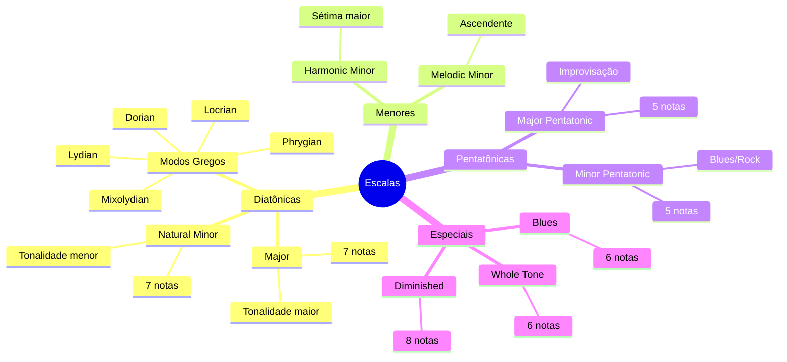

**Identificação de escalas**

O Gingo pode identificar escalas a partir de um conjunto de notas:

```python
from gingo import Scale

notas = ["C", "D", "E", "F", "G", "A", "B"]
escala = Scale.identify(notas)

print(f"Conjunto {notas} forma: {escala}")
# C Major
```

## 🎪 Passo 4: Campo Harmônico

O campo harmônico organiza os acordes diatônicos de uma tonalidade. Crie `campo_harmonico.py`:

```python
from gingo import Field

print("Explorando Campo Harmônico\n")

# ==========================================
# 1. Campo Harmônico de C Maior
# ==========================================
print("=== 1. Campo Harmônico de C Maior ===\n")

campo = Field("C", "major")

# Tríades (3 notas)
print("Tríades (3 notas):")
graus_romanos = ["I", "ii", "iii", "IV", "V", "vi", "vii°"]

for grau, acorde in zip(graus_romanos, campo.triads()):
    print(f"  {grau:5} → {acorde:6} → {acorde.notes()}")

# Tétrades (4 notas - com 7ª)
print("\nTétrades (4 notas com 7ª):")
for grau, acorde in zip(graus_romanos, campo.sevenths()):
    print(f"  {grau:5} → {acorde:8} → {acorde.notes()}")

# ==========================================
# 2. Funções Harmônicas
# ==========================================
print("\n=== 2. Funções Harmônicas ===\n")

campo = Field("C", "major")

print("Tríades com suas funções:")
print("(T=Tônica, S=Subdominante, D=Dominante)\n")

for grau, acorde, funcao in zip(graus_romanos, campo.triads(), campo.functions()):
    simbolo = funcao.short()  # T, S ou D
    nome = funcao.name()      # Tonic, Subdominant, Dominant

    print(f"  {grau:5} → {acorde:6} → {simbolo} ({nome:13})")

# ==========================================
# 3. Cadências - progressões tradicionais
# ==========================================
print("\n=== 3. Cadências ===\n")

campo = Field("C", "major")
triades = campo.triads()

# Cadência Autêntica Perfeita (V → I)
print("Cadência Autêntica Perfeita (V → I):")
print(f"  {triades[4]} → {triades[0]}")  # G → C
print("  (Dominante → Tônica)")

# Cadência Plagal (IV → I)
print("\nCadência Plagal (IV → I):")
print(f"  {triades[3]} → {triades[0]}")  # F → C
print("  (Subdominante → Tônica)")

# Cadência de Engano (V → vi)
print("\nCadência de Engano (V → vi):")
print(f"  {triades[4]} → {triades[5]}")  # G → Am
print("  (Dominante → Tônica relativa)")

# ==========================================
# 4. Progressões Comuns
# ==========================================
print("\n=== 4. Progressões Comuns ===\n")

campo = Field("C", "major")
triades = campo.triads()

# I-V-vi-IV (progressão pop)
print("I-V-vi-IV (progressão pop):")
progressao1 = [triades[0], triades[4], triades[5], triades[3]]
for i, acorde in enumerate(progressao1, 1):
    print(f"  {i}. {acorde:6} → {acorde.notes()}")

# ii-V-I (progressão de jazz)
print("\nii-V-I (progressão de jazz):")
progressao2 = [triades[1], triades[4], triades[0]]
for i, acorde in enumerate(progressao2, 1):
    print(f"  {i}. {acorde:6} → {acorde.notes()}")

# I-IV-V (progressão de blues/rock)
print("\nI-IV-V (progressão de blues/rock):")
progressao3 = [triades[0], triades[3], triades[4]]
for i, acorde in enumerate(progressao3, 1):
    print(f"  {i}. {acorde:6} → {acorde.notes()}")

# ==========================================
# 5. Campo Menor
# ==========================================
print("\n=== 5. Campo Menor ===\n")

campo_menor = Field("A", "natural minor")

print("Campo Harmônico de A Menor:")
for grau, acorde in zip(graus_romanos, campo_menor.triads()):
    print(f"  {grau:5} → {acorde:6} → {acorde.notes()}")

# ==========================================
# 6. Identificação de Campo Harmônico
# ==========================================
print("\n=== 6. Identificar Campo ===\n")

acordes_misterio = ["C", "Dm", "Em", "F", "G", "Am"]

campo_identificado = Field.identify(acordes_misterio)
print(f"Acordes {acordes_misterio}")
print(f"Pertencem ao campo: {campo_identificado}")
```

**Ouca o que voce codou:**

```python
from gingo import Field
from gingo.audio import play

# Ouvir o campo harmonico completo
Field("C", "major").play(duration=0.6)

# Ouvir campo menor
Field("A", "natural minor").play(duration=0.6)

# Ouvir progressao ii-V-I (jazz)
play(["Dm7", "G7", "C7M"], duration=1.0, strum=0.05)

# Exportar o campo
Field("C", "major").to_wav("campo_c.wav", duration=0.8)
```

Execute:

```bash
python campo_harmonico.py
```

No terminal:

```bash
gingo field "C major" --play
gingo field "A natural minor" --play --wav campo_am.wav
```

### Estrutura do Campo Harmônico

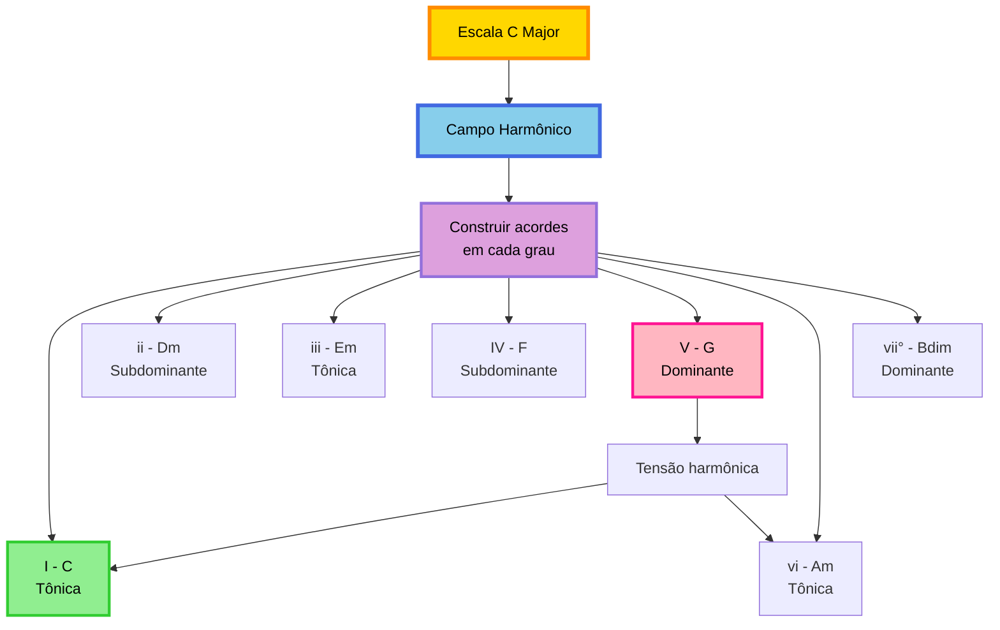

### Ciclo Funcional Harmônico

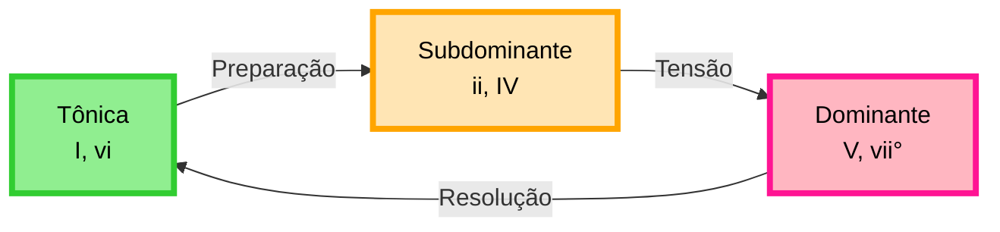

**Exercicio: Analise harmonica — ouca e compare**

Analise uma musica conhecida:

1. Identifique a tonalidade (C major, A minor, etc)
2. Liste os acordes utilizados
3. Verifique se pertencem ao campo harmonico
4. Identifique as funcoes harmonicas (T, S, D)
5. **Ouca os acordes** com `.play()` para confirmar auditivamente

## 🎮 Passo 5: Analisador Musical Completo

Crie um programa integrado que demonstra análise harmônica. Arquivo `analisador_musical.py`:

```python
from gingo import Note, Chord, Scale, Field
from gingo.audio import play

def linha(char="=", tam=50):
    """Imprime uma linha separadora"""
    print(char * tam)

def titulo(texto):
    """Imprime um título formatado"""
    print()
    linha()
    print(f" {texto}")
    linha()

# ==========================================
# ANALISADOR MUSICAL
# ==========================================

print("""
╔══════════════════════════════════════════╗
║   ANALISADOR MUSICAL GINGO               ║
╚══════════════════════════════════════════╝
""")

# ==========================================
# 1. Definir tonalidade
# ==========================================
titulo("1. TONALIDADE")

tonica = "C"
modo = "major"

campo = Field(tonica, modo)
escala = Scale(tonica, modo)

print(f"Tonalidade: {escala}")
print(f"Notas disponíveis: {escala.notes()}")

# Ouvir a escala
escala.play(duration=0.25)

# ==========================================
# 2. Campo Harmônico
# ==========================================
titulo("2. CAMPO HARMÔNICO")

print("Tríades:")
graus = ["I", "ii", "iii", "IV", "V", "vi", "vii°"]
for grau, acorde in zip(graus, campo.triads()):
    print(f"  {grau:5} → {acorde:6} → {acorde.notes()}")

# Ouvir o campo completo
campo.play(duration=0.6)

# ==========================================
# 3. Analisar progressão
# ==========================================
titulo("3. ANÁLISE DE PROGRESSÃO")

# Exemplo: C - Am - F - G
progressao = ["C", "Am", "F", "G"]

print(f"Progressão: {' → '.join(progressao)}")
print()

# Ouvir a progressao
play(progressao, duration=0.8, waveform="triangle")

triades = campo.triads()
for acorde_nome in progressao:
    acorde = Chord(acorde_nome)

    # Localizar o grau
    try:
        indice = [str(t) for t in triades].index(acorde_nome)
        grau = graus[indice]
        funcao = campo.functions()[indice]

        print(f"{acorde}")
        print(f"  Grau: {grau}")
        print(f"  Função: {funcao.name()} ({funcao.short()})")
        print(f"  Notas: {acorde.notes()}")
        print()
    except ValueError:
        print(f"{acorde} - Fora do campo harmônico")
        print()

# ==========================================
# 4. Sugestões de tétrades
# ==========================================
titulo("4. SUBSTITUIÇÃO POR TÉTRADES")

print("Tríades → Tétrades correspondentes:")
for nome_acorde in progressao:
    triade = Chord(nome_acorde)

    try:
        indice = [str(t) for t in triades].index(nome_acorde)
        tetrade = campo.sevenths()[indice]

        print(f"  {triade:6} → {tetrade:8}")
        print(f"    {triade.notes()} → {tetrade.notes()}")
    except ValueError:
        print(f"  {triade} → (não diatônico)")

# ==========================================
# 5. Material para improvisação
# ==========================================
titulo("5. NOTAS PARA IMPROVISO")

print(f"Escala de referência ({escala}):")
print(f"  {escala.notes()}")
print()
print("Alternativa pentatônica (simplificada):")
penta = Scale(tonica, "major pentatonic")
print(f"  {penta.notes()}")

# ==========================================
# 6. Notas características (cores)
# ==========================================
titulo("6. NOTAS CARACTERÍSTICAS")

escala_ref = Scale("C", "major")
cores = escala_ref.colors(escala_ref)

print(f"Notas características de {escala_ref}:")
if cores:
    print(f"  {cores}")
else:
    print("  Todas as notas são características do modo")

# ==========================================
# FIM
# ==========================================
print()
linha("=", 50)
print(" Análise completa")
linha("=", 50)
print()
```

Execute:

```bash
python analisador_musical.py
```

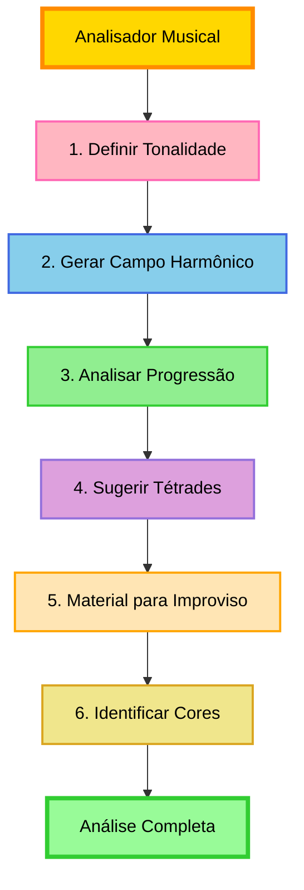

**Programa completo**

Você construiu um analisador funcional. Modifique:

- A tonalidade (`tonica` e `modo`)
- A progressão analisada
- Os modos e escalas explorados

## 🎯 Exercícios de Consolidação

### Nível Básico

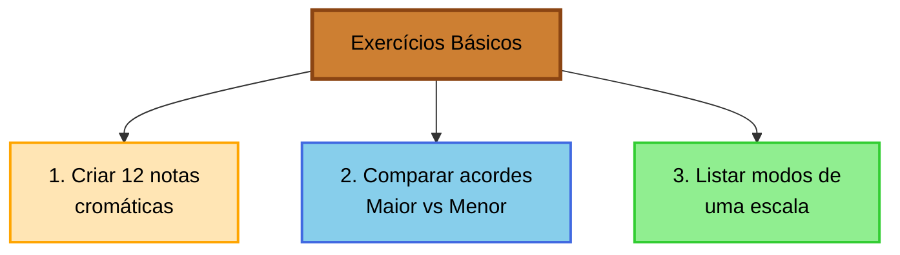

1. **Escala Cromática**: Implemente um programa que mostre as 12 notas cromáticas a partir de C
2. **Comparação de Acordes**: Compare acordes maiores com seus menores paralelos (C vs Cm, D vs Dm)
3. **Modos de G**: Liste os 7 modos da escala de G

### Nível Intermediário

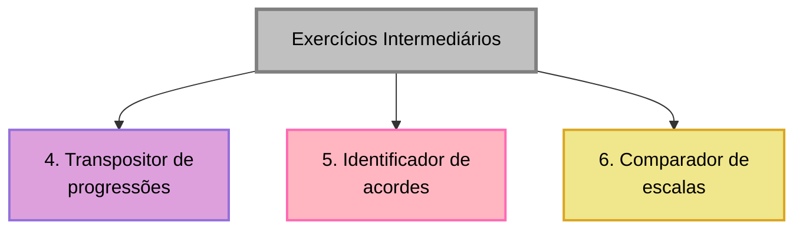

4. **Transpositor**: Transponha uma progressão para outra tonalidade
5. **Identificador de Acordes**: Dado um conjunto de notas, identifique o acorde
6. **Comparador de Escalas**: Compare duas escalas e apresente as diferenças

### Nível Avançado

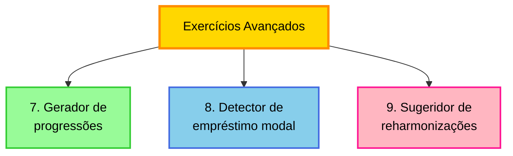

7. **Gerador de Progressões**: Crie progressões aleatórias mas harmonicamente válidas
8. **Empréstimo Modal**: Detecte acordes emprestados de modos paralelos (modal borrowing)
9. **Reharmonização**: Sugira acordes substitutos para uma progressão dada

## 📚 Referências Técnicas

### Comandos Úteis

```python
# Introspecção
dir(nota)       # Lista métodos disponíveis
help(Chord)     # Documentação da classe

# Representação
str(acorde)     # Notação simples
repr(acorde)    # Representação completa

# Comparação
acorde1 == acorde2  # Igualdade
```

### Formatação de Saída

```python
# Alinhamento
print(f"{acorde:8}")  # 8 caracteres

# Separadores
print("=" * 50)
print("-" * 30)
```

## 🎓 Resumo

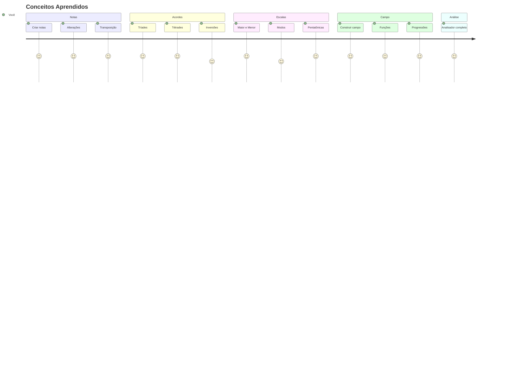

**Fundamentos estabelecidos**

✅ Criar e manipular notas

✅ Construir e analisar acordes

✅ Explorar escalas e modos

✅ Trabalhar com campo harmonico

✅ Ouvir tudo com `.play()` e exportar com `.to_wav()`

✅ Criar programas de analise musical

## 🚀 Próximos Passos

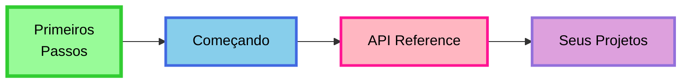

### Continue Aprendendo

1. **[Começando](comecando.md)** - Exemplos avançados e casos de uso reais
2. **[Referência da API](../api/referencia.md)** - Documentação completa
3. **Desenvolva projetos próprios** - A prática consolida o conhecimento

### Sugestoes de Projetos

- **Gerador de Backing Tracks** — use `Sequence` e `.play()` para acompanhamentos automaticos
- **Analisador de Partituras** — analise de musicas existentes com `Field.deduce()`
- **Assistente de Improvisacao** — sugestoes para solos com `Scale.colors()`
- **Dicionario de Acordes** — enciclopedia musical interativa com `.play()` em cada acorde
- **Sistema de Reharmonizacao** — substituicoes harmonicas avancadas com `Field.compare()`

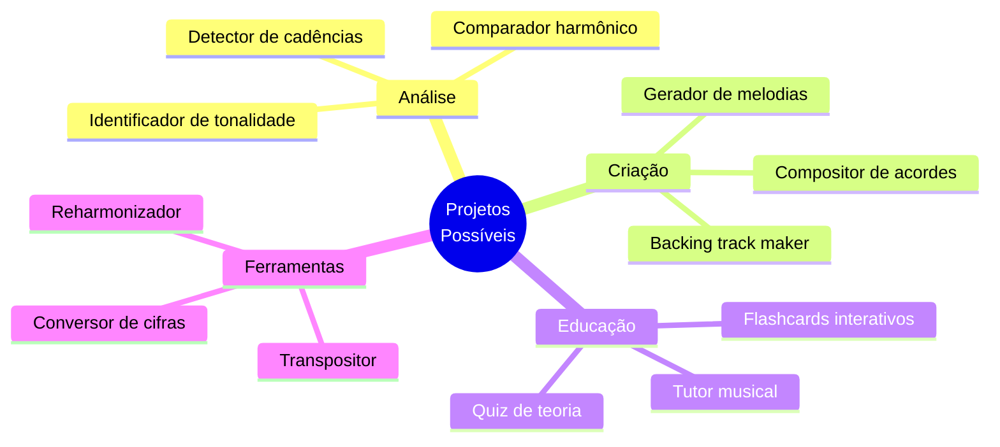

---

**Próxima etapa: Começando**

Continue para **[Começando](comecando.md)** para exemplos avançados e aplicações práticas.
