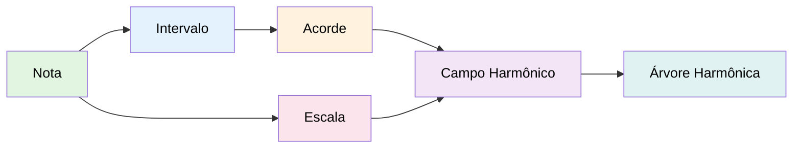
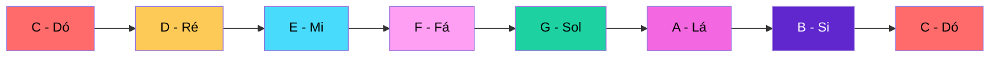
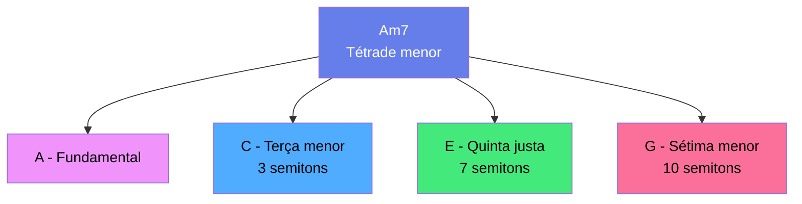
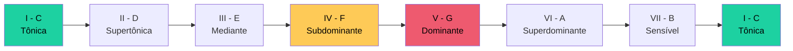
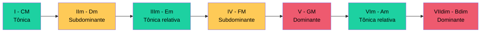
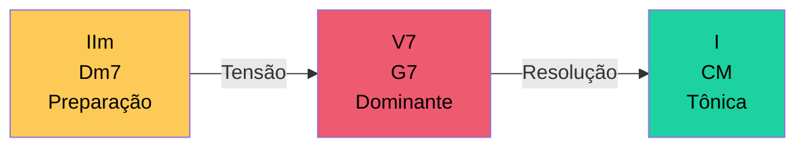
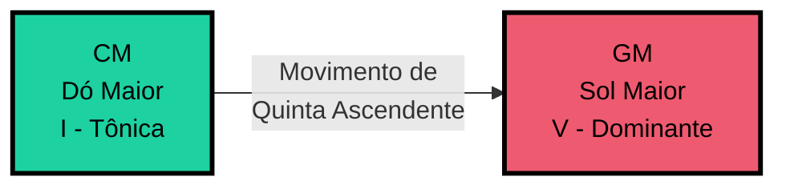

# Gingo

**Biblioteca Python para Teoria Musical e Análise Harmônica**

Gingo é uma biblioteca Python que implementa conceitos de teoria musical ocidental, fornecendo ferramentas para análise harmônica, manipulação de escalas e acordes, e validação de progressões. Construída em C++17 com bindings Python (pybind11), combina performance nativa com API Python intuitiva.

---

## Arquitetura

Gingo modela conceitos musicais em camadas hierárquicas, onde cada componente fundamental serve de base para estruturas mais complexas:



Esta arquitetura em camadas permite a construção progressiva de conceitos harmônicos complexos a partir de elementos fundamentais.

---

## Instalação

```bash
pip install gingo            # biblioteca completa
pip install gingo[audio]     # + playback com simpleaudio
```

Requer Python 3.10+. Wheels pré-compiladas disponíveis para Linux, macOS e Windows.
A sintese de audio e exportacao WAV funcionam sem dependencias extras.

---

## Exemplos

### 1. Notas Musicais

```python
from gingo import Note

# Criar uma nota
nota = Note("C")  # Dó
print(nota.name())  # "C"

# Calcular frequência
freq = nota.frequency(4)  # Dó da 4ª oitava (C4)
print(f"{freq:.2f} Hz")  # 261.63 Hz
```

**Ciclo cromático:**


### 2. Acordes

```python
from gingo import Chord

# Criar um acorde
acorde = Chord("Am7")  # Lá menor com sétima (tétrade)

# Obter notas do acorde
notas = [n.name() for n in acorde.notes()]
print(notas)  # ['A', 'C', 'E', 'G']
```

**Estrutura intervalar de Am7:**


### 3. Escalas

```python
from gingo import Scale

# Criar uma escala
escala = Scale("C", "major")  # Dó maior (escala diatônica)

# Obter notas da escala
notas = [n.name() for n in escala.notes()]
print(notas)
# ['C', 'D', 'E', 'F', 'G', 'A', 'B']
```

**Escala de Dó maior com funções dos graus:**


### 4. Campo Harmônico

```python
from gingo import Field, ScaleType

# Criar campo harmônico
campo = Field("C", ScaleType.Major)

# Obter acordes diatônicos
acordes = [c.name() for c in campo.chords()]
print(acordes)
# ['CM', 'Dm', 'Em', 'FM', 'GM', 'Am', 'Bdim']
```

**Campo harmônico de Dó maior (tríades):**


### 5. Audio — ouvir o que voce codou

```python
from gingo import Note, Chord, Scale, Field

Note("C").play()                        # nota unica
Chord("Am7").play()                     # acorde com strum
Scale("C", "major").play(duration=0.3)  # escala ascendente
Field("C", "major").play(duration=0.6)  # 7 acordes do campo

# Exportar WAV
Chord("Am7").to_wav("am7.wav", waveform="triangle")
```

No terminal:

```bash
gingo chord Am7 --play --waveform triangle
gingo scale "C major" --play
```

### 6. Progressões Harmônicas (beta)

!!! info "Beta"
    A classe Tree esta em fase beta. A API pode mudar em versoes futuras.

```python
from gingo import Tree, ScaleType, Progression

# Criar árvore harmônica (baseada na teoria de José de Alencar)
tree = Tree("C", ScaleType.Major, "harmonic_tree")

# Validar progressão
valido = tree.is_valid(["IIm", "V7", "I"])
print(valido)  # True - progressão II-V-I

# Usar Progression para análise cross-tradition
prog = Progression("C", "major")
match = prog.identify(["IIm", "V7", "I"])
print(match.schema)  # "descending"
```

**Progressão II-V-I (cadência harmônica fundamental do jazz):**


---

## Características

**API Intuitiva**

Interface Python clara e consistente, seguindo convenções modernas de design de bibliotecas.

**Performance**

Core implementado em C++17 com lookup tables e cached computations para operações eficientes.

**Audio integrado**

Ouca qualquer objeto com `.play()` — notas, acordes, escalas, campos harmonicos.
Exporte para WAV com `.to_wav()`. Quatro formas de onda, envelope ADSR, strum e gap.
Zero dependencias para sintese; `simpleaudio` opcional para playback.

**Fundamentação Teórica**

Implementa conceitos de teoria musical acadêmica:

- **Teoria das Árvores Harmônicas** (José de Alencar)
- **Neo-Riemannian transformations** (Richard Cohn)
- **Voice leading** (Dmitri Tymoczko)
- **Interval vectors** (Allen Forte)
- **Dissonância psicoacústica** (Plomp & Levelt)

**Documentação Completa**

Referência detalhada com exemplos práticos, conceitos de teoria musical e casos de uso avançados.

---

## Para Quem É o Gingo

<div class="grid" markdown>

:material-guitar:{ .lg } **Músicos**
:   Análise de harmonias, transposição de escalas, identificação de acordes e validação de progressões.

:material-school:{ .lg } **Estudantes**
:   Estudo de teoria musical através de experimentação prática com código Python.

:material-code-tags:{ .lg } **Desenvolvedores**
:   Criação de ferramentas de análise musical, aplicações de ensino e software de composição assistida.

:material-piano:{ .lg } **Professores**
:   Demonstrações interativas de conceitos harmônicos e exercícios programáticos para alunos.

</div>

---

## Próximos Passos

<div class="grid cards" markdown>

-   :material-book-open-page-variant:{ .lg .middle } __Conceitos Básicos__

    ---

    Fundamentos de teoria musical e sistema de notação

    [:octicons-arrow-right-24: Ver Conceitos](guia/conceitos-basicos.md)

-   :material-rocket-launch:{ .lg .middle } __Primeiros Passos__

    ---

    Exemplos práticos de uso da biblioteca

    [:octicons-arrow-right-24: Começar](guia/primeiros-passos.md)

-   :material-school:{ .lg .middle } __Tutoriais__

    ---

    Guias detalhados de cada classe e conceito

    [:octicons-arrow-right-24: Ver Tutoriais](tutoriais/notas.md)

-   :material-api:{ .lg .middle } __Referência da API__

    ---

    Documentação completa de métodos e classes

    [:octicons-arrow-right-24: Ver API](api/referencia.md)

</div>

---

## Exemplo Avançado: Análise Contextual

```python
from gingo import Field, Chord, ScaleType

# Criar campo harmônico de Dó maior
campo = Field("C", ScaleType.Major)

# Comparar dois acordes dentro do contexto harmônico
resultado = campo.compare(Chord("CM"), Chord("GM"))

# Análise contextual (21 dimensões)
print(f"Grau de CM: {resultado.degree_a}")      # 1 (I)
print(f"Grau de GM: {resultado.degree_b}")      # 5 (V)
print(f"Função de CM: {resultado.function_a}")  # Tonic
print(f"Função de GM: {resultado.function_b}")  # Dominant
print(f"Movimento: {resultado.root_motion}")    # "ascending_fifth"
```

**Relação funcional I-V:**


**Funções Harmônicas**

O Gingo classifica acordes em três funções principais:

- **Tônica (T)**: estabilidade e repouso (I, IIIm, VIm)
- **Subdominante (S)**: preparação e afastamento (IIm, IV)
- **Dominante (D)**: tensão e resolução (V, V7, VIIdim)

---

## Recursos Adicionais

- **GitHub**: [github.com/sauloverissimo/gingo](https://github.com/sauloverissimo/gingo)
- **Referências Bibliográficas**: [Teoria e fundamentos acadêmicos](referencias.md)
- **Exemplos Práticos**: Disponíveis em cada seção de tutorial
